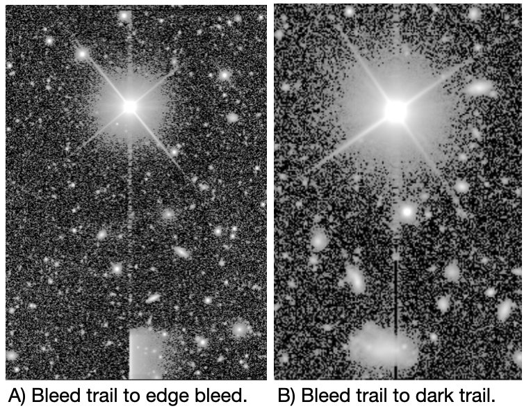
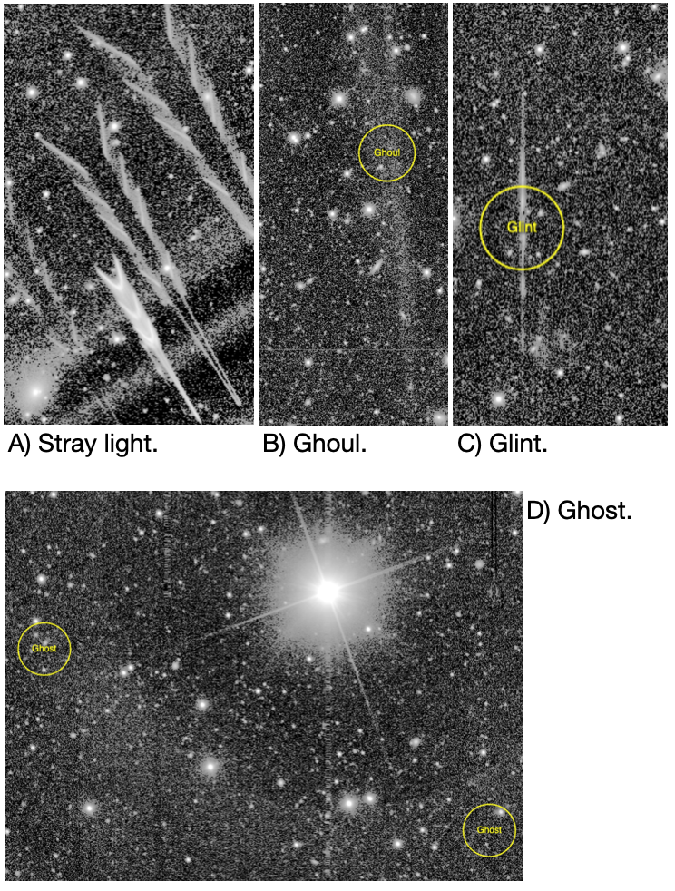
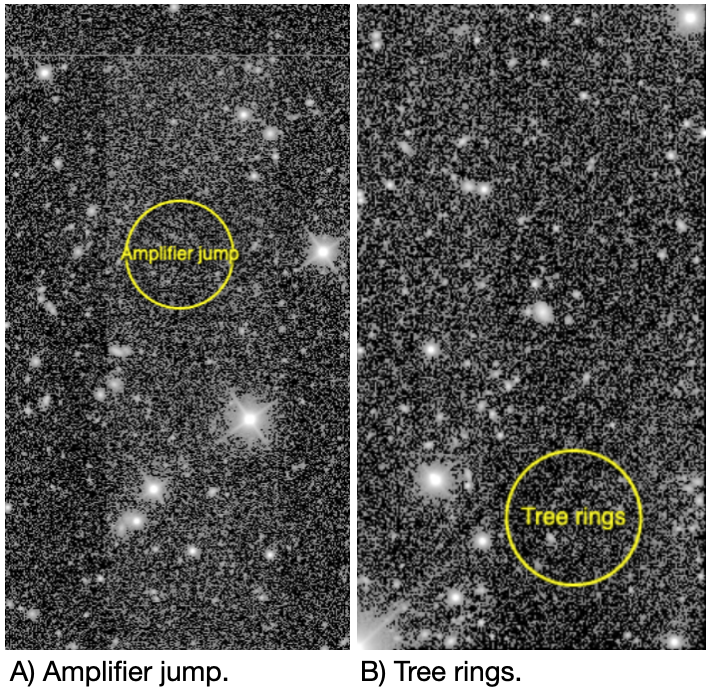
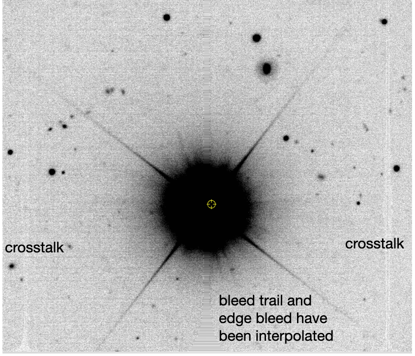
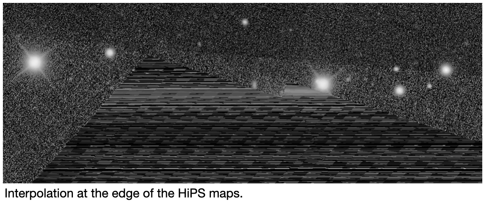

.. _artifacts:

#########
Artifacts
#########

Some image artifacts from the camera or processing will remain visible in the data.

The purpose of this page is to assist with artifact identification
and to provide users with a consistent vocabulary for the artifacts they might notice.

Masked artifacts
================

Several types of artifacts are masked, meaning that the pixel mask plane for processed images will have a value that indicates a pixel was affected by one of the following.

Bad pixels
----------

Individual pixels with erroneous sensitivity (quantum efficiency) beyond a correctable range or dead pixels.
A "vampire pixel" is a term for a particular kind of bad pixel that seems to "suck" charge from nearby pixels.

Bad columns
-----------

Instances when an entire column of pixels has erroneous sensitivity, e.g., due to a "hot" (oversensitive) pixel.

Bleed trails
------------

The charge created from very bright stars can overflow a pixel and extend along the column (vertical; y-direction), sometimes all the way to the CCD edge.

Dark trails
-----------

In some cases, the pixels in the column of a bleed trail exhibit a "dark trail" beyond where bleeding has occurred.

Edge bleed
----------

When a bleed trail extends to the CCD edge and then continues to affect pixels along the edge of the CCD in the x-direction.

Crosstalk
---------

Charge leakage between amplifiers, caused by excess charge from bright stars, typically affecting amplifiers on the same CCD.

The effect is long vertical (y-direction) features several pixels wide, and widest at about mid-length.

Cosmic rays
-----------

When high energy particles moving near the speed of light hit the CCD, the pixels they interact with are saturated.

Satellites
----------

Artificial objects in Earth's orbit, including satellites and debris, can appear as bright streaks and/or dotted or dashed lines across images.
In general, shorter and thinner streaks (less than the width of one detector) are from objects in higher orbits, while longer and wider streaks (often crossing the whole field of view) are from objects in lower orbits.
It is common for such features to vary in brightness along the track and exhibit flares or glint trails.
Pixel values are not erased, redacted, or otherwise altered in trailed regions, and no attempt is made to identify the origin of any streak.
If a streak is visually present in a difference image, it may set the STREAK mask plane, and any diaSource detected in such a region will have the ``pixelFlags_streak`` flag set in the corresponding catalog.
In practice, it is challenging to distinguish "real" streaks from, e.g., diffraction spikes, and DP1 makes no promise of accuracy for the STREAK mask.
In the future, STREAK mask information may be propagated into other catalogs, and trailed glints may also be detected and indicated.

For a description of how satellite constellations impact LSST more generally, please see `ls.st/satcon <https://www.lsst.org/content/lsst-statement-regarding-increased-deployment-satellite-constellations>`_.

    Figure 1: Examples of a bleed trail that leads to an edge bleed, and a bleed trail that leads into a dark trail.

Optical system
==============

Stray light
-----------

Light from off-axis sources beyond the camera's field of view can scatter into the camera and cause stray light features, typically near the edge of the focal plane.

Ghost
-----

Light from a bright object in the field of view can reflect off of the internal camera optics and cause large features.

Ghoul
-----

Fainter, more diffuse, and sometimes transient, stray light and ghost effects.

Glint
-----

Also caused by reflections, e.g., off the uncoated edge of the filters, but typically smaller and less diffuse.

    Figure 2: Examples of stray light near the detector edge, a ghoul, a glint, and a ghost.

Camera detector
===============

There are several effects related to the camera which should be corrected for during instrument signature removal -- by the flat field in particular.

Amplifier jump
--------------

The electronic gain of each amplifier is different, and an incomplete correction
looks like rectangular blocks with different background levels.

Fringing
--------

A variable interference pattern caused by light interacting with the different layers of the chip; most visible in the z- and y-bands.

Tree rings
----------

Circularly symmetric features caused by changes in the effective pixel size over the CCD; most apparent in the z-band.
Tree rings are actually changes in pixel *area*, not sensitivity, so they have a small astrometric effect as well, which is not (as of DP1) corrected.

    Figure 3: Examples of an amplifier jump and tree rings.

Interpolation
=============

Pixel values are replaced by an interpolation algorithm when they're identified
as affected by bad pixels, cosmic rays, and bleeding.
Our interpolation algorithm is optimized for small regions and vertical features (primarily bleed trails); in larger areas it produces visible striping, and we rely on other features of the processing to ignore these areas.

Interpolation will also be evident at the edges of the HiPS maps.

    Figure 4: An example of a bright star which caused a bleed trail and an edge bleed, where the affected pixels have been interpolated in the processed visit image. Crosstalk features from the bright star remain visible.

    Figure 5: An example of interpolation at the edge of a HiPS map.

Background subtraction artifacts
================================

Artifacts that stem from the estimation and subtraction of the sky background.

Dark edge
---------

Over-estimation and thus over-subtraction of the sky background at the edge or in the corners of images

Dark halo
---------

Over-estimation and thus over-subtraction of the sky background around bright stars.

