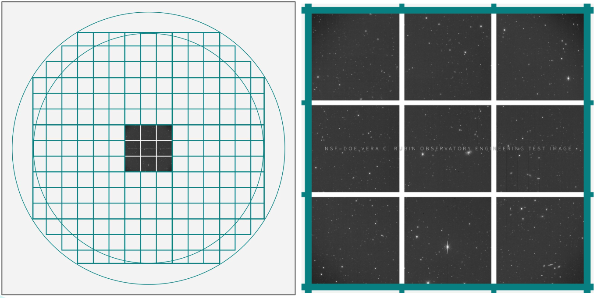

.. _comcam:

#########################
LSST Commissioning Camera
#########################

DOI: |doi_comcam|

The LSST Commissioning Camera, LSSTComCam (`lsstcomcam.lsst.io <https://lsstcomcam.lsst.io/>`_),
is a smaller, fully functional version of `LSSTCam <https://rubinobservatory.org/for-scientists/rubin-101/instruments>`_.
LSSTComCam is also referred to as the engineering test camera.

.. _comcam-focalplane:

Focal plane
===========

LSSTComCam consists of only a single "raft" of 9 CCDs
(charge-coupled device, also called a sensor, detector, or chip).
Each CCD is 4k x 4k pixels (4000 by 4000 pixels), for a total of 144 Mpix.
For comparison, LSSTCam will have 21 rafts, and 189 of the same CCDs.
All of LSSTComCam's CCDs are from ITL, one of the same two vendors that supplied the LSSTCam detectors (ITL and e2v).

    Figure 1: The LSSTComCam has only 9 CCDs compared to LSSTCam's 189 CCDs.

.. _comcam-filters:

Filters
=======

LSSTComCam uses the same *ugrizy* filters as `LSSTCam <https://rubinobservatory.org/for-scientists/rubin-101/instruments>`_.
LSSTComCam's filter exchanger can only hold three physical filters at a time (compared to 5 for LSSTCam).

.. _comcam-keynumbers:

Key numbers
===========

* CCDs: 9
* pixels: 144 Mpix
* platescale: 0.2 arcsec / pixel
* field of view: 40 x 40 arcminutes
* read noise: 6.21 electrons (ITL sensors)
* gain: 1.68 electrons / ADU (ITL sensors)

Visit Rubin Observatory's `Key Numbers <https://rubinobservatory.org/for-scientists/rubin-101/key-numbers>`_ page, and the page for `LSSTCam <https://rubinobservatory.org/for-scientists/rubin-101/instruments>`_, for more key numbers.

.. _comcam-knownissues:

Known issues
============

LSSTComCam was the instrument used to facilitate early system integration for the Rubin Observatory.
It was not, itself, commissioned.
The image quality achieved during the LSSTComCam on-sky campaign, and of the data in DP1, is not necessarily indicative of the image quality that is expected to be achieved with LSSTCam.
