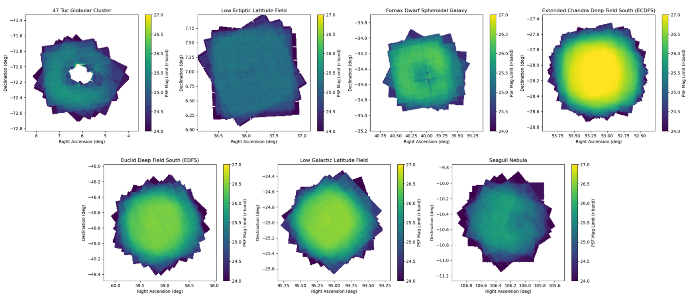

.. _iqsummary:

#############
Image quality
#############

An overview of the image quality and coadded depth per field.

.. _iqsummary-iq:

Visit PSF size
==============

.. list-table:: Table 1: Average seeing in arcseconds, over all detectors from all visits.
   :widths: 4 1 1 1 1 1 1 1
   :header-rows: 1

   * - Field name
     - u
     - g
     - r
     - i
     - z
     - y
     - Total
   * - 47 Tuc Globular Cluster
     - --
     - 1.47
     - 1.26
     - 1.11
     - --
     - 1.34
     - 1.25
   * - Low Ecliptic Latitude Field
     - --
     - 1.16
     - 1.13
     - 1.11
     - 1.23
     - --
     - 1.14
   * - Fornax Dwarf Spheroidal Galaxy
     - --
     - 1.16
     - 0.83
     - 0.87
     - --
     - --
     - 0.88
   * - Extended Chandra Deep Field South (ECDFS)
     - 1.43
     - 1.17
     - 1.09
     - 1.01
     - 1.00
     - 1.07
     - 1.10
   * - Euclid Deep Field South (EDFS)
     - 1.88
     - 1.20
     - 1.20
     - 1.05
     - 1.17
     - 0.98
     - 1.21
   * - Low Galactic Latitude Field
     - 1.48
     - 1.24
     - 1.13
     - 0.99
     - 1.23
     - 0.83
     - 1.20
   * - Seagull Nebula
     - 1.53
     - 1.26
     - 1.12
     - --
     - 1.21
     - --
     - 1.22

Visit magnitude limits
======================

.. list-table:: Table 2: Average magnitude limit, over all detectors from all visits.
   :widths: 4 1 1 1 1 1 1 1
   :header-rows: 1

   * - Field name
     - u
     - g
     - r
     - i
     - z
     - y
     - Total
   * - 47 Tuc Globular Cluster
     - --
     - 24.16
     - 24.28
     - 23.99
     - --
     - 21.7
     - 23.98
   * - Low Ecliptic Latitude Field
     - --
     - 24.45
     - 24.19
     - 23.74
     - 22.9
     - --
     - 23.94
   * - Fornax Dwarf Spheroidal Galaxy
     - --
     - 24.78
     - 24.74
     - 24.15
     - --
     - --
     - 24.58
   * - Extended Chandra Deep Field South (ECDFS)
     - 23.5
     - 24.49
     - 24.15
     - 23.9
     - 23.14
     - 21.94
     - 23.9
   * - Euclid Deep Field South (EDFS)
     - 23.3
     - 24.57
     - 24.15
     - 23.87
     - 23.18
     - 22.15
     - 23.84
   * - Low Galactic Latitude Field
     - 23.54
     - 24.63
     - 24.36
     - 23.95
     - 23.12
     - 22.17
     - 23.98
   * - Seagull Nebula
     - 23.38
     - 24.02
     - 23.76
     - --
     - 23.18
     - --
     - 23.76

.. _iqsummary-depth:

Coadded image depths
====================

    Figure 1: The r-band coadded magnitude limit for the seven LSSTComCam fields. All plots use the same colorbar scaling and are the same size except the Low Ecliptic Latitude field, which is a bit larger in extent.

