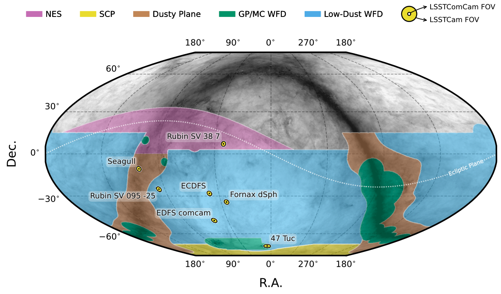

.. _observations:

############
Observations
############

The LSSTComCam obtained observations of 7 fields between Oct 24 and Dec 11 2024.

.. _observations-fields:

Field centers
=============

    Figure 1: The seven LSSTComCam fields (yellow dots, as named) in the context of the LSST's planned regions: North Ecliptic Spur (NES), South Celestial Pole (SCP), the dusty plane, and the Galactic Plane and Magellanic Clouds (GP/MC) and low-dust regions of the Wide-Fast-Deep (WFD) region.

.. list-table:: Table 1: Field names and central coordinates.
   :widths: 2 1 1
   :header-rows: 1

   * - Field name
     - RA, Dec
     - RA, Dec (deg)
   * - 47 Tuc Globular Cluster
     - 00h24m05s -72d04m48s
     - 6.02, -72.08
   * - Low Ecliptic Latitude Field
     - 02h31m26s +06d58m48s
     - 37.86, 6.98
   * - Fornax Dwarf Spheroidal Galaxy
     - 02h40m00s -34d27m00s
     - 40.00, -34.45
   * - Extended Chandra Deep Field South (ECDFS)
     - 03h32m31s -28d06m00s
     - 53.13, -28.10
   * - Euclid Deep Field South (EDFS)
     - 03h56m24s -48d43m48s
     - 59.10, -48.73
   * - Low Galactic Latitude Field
     - 06h20m00s -25d00m00s
     - 95.00, -25.00
   * - Seagull Nebula
     - 07h04m55s -10d30m36s
     - 106.23, -10.51

.. _observations-filters:

Filters
=======

.. list-table:: Table 2: Number of visits per band per field.
   :widths: 3 3 1
   :header-rows: 1

   * - Field name
     - u g r i z y
     - Total
   * - 47 Tuc Globular Cluster
     - 0 10 32 19 0 5
     - 66
   * - Low Ecliptic Latitude Field
     - 0 44 40 55 20 0
     - 159
   * - Fornax Dwarf Spheroidal Galaxy
     - 0 5 25 12 0 0
     - 42
   * - Extended Chandra Deep Field South (ECDFS)
     - 43 230 237 162 153 30
     - 855
   * - Euclid Deep Field South (EDFS)
     - 20 61 87 42 42 20
     - 272
   * - Low Galactic Latitude Field
     - 33 82 84 23 60 10
     - 292
   * - Seagull Nebula
     - 10 37 43 0 10 0
     - 100

.. _observations-epochs:

Epochs (nights)
===============

.. list-table:: Table 3: Number of nights, mean visits per night.
   :widths: 3 1 1
   :header-rows: 1

   * - Field name
     - Epochs (nights)
     - Visits/epoch
   * - 47 Tuc Globular Cluster
     - 4
     - 16.5
   * - Low Ecliptic Latitude Field
     - 5
     - 31.8
   * - Fornax Dwarf Spheroidal Galaxy
     - 2
     - 21.0
   * - Extended Chandra Deep Field South (ECDFS)
     - 21
     - 40.7
   * - Euclid Deep Field South (EDFS)
     - 9
     - 30.2
   * - Low Galactic Latitude Field
     - 10
     - 29.2
   * - Seagull Nebula
     - 4
     - 25.0
