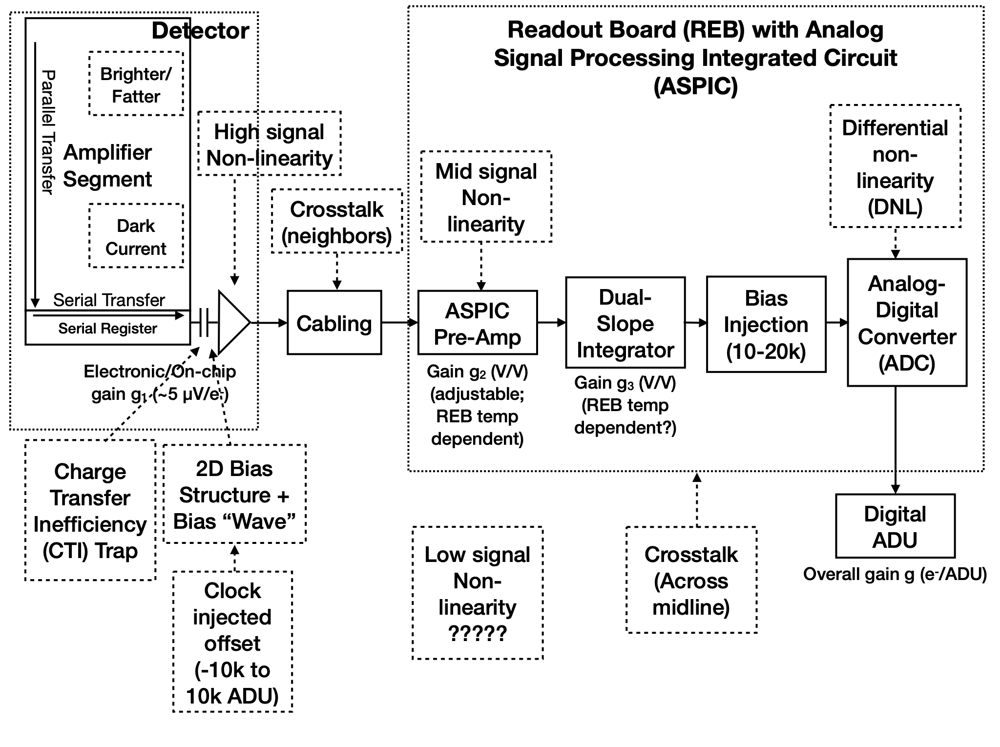
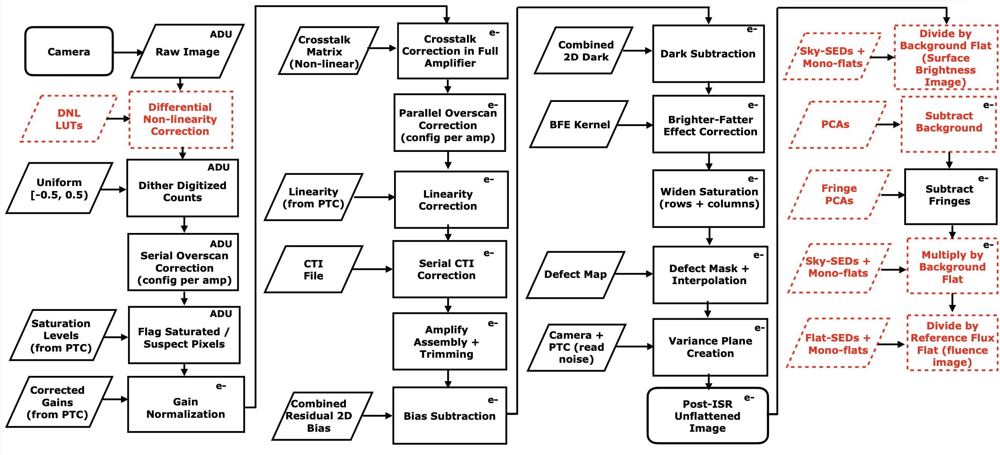

.. _isr:

##################################
Instrument signature removal (ISR)
##################################

ISR is the first step of image processing, which removes instrumental effects introduced in the raw images by the telescope and detectors and produces an accurate representation of the incoming light.

For descriptions of the ISR steps and the generation, verification, certification, approval, and distribution of the calibration products necessary for ISR, refer to the paper `Instrument Signature Removal and Calibration Products for the Rubin Legacy Survey of Space and Time <https://ui.adsabs.harvard.edu/abs/2025JATIS..11a1209P/abstract>`_, the "Rubin Baseline Calibration Plan" (`SITCOMTN-086 <https://sitcomtn-086.lsst.io/>`_), and the "Verifying LSST Calibration Data Products" (`DMTN-101 <https://dmtn-101.lsst.io/>`_) and "Calibration Generation, Verification, Acceptance, and Certification" (`DMTN-222 <https://dmtn-222.lsst.io/>`_) technical notes.

**Users should not attempt to recreate or rerun ISR; it was automatically applied within the LSST Science Pipelines.**

    Figure 1: The model of the detector and readout board (REB) components, labeled with the effects that they impart on signal (from |dp1_paper|).

    Figure 2: Instrument Signature Removal steps derived from the detector model in Figure 1 (from `Plazas Malagón et al. 2025 <https://ui.adsabs.harvard.edu/abs/2025JATIS..11a1209P/abstract>`_).

Components
----------

The steps of ISR include (from `Plazas Malagón et al. 2025 <https://ui.adsabs.harvard.edu/abs/2025JATIS..11a1209P/abstract>`_):

**Dithering of digitized counts**: applies a small random offset in the range [−0.5, 0.5) analog-to-digital units (ADU) to mitigate quantization bias introduced by analog-to-digital conversion.

**Serial overscan subtraction**: removes row-wise electronic bias using the serial overscan region, typically via a per-row median excluding the initial columns affected by deferred charge.

**Masking of saturated and suspect pixels**: flags pixels that exceed defined saturation levels or exhibit anomalies, ensuring they are excluded from subsequent calibration steps.

**Gain scaling**: converts pixel values from ADU to electrons using temperature-corrected gain factors derived from photon transfer curve (PTC) measurements.

**Correction of crosstalk in parallel overscan**: removes signal leakage from high-charge pixels into the parallel overscan regions of other amplifiers before performing the overscan subtraction.

**Parallel overscan subtraction**: subtracts column-wise bias using the parallel overscan region, after crosstalk and saturation artifacts have been corrected.

**Correction of crosstalk between amplifiers**: removes crosstalk between amplifier channels using a pre-measured crosstalk matrix, correcting both intra- and inter-CCD effects.

**Linearity correction**: corrects for non-linear detector response at medium and high signal levels.

**Serial charge transfer inefficiency (CTI) correction**: removes trailing charge artifacts from incomplete charge transfer in the serial register using a flux- and position-dependent correction model.

**Image assembly and trimming**: combines the 16 amplifier segments into a single CCD image and trims the overscan regions.

**Bias subtraction**: subtracts a combined bias frame created from multiple zero-time exposure images, correcting for static readout structure and electronic offsets.

**Dark subtraction**: removes the thermal dark current and any residual bias structure using a combined dark frame measured with closed-shutter exposures.

**Brighter-fatter correction**: corrects for the "brighter-fatter" effect (where brighter sources appear larger due to electrostatic interactions in the detector) using a convolution kernel calibrated from flat-field pixel correlations.

**Defect masking and interpolation**: flags and interpolates over known bad pixels or columns identified from flat and dark exposures as statistical outliers.

**Variance plane construction**: computes the variance per pixel from the Poisson noise and read noise, creating a map for uncertainty propagation in later processing.

**Flat fielding**: applies a background and reference flat to convert images to fluence units (e−/pixel), correcting for illumination non-uniformities.

Overview
========

Each sensor and its readout amplifiers can vary slightly in performance, causing images of even a uniformly illuminated focal plane to exhibit discontinuities and shifts due to detector effects.
Figure 1 illustrates the model of detector components and their impact on the signal, tracing the process from photons incident on the detector surface to the final quantized values recorded in the image files.
Based on this model, a series of Instrument Signature Removal steps are implemented to eliminate camera-induced effects (Figure 2).

The ISR pipeline essentially “works backward” through the signal chain, correcting the integer analog-to-digital units (ADU) raw camera output back to a floating-point number of photoelectrons created in the silicon.
The physical detector, shown on the left in Figure 1, is the source of effects that arise from the silicon itself, such as the dark current and the brighter-fatter effect (`Broughton et al. 2024 <https://ui.adsabs.harvard.edu/abs/2024PASP..136d5003B/abstract>`_, `Gruen et al. 2015 <https://ui.adsabs.harvard.edu/abs/2015JInst..10C5032G/abstract>`_).

After the image has integrated, the charge is shifted to the serial register and read out, which can introduce charge transfer inefficiencies and a clock-injected offset level.
The signals for all amplifiers are transferred via cables to the Readout Board (REB), during which crosstalk between the amplifiers may occur.
The Analog Signal Processing Integrated Circuit (ASPIC) on the REB converts the analog signal from the detector into a digital signal, adding both quantization and a bias level to the image.
Although the signal chain is designed to be stable and linear, the presence of numerous sources of non-linearity reveals its complexity.

Following this model, the sequence of ISR corrections is structured to reverse the detector and electronics effects in the order opposite to their introduction.
For example, quantization artifacts are addressed first through dithering and differential non-linearity correction, followed by serial overscan subtraction, saturation masking, and gain normalization.
Crosstalk is then corrected to prevent its contamination of later steps like parallel overscan subtraction and linearity correction.
CTI is corrected next, just before assembling the amplifier segments into full CCD images.
The final steps include bias and dark subtraction, brighter-fatter effect correction, defect masking, variance plane construction, and flat-fielding.
Each of these steps is tied to specific elements in the detector readout chain, and their ordering ensures that each correction builds upon a cleaner, more physically meaningful image (`Plazas Malagón et al., 2025 <https://ui.adsabs.harvard.edu/abs/2025JATIS..11a1209P/abstract>`_).
