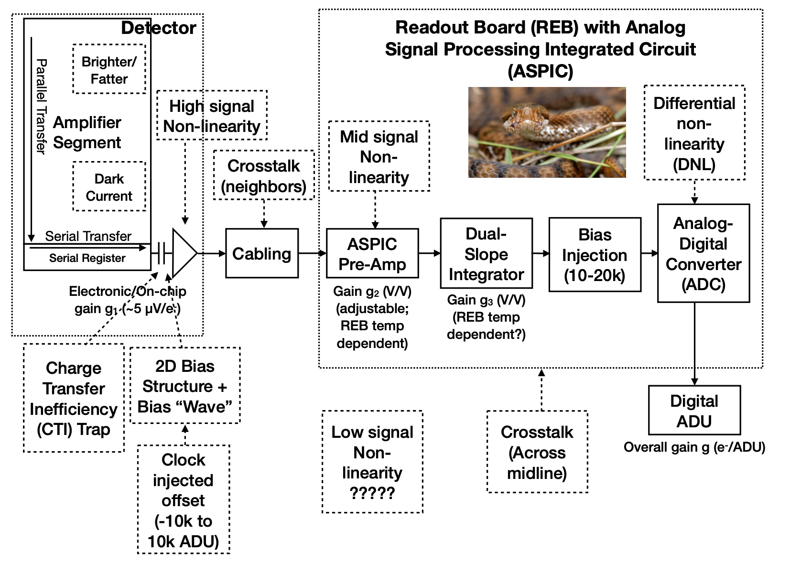

.. _isr:

##################################
Instrument signature removal (ISR)
##################################

ISR corrects the raw images for the effects of the telescope and detector.

For descriptions of the ISR steps, refer to the paper "Instrument Signature Removal and Calibration Products for the Rubin Legacy Survey of Space and Time" (`<https://ui.adsabs.harvard.edu/abs/2025JATIS..11a1209P/abstract>`_) and the "Rubin Baseline Calibration Plan" (`sitcomtn-086.lsst.io <https://sitcomtn-086.lsst.io/>`_).

ISR is the first step of the image processing which leads to calibrated, science-ready images.

**Users should not attempt to recreate or rerun ISR.**

The steps of ISR include:

* dithering
* serial overscan subtraction
* saturation masking
* gain normalization
* crosstalk correction
* parallel overscan subtraction
* linearity correction
* serial charge transfer inefficiency (CTI) correction
* image assembly
* bias subtraction
* dark subtraction
* brighter-fatter correction
* defect masking and interpolation
* variance plane construction
* flat fielding

    Figure 1: The model of the detector and readout board (REB) components, labeled with the effects that they impart on signal (from |dp1_paper|).

Overview
========

Each sensor and its readout amplifiers can vary slightly in performance, causing images of even a uniformly illuminated focal plane to exhibit discontinuities and shifts due to detector effects.
Figure 1 illustrates the model of detector components and their impact on the signal, tracing the process from photons incident on the detector surface to the final quantized values recorded in the image files.

The ISR pipeline essentially “works backward” through the signal chain, correcting the integer analog-to-digital units (ADU) raw camera output back to a floating-point number of photoelectrons created in the silicon.
The physical detector, shown on the left in Figure 1, is the source of effects that arise from the silicon itself, such as the dark current and the brighter-fatter effect (`Gruen et al. 2015 <https://ui.adsabs.harvard.edu/abs/2015JInst..10C5032G/abstract>`_).

After the image has integrated, the charge is shifted to the serial register and read out, which can introduce charge transfer inefficiencies and a clock-injected offset level.
The signals for all amplifiers are transferred via cables to the Readout Board (REB), during which crosstalk between the amplifiers may occur.
The Analog Signal Processing Integrated Circuit (ASPIC) on the REB converts the analog signal from the detector into a digital signal, adding both quantization and a bias level to the image.
Although the signal chain is designed to be stable and linear, the presence of numerous sources of non-linearity indicates otherwise.

