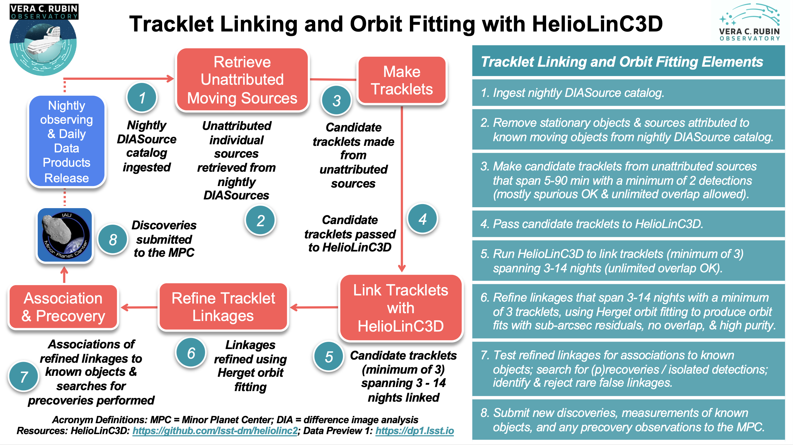

.. _moving:

##########################################
The Solar System Processing (SSP) Pipeline
##########################################

.. _DP0-3-Solar-System-Processing:

.. image:: images/LSST-Solar-System-Processing-Infographic.png

Solar System Prompt Processing
==============================

The goal of the nightly Solar System Processing pipeline is to link (identify) previously unknown ``SSObjects``,
given an additional night of observing,
and report the discoveries to the `Minor Planet Center <https://minorplanetcenter.net>`_ (MPC),
as well as to compute physical (e.g., absolute magnitudes) and other auxiliary properties
(e.g., predicted apparent magnitudes and coordinates in various coordinate systems)
for known Solar System objects and their LSST observations. The majority of the
pipeline's processing occurs in daytime, after a night of observing.
The pipeline will deliver Daily Data Products for Solar System objects in the form of four catalogs:
``SSObject``, ``SSSource``, ``DIASource``, and ``MPCORB``, which are described in the
:doc:`/products/index` documentation and the
`Data Products Definition Document <https://lse-163.lsst.io>`_ (DPDD).
The Solar System Processing pipeline is illustrated in the infographic provided above.
For more information on the moving object tracklet linking and orbit fitting
algorithm, see the relevant section below.

The Solar System Processing pipeline steps
------------------------------------------

During operations, the pipeline will consist of the following steps that will repeat every 24 hours:

During nightly observing:
1. Known Solar System objects are associated with difference image detections in real-time. Alerts are produced within 60 seconds for all signal-to-noise ratio (SNR)>=5 ``DIASources``. The Alert Production pipeline attempts association of ``DIASources`` with known Solar System objects in real-time, and if a match is found then the alert includes the corresponding ``SSObject`` catalog.
During the day following nightly observing:
2. All ``DIASources`` detected on the previous night that have not been matched at a high confidence level (SNR>=5) to a known Object, ``DIAObject``, ``SSObject``, or an artifact, are analyzed by the HelioLinC3D moving object linking algorithm for potential pairs that form tracklets (consisting of detections in three pairs of images for a given visit within 15 days) that are consistent with being on the same Keplerian orbit around the Sun. For more information on this algorithm, see the "HelioLinC3D Tracklet Linking and Orbit Fitting software package" section below.
3. Measurements of known objects and new discoveries are submitted to the Minor Planet Center (MPC) using the standard data-exchange protocols (e.g., the ADES format). The measurements of all ``DIASources`` detected on the previous night that have been matched at a high level of confidence (SNR>=5) to a known ``SSObject`` are also submitted to the MPC.
During the day before the coming night’s observing:
4. The most up-to-date ``MPCORB`` catalog is downloaded from the Minor Planet Center (MPC) and ingested into the Prompt Products database to obtain all previously submitted LSST discoveries and detections as well as discoveries and detections by other contemporaneous programs made during the past 24 hours.
5. The Daily Data Product catalogs are updated to include the new Solar System object discoveries included in the ingested ``MPCORB`` catalog. In particular, the ``SSObject`` catalog is updated to include the new discoveries from the ingested ``MPCORB`` catalog, and the ``SSSource`` and ``DIASource`` catalogs are updated to point to the relevant ``SSObject`` records for the new discoveries. In addition, the physical properties of all known ``SSObjects`` (e.g., absolute magnitudes, predicted apparent magnitudes, extendedness estimates, and light curve characteristics), as defined by the orbit catalog, are recomputed. Updated data are entered into the relevant tables.
6. The Solar System Daily Data Products (``MPCORB``, ``SSObject``, ``DIASource``, & ``SSSource`` tables) are released.
7. Precovery linking is attempted for all ``SSObjects`` whose orbits were updated in the above process (or are new). Where successful, newly discovered observations are queued up for submission to the Minor Planet Center.

Small Body Tracklet Linking and Orbit Fitting
=============================================

The HelioLinC3D Tracklet Linking and Orbit Fitting Software Package
-------------------------------------------------------------------

The Vera C. Rubin Observatory will detect millions of sources each night. As part of the Solar System Processing pipeline (Step 2 above),
the goal of the HelioLinC3D software package is to discover asteroids amid this flood of data. The algorithm identifies and links together little sequences of typically 6-20 sources that could comprise repeated detections of a new asteroid moving in its orbit around the Sun. These sets of detections (called 'linkages') are formed in two stages. First, ‘tracklets’ of observations are identified, where a tracklet comprises at least two images within a single night. Next, tracklets from multiple nights are linked together. LSST specifications state that a valid linkage must include at least three tracklets, each from a different night, and all within a 14-day period. Each linkage meeting these criteria constitutes a candidate asteroid discovery. After the full set of candidate linkages has been produced, they are culled and refined through orbit fitting and other analyses. The final product is a purified set of thousands of non-overlapping linkages, each of which has an orbit-fit with sub-arcsecond astrometric residuals. These linkages -- each comprising a probable new asteroid discovery -- are submitted to the `Minor Planet Center <https://minorplanetcenter.net>`_ (MPC) for confirmation and publication. The tracklet linking and orbit fitting procedure is illustrated in the infographic provided above.

During operations, the tracklet linking and orbit fitting process will consist of the following steps that will repeat every 24 hours following nightly observing and before release of the Solar System Daily Data Products (as described above):

1. The nightly DIASource catalog is ingested.
2. All stationary objects are removed from the nightly catalog of DIASources. In addition, any individual sources that can be attributed to known moving objects with high-confidence orbits where the astrometric match between the individual source and a known object has very low uncertainty (SNR>=5) are also removed from the nightly catalog of DIASources. In this manner, the moving object detections that are unattributed to any known sources are retrieved from the nightly DIASource catalog to be passed to candidate tracklet identification.
3. All DIASources detected on the previous night that have not been matched at a high confidence level (SNR>=5) to a known Object, DIAObject, SSObject, or an artifact, are analyzed for potential pairs that form tracklets. These tracklets span 5 - 90 minutes and consist of a minimum of 2 detections, which can be mostly spurious and have unlimited overlap.
4. Candidate tracklets are then passed to HelioLinC3D for linkage.
5. `HelioLinC3D <https://github.com/lsst-dm/heliolinc2>`_ is run to produce linkages that include tracklets from at least three distinct nights within a period of 14 days, with unlimited overlap allowed. Each linkage must comprise at least three tracklets – that is, at least six distinct detections of the candidate asteroid.
6. The large catalog of overlapping linkages produced by HelioLinC3D is refined using `"Method of Herget" orbit fitting <https://www.projectpluto.com/herget.htm>`_, producing a final set of non-overlapping, high-purity linkages that have sub-arcsecond astrometric residuals relative to the best-fit orbit -- and still meet the requirement of including tracklets from at least three distinct nights within a 14-day time span.
7. Refined linkages are tested for associations to known objects. In this step, the short-arc orbits provided by the refined tracklet linkages are more confidently able to be associated with orbits of known objects than the individual sources tested for association prior to linking in Step 2 above. Searches for (p)recoveries and isolated detections that can be linked to the refined linkages made by HelioLinC3D are performed. Rare false linkages are identified and rejected.
8. New discoveries and measurements of known objects are submitted to the Minor Planet Center (MPC) using the standard data-exchange protocols (e.g., the ADES format). The measurements of all DIASources detected on the previous night that have been matched at a high level of confidence (SNR>=5) to a known SSObject are also submitted to the MPC.

Solar System Data Release Processing
====================================

In addition to the prompt processing that will be performed on a daily basis, re-processing of the data will be performed annually to produce the Data Release Data Products; an exception to the annual re-processing timeline will be the first two Data Releases that will be created six months apart. As described above, the Daily (Prompt) Data Products for Solar System objects will include single visit images, difference images, catalogs of sources detected in difference images (``DIASources``) and detected objects that are associated with Solar System objects (``SSObjects``), which will include all data collected by the survey to date and will be entered into the Prompt Products database and made available in near real time. One expection to the use of all survey data to date for the near real time data releases, however, is the Alert Production pipeline that limits the  ``DIASource`` history for all variability parameters within the alert packets to a 12-month period.

The roughly annual Data Release Data Products for Solar System objects will include high-fidelity re-processing of all catalogs derived from re-reductions of all survey data using improved calibrations and a single, well-characterized, software release. In addition, the Data Release Data Products will include a LSST Catalog of Solar System Objects that will be suitable for population studies of objects detected by LSST with orbits estimated using only LSST data; this catalog will not rely on association of known objects using MPC orbit predictions. In contrast to the Prompt Products database, which is updated continuously during observing, the Data Release database is static and will not change after release. In general, the Data Release Data Products are best for purposes such as large-scale Solar System population studies and model debiasing, while the Daily (Prompt) Data Products are most useful for efforts such as follow-up and characterization of Solar System objects as they are detected by the survey.

Acronym definitions:
   * MPC = Minor Planet Center
   * SS = Solar System
   * DIA = difference image analysis
   * SNR = signal-to-noise ratio

