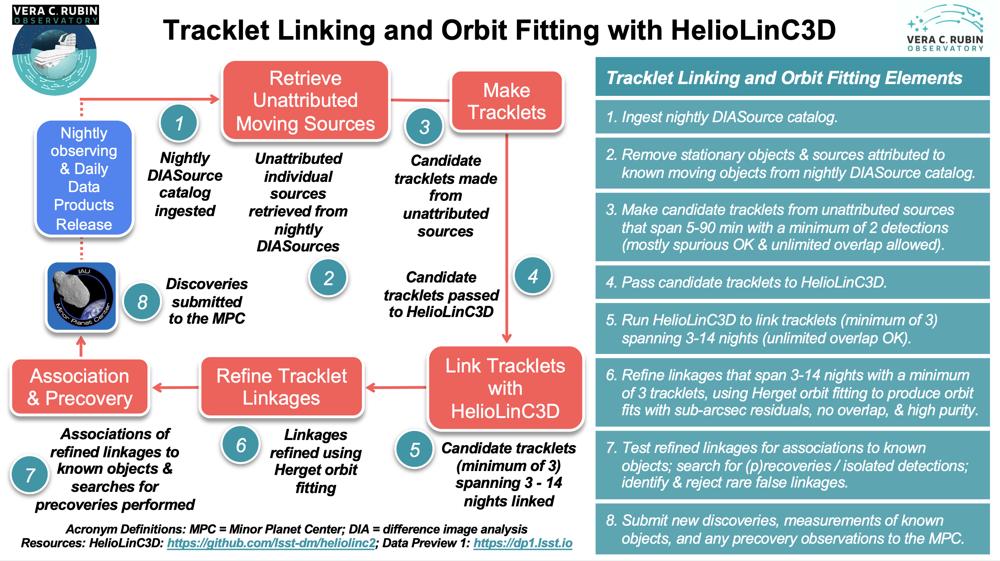

.. _moving-linking:

#############################################
Small body tracklet linking and orbit fitting
#############################################

The HelioLinC3D tracklet linking and orbit fitting package
==========================================================

The Vera C. Rubin Observatory will detect millions of sources each night.
As part of the :doc:`/processing/moving/ss_prompt` pipeline,
the goal of the HelioLinC3D software package is to discover asteroids amid this flood of data.
The algorithm identifies and links together little sequences of typically 6-20 sources that could comprise repeated detections of a new asteroid moving in its orbit around the Sun.
These sets of detections (called 'linkages') are formed in two stages.
First, ‘tracklets’ of observations are identified, where a tracklet comprises at least two images within a single night.
Next, tracklets from multiple nights are linked together.
LSST specifications state that a valid linkage must include at least three tracklets, each from a different night, and all within a 14-day period.
Each linkage meeting these criteria constitutes a candidate asteroid discovery.
After the full set of candidate linkages has been produced, they are culled and refined through orbit fitting and other analyses.
The final product is a purified set of thousands of non-overlapping linkages, each of which has an orbit-fit with sub-arcsecond astrometric residuals.
These linkages -- each comprising a probable new asteroid discovery -- are submitted to the `Minor Planet Center <https://minorplanetcenter.net>`_ (MPC) for confirmation and publication.
The tracklet linking and orbit fitting procedure is illustrated in the infographic provided above.

The 24 hour processing cycle
============================

During operations, the tracklet linking and orbit fitting process will consist of the following steps that will repeat every 24 hours following nightly observing and before release of the Solar System Daily Data Products:

1. The nightly ``DiaSource`` catalog is ingested.
2. All stationary objects are removed from the nightly catalog of ``DiaSources``. In addition, any individual sources that can be attributed to known moving objects with high-confidence orbits where the astrometric match between the individual source and a known object has very low uncertainty (SNR>=5) are also removed from the nightly catalog of ``DiaSources``. In this manner, the moving object detections that are unattributed to any known sources are retrieved from the nightly ``DiaSource`` catalog to be passed to candidate tracklet identification.
3. All ``DiaSources`` detected on the previous night that have not been matched at a high confidence level (SNR>=5) to a known Object, DIAObject, SSObject, or an artifact, are analyzed for potential pairs that form tracklets. These tracklets span 5 - 90 minutes and consist of a minimum of 2 detections, which can be mostly spurious and have unlimited overlap.
4. Candidate tracklets are then passed to HelioLinC3D for linkage.
5. `HelioLinC3D <https://github.com/lsst-dm/heliolinc2>`_ is run to produce linkages that include tracklets from at least three distinct nights within a period of 14 days, with unlimited overlap allowed. Each linkage must comprise at least three tracklets – that is, at least six distinct detections of the candidate asteroid.
6. The large catalog of overlapping linkages produced by HelioLinC3D is refined using `"Method of Herget" orbit fitting <https://www.projectpluto.com/herget.htm>`_, producing a final set of non-overlapping, high-purity linkages that have sub-arcsecond astrometric residuals relative to the best-fit orbit -- and still meet the requirement of including tracklets from at least three distinct nights within a 14-day time span.
7. Refined linkages are tested for associations to known objects. In this step, the short-arc orbits provided by the refined tracklet linkages are more confidently able to be associated with orbits of known objects than the individual sources tested for association prior to linking. Searches for (p)recoveries and isolated detections that can be linked to the refined linkages made by HelioLinC3D are performed. Rare false linkages are identified and rejected.
8. New discoveries and measurements of known objects are submitted to the Minor Planet Center (MPC) using the standard data-exchange protocols (e.g., the ADES format). The measurements of all ``DiaSources`` detected on the previous night that have been matched at a high level of confidence (SNR>=5) to a known SSObject are also submitted to the MPC.

