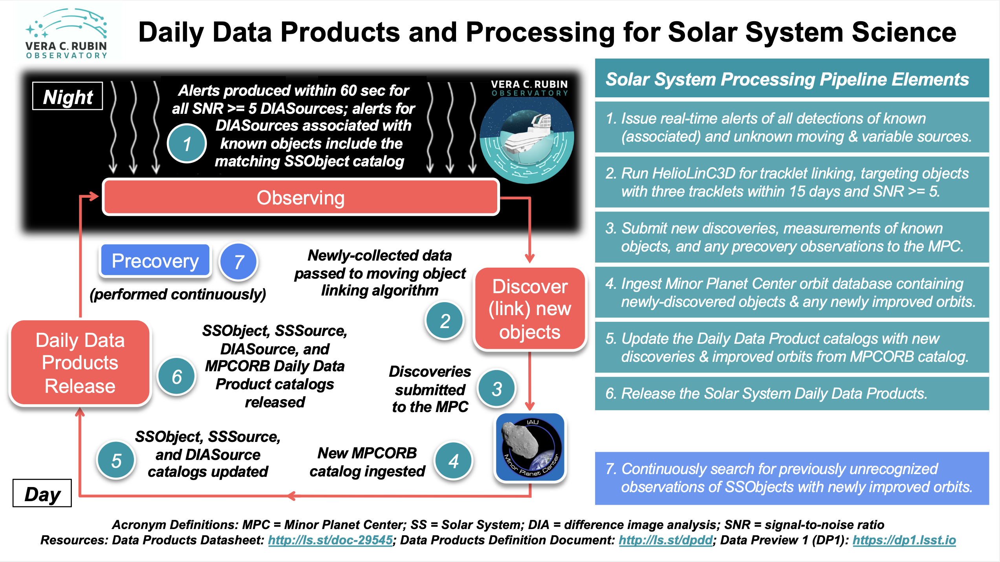

.. _moving-prompt:

##############################
Solar System prompt processing
##############################

The goal of the nightly Solar System Processing (SSP) pipeline is to link (identify) previously unknown ``SSObjects``,
given an additional night of observing,
and report the discoveries to the `Minor Planet Center <https://minorplanetcenter.net>`_ (MPC),
as well as to compute physical (e.g., absolute magnitudes) and other auxiliary properties
(e.g., predicted apparent magnitudes and coordinates in various coordinate systems)
for known Solar System objects and their LSST observations.

The majority of the pipeline's processing occurs in daytime, after a night of observing.
The pipeline will deliver daily data products for Solar System objects in the form of four catalogs:
``SSObject``, ``SSSource``, ``DIASource``, and ``MPCORB``, which are described in the
:doc:`/products/index` documentation and the
`Data Products Definition Document <https://lse-163.lsst.io>`_ (DPDD).
The SSP pipeline is illustrated in the infographic provided above.
For more information on the moving object tracklet linking and orbit fitting
algorithm, see :doc:`/processing/moving/ss_linking`.

The 24 hour processing cycle
============================

During operations, the pipeline will consist of the following steps that will repeat every 24 hours.

During nightly observing:

1. Known Solar System objects are associated with difference image detections in real-time. Alerts are produced within 60 seconds for all signal-to-noise ratio (SNR)>=5 ``DIASources``. The Alert Production pipeline attempts association of ``DIASources`` with known Solar System objects in real-time, and if a match is found then the alert includes the corresponding ``SSObject`` catalog.

During the day following nightly observing:

2. All ``DIASources`` detected on the previous night that have not been matched at a high confidence level (SNR>=5) to a known Object, ``DIAObject``, ``SSObject``, or an artifact, are analyzed by the HelioLinC3D moving object linking algorithm for potential pairs that form tracklets (consisting of detections in three pairs of images for a given visit within 15 days) that are consistent with being on the same Keplerian orbit around the Sun. For more information on this algorithm, see :doc:`/processing/moving/ss_linking`.

3. Measurements of known objects and new discoveries are submitted to the Minor Planet Center (MPC) using the standard data-exchange protocols (e.g., the ADES format). The measurements of all ``DIASources`` detected on the previous night that have been matched at a high level of confidence (SNR>=5) to a known ``SSObject`` are also submitted to the MPC.

During the day before the coming night’s observing:

4. The most up-to-date ``MPCORB`` catalog is downloaded from the Minor Planet Center (MPC) and ingested into the Prompt Products database to obtain all previously submitted LSST discoveries and detections as well as discoveries and detections by other contemporaneous programs made during the past 24 hours.

5. The daily data product catalogs are updated to include the new Solar System object discoveries included in the ingested ``MPCORB`` catalog. In particular, the ``SSObject`` catalog is updated to include the new discoveries from the ingested ``MPCORB`` catalog, and the ``SSSource`` and ``DIASource`` catalogs are updated to point to the relevant ``SSObject`` records for the new discoveries. In addition, the physical properties of all known ``SSObjects`` (e.g., absolute magnitudes, predicted apparent magnitudes, extendedness estimates, and light curve characteristics), as defined by the orbit catalog, are recomputed. Updated data are entered into the relevant tables.

6. The Solar System daily data products (``MPCORB``, ``SSObject``, ``DIASource``, & ``SSSource`` tables) are released.

7. Precovery linking is attempted for all ``SSObjects`` whose orbits were updated in the above process (or are new). Where successful, newly discovered observations are queued up for submission to the Minor Planet Center.
