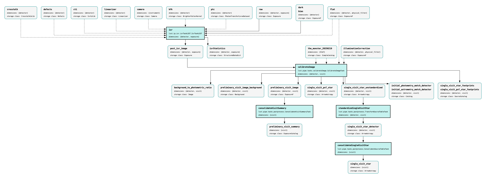
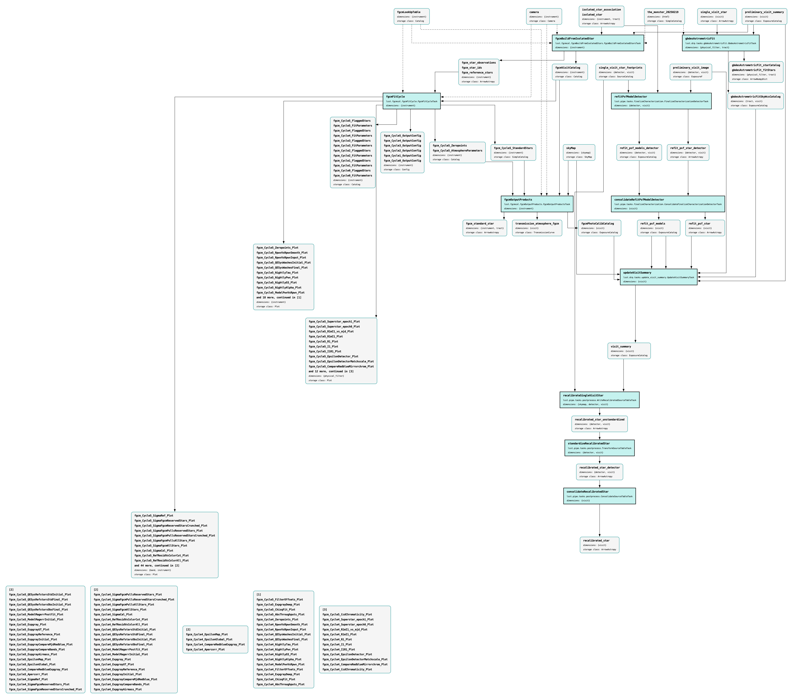
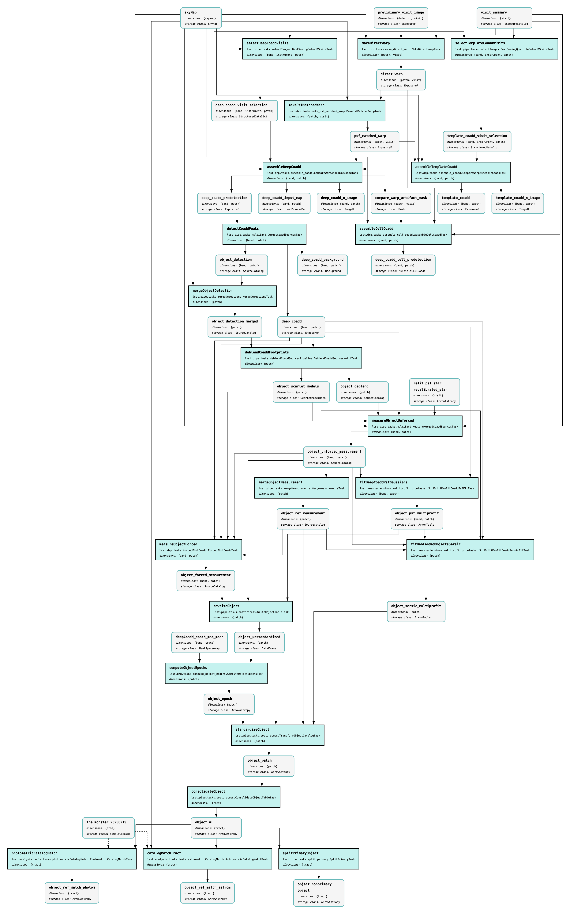
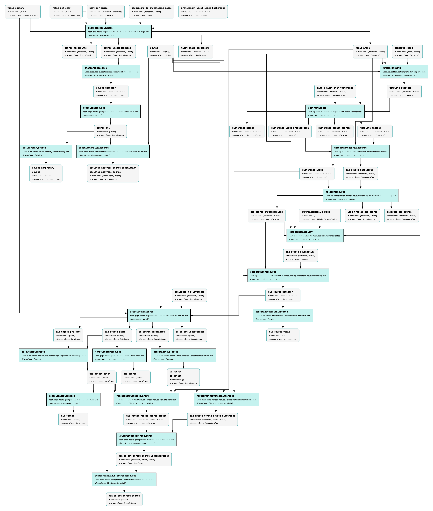

.. _pipeline-graphs:

###############
Pipeline graphs
###############

To help visualize the steps of Data Release Processing (DRP), the pipeline graphs below illustrate data products (gray boxes) and Pipeline Tasks (teal boxes).
They are divided into "stages" such that each stage finishes with all the analysis needed to vet it and move onto the next one.
For simplicity, all DRP tasks designed to compute metrics and make plots are omitted.

.. note::
    Not every data product shown is part of DP1!
    These pipeline graphs are a representation of most tasks in the LSSTComCam DRP pipeline at the time DP1 was processed.
    They illustrate how different data products and tasks relate to one another, and are not a definitive record of all processing steps performed.

Stage 1
=======

Stage 1 is :ref:`Instrument Signature Removal (ISR) <isr>`, which applies the input :ref:`calibration data products <calibrations>` to :ref:`raw <images-raw>`, and produces 'post_isr_images'. These are matched to the :doc:`/processing/calibration/monster` to derive the initial single-detector calibrations, and analysis is performed on those calibrated single-visit images (which includes matching across visits).

  **Figure 1:** Pipeline graph of DP1 DRP Stage 1, showing single visit processing steps.

:download:`Download the PDF for Stage 1 <images/DP1-stage1-figure.pdf>`.

Stage 2
=======

Stage 2 is multi-visit and full-visit recalibration, including :ref:`FGCM photometric calibration <photometric>` and :ref:`gbdes astrometric calibration <astrometric>`.

  **Figure 2:** Pipeline graph of DP1 DRP Stage 2, showing recalibration steps.

:download:`Download the PDF for Stage 2 <images/DP1-stage2-figure.pdf>`.

Stage 3
=======

Stage 3 is coaddition and coadd processing, which results in the object table.

  **Figure 3:** Pipeline graph of DP1 DRP Stage 3, showing coaddition steps.

:download:`Download the PDF for Stage 3 <images/DP1-stage3-figure.pdf>`.

Stage 4
=======

Stage 4 uses information from stage 3 to create visit-level final source catalogs and do difference imaging and forced photometry.

  **Figure 4:** Pipeline graph of DP1 DRP Stage 4, showing variability measurement steps.

:download:`Download the PDF for Stage 4 <images/DP1-stage4-figure.pdf>`.
