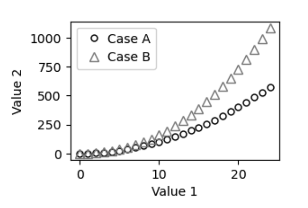

.. _api-101-1:

############################
101.1. How to create a token
############################

For the API Aspect of the Rubin Science Platform at data.lsst.cloud.

**Data Release:** DP1

**Last verified to run:** *yyyy-mm-dd*

**Learning objective:** *Very brief description of tutorial's learning objective.*

**LSST data products:** *List the catalogs and images used.*

**Credit:** *E.g., "Originally developed by" or "Based on tutorials developed by" and then people's names, including journal article or software release citations if appropriate.* Please consider acknowledging them if this tutorial is used for the preparation of journal articles, software releases, or other tutorials.

**Get Support:** Everyone is encouraged to ask questions or raise issues in the `Support Category <https://community.lsst.org/c/support/6>`_ of the Rubin Community Forum. Rubin staff will respond to all questions posted there.

*How-to tutorials should NOT need sections, and have a minimal number of very concise steps. How-tos should NOT have an introduction as this is covered by the learning objective above.*

*Like the notebook template, italicized text should be removed or replaced.*

.. _api-101-1-intro:

Introduction
============

*Provide a light narrative about this tutorial, e.g., "This tutorial will demonstrate how to...".*

*Cite or link to any external information, documentation, or papers.*

*Describe key scientific concepts.*

**Related tutorials:**
*If applicable, mention other relevant tutorials by name but do not link to them.*
*Tutorials evolve continuously, there is no linkchecker for the notebook repo, and tutorial hotlinks will go stale quickly.*
*It is not necessary to mention the preceeding/subsequent tutorials in the same series as this one - those are trivial for the user to find.*
*But do use this section to mention related tutorials in other series.*

.. _api-101-1-S1:

1. The first section
====================

**1.1. Log in to the Portal Aspect of the Rubin Science Platform.**
In a browser, go to the URL `data.lsst.cloud <https://data.lsst.cloud>`_ and select the Portal Aspect.
Follow the process to log in.

**1.2. Select the X tab in the Portal.**
*Explanation of the setup, reference to Figure 1.*

    Figure 1: Figure caption goes here.

**1.3. Execute the ADQL query.**
*Explanation of the query, reference to the code block below.*

.. code-block:: SQL 
    
    SELECT g_H, r_H, i_H, z_H 
    FROM dp03_catalogs_10yr.SSObject 
    WHERE ssObjectId > 8660000000000000000

.. _api-101-1-S2:

2. The second section
=====================

**2.1.** *And so on.*

.. _api-101-1-ex:

X. Exercises for the learner 
============================

**X.1. A clear, achievable task.**

**X.2. Another clear, achievable task.**
