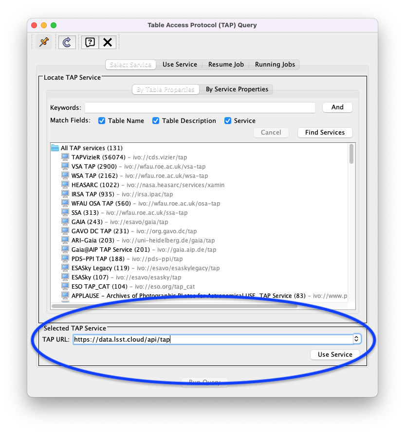
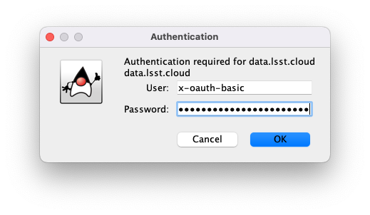

.. _api-101-1:

############################
101.1. How to create a token
############################

For the API Aspect of the Rubin Science Platform at data.lsst.cloud.

**Data Release:** DP1

**Last verified to run:** *yyyy-mm-dd*

**Learning objective:** *Very brief description of tutorial's learning objective.*

**LSST data products:** *List the catalogs and images used.*

**Credit:** *E.g., "Originally developed by" or "Based on tutorials developed by" and then people's names, including journal article or software release citations if appropriate.* Please consider acknowledging them if this tutorial is used for the preparation of journal articles, software releases, or other tutorials.

**Get Support:** Everyone is encouraged to ask questions or raise issues in the `Support Category <https://community.lsst.org/c/support/6>`_ of the Rubin Community Forum. Rubin staff will respond to all questions posted there.

*How-to tutorials should NOT need sections, and have a minimal number of very concise steps. How-tos should NOT have an introduction as this is covered by the learning objective above.*

*Like the notebook template, italicized text should be removed or replaced.*

.. _api-101-1-intro:

Introduction
============

*Provide a light narrative about this tutorial, e.g., "This tutorial will demonstrate how to...".*

*Cite or link to any external information, documentation, or papers.*

*Describe key scientific concepts.*

**Related tutorials:**
*If applicable, mention other relevant tutorials by name but do not link to them.*
*Tutorials evolve continuously, there is no linkchecker for the notebook repo, and tutorial hotlinks will go stale quickly.*
*It is not necessary to mention the preceeding/subsequent tutorials in the same series as this one - those are trivial for the user to find.*
*But do use this section to mention related tutorials in other series.*

.. _api-101-1-S1:

1. The first section
====================

**1.1. Log in to the Portal Aspect of the Rubin Science Platform.**
In a browser, go to the URL `data.lsst.cloud <https://data.lsst.cloud>`_ and select the Portal Aspect.
Follow the process to log in.

**1.2. Select the X tab in the Portal.**
*Explanation of the setup, reference to Figure 1.*

.. figure:: images/template_figure.png
    :name: template_figure
    :alt: Alt-text goes here.

    Figure 1: Figure caption goes here.

**1.3. Execute the ADQL query.**
*Explanation of the query, reference to the code block below.*

.. code-block:: SQL

    SELECT g_H, r_H, i_H, z_H
    FROM dp03_catalogs_10yr.SSObject
    WHERE ssObjectId > 8660000000000000000

.. _api-101-1-S2:

2. The second section
=====================

**2.1.** *And so on.*

.. _api-101-1-ex:

X. Exercises for the learner
============================

**X.1. A clear, achievable task.**

**X.2. Another clear, achievable task.**

.. _Data-Access-Analysis-Tools-TAP-TOPCAT:

Use of TOPCAT with the RSP TAP service
======================================

One popular and useful non-RSP utility that supports the TAP API is 
`TOPCAT <http://www.star.bris.ac.uk/~mbt/topcat/>`_.  With TOPCAT, 
it is possible to run ADQL queries on the Rubin DP0.2 data set, 
explore tables, and make a variety of 2D and 3D plots via an 
interactive graphical users interface (GUI).  (For a broader view 
of TOPCAT capabilities, please see the 
`TOPCAT webpage <http://www.star.bris.ac.uk/~mbt/topcat/>`_,
which includes documentation, examples, and tutorials.)

To access DP0.2 from a non-RSP TAP utility like TOPCAT, an RSP access token needs to be generated.
How to generate and use an RSP access token is described by the 
`Rubin Science Platform APIs <https://data.lsst.cloud/api-aspect>`_ webpage and
by the `Science Platform Tokens <https://nb.lsst.io/environment/tokens.html>`_ webpage.

.. Important::
    **Note that tokens should be treated like passwords:  they should not be shared with others.  
    Take precautions to keep tokens secure.  Never store tokens in git-tracked files.**

.. _Data-Access-Analysis-Tools-TAP-TOPCAT-get-started:

Get started with TOPCAT
-----------------------

This section provides a basic guide to get TOPCAT set up to explore the DP0.2 tables.

**1. Create an RSP access token.**  
See the `Creating user tokens webpage <https://rsp.lsst.io/guides/auth/creating-user-tokens.html>`_ 
for a step-by-step guide for creating an RSP access token.  It is recommended that the token you create has the
following propoerties:  a name that includes "TOPCAT" as a substring, a scope of ``read:tap``, 
and no expiration date.) The token will only be visible once.
*You must cut-and-paste the token to a secure file for future use.*
A new token is not needed for every TOPCAT session; the token can be reused, but it must be kept secure.
  
**2. Start up TOPCAT on your own computer.**
See `TOPCAT homepage <http://www.star.bris.ac.uk/~mbt/topcat/>`_ for download and install instructions.

**3. Click on "Table Access Protocol (TAP) Query" under the “VO” menu.**
This will open up a separate Table Access Protocol (TAP) Query window. 

.. figure:: images/api-101-1-1.png
    :name: api-101-1-1
    :alt: A screenshot of the main TOPCAT window with the Table Access Protocol item 
	  highlighted by the cursor under the VO drop-down menu.

    The main TOPCAT window, with the "VO" menu pulled down and the "Table Access Protocol (TAP) Query" highlighted.

**4. Fill in the relevant in the “TAP URL” window and click the “Use Service” button in the Table Access Protocol (TAP) Query window.**
For DP0.2, use ``https://data.lsst.cloud/api/tap``.  If you wish to access DP0.3 -- which 
is a database of solar system objects that supplements the main DP0.2 database -- use 
``https://data.lsst.cloud/api/ssotap`` instead.

          for the TAP URL has been filled in with the URL
	  https://data.lsst.cloud/api/tap .  A blue oval indicates the location of the 
          Selected TAP Service panel in the window.

    The Table Access Protocol (TAP) Query window with the location of the "Selected TAP Service" panel indicated by a blue oval.

**5. Populate the Authentication window that pops up.**  
Fill in ``x-oauth-basic`` for the "User" and your security token forthe "Password" and click "OK".

	  and the password is shown (for security purposes) as a series of filled black circles.

    The Authentication window with the values for the user and the password filled in.

**6. Note that the RSP TAP service is now accessible from your instance of TOPCAT.**  
An indicator that the service is now accessible is that a list of DP0.1 and DP0.2 tables available has appeared in the Metadata panel of the TAP Query window.

.. figure:: images/api-101-1-4.png
    :name: api-101-1-4
    :alt: A screenshot of the Table Access Protocol (TAP) Query window.
          The Table Access Protocol (TAP) Query window now shows three panels, stacked vertically.  The
	  top panel is the Metadata panel, and it shows a list of DP0.1 and DP0.2 schemas and tables that
	  are available to query.  The middle panel is the Service Capabilities panel, and it shows that
	  the available Query Language is ADQL-2.0.  The bottom panel is the ADQL Text panel, and it 
	  indicates the current Mode is Synchronous; the bottom panels text box is currently empty.

    The Table Access Protocol (TAP) Query window; a list of DP0.1 and DP0.2 tables 
    available for query can be be seen in the Metadata panel.

**7. Explore.**
At this stage, the Rubin DP0.2 data set can be explored via TOPCAT.  For an example, see the 
:doc:`/tutorials-examples/api-topcat-beginner`.

