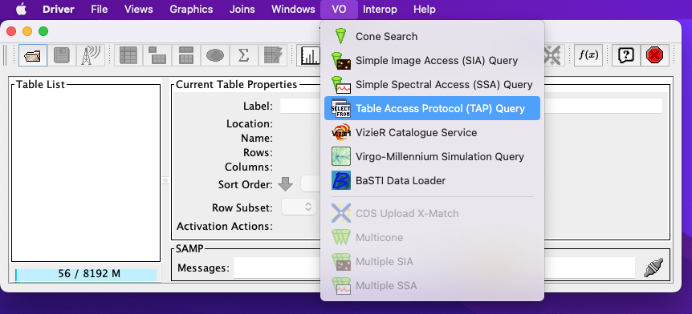
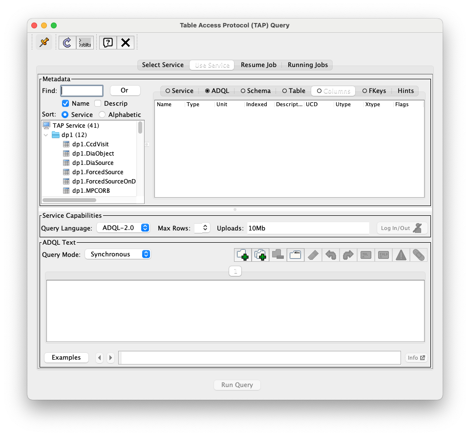

.. _api-101-2:

#############################################
101.2. How to plot retrieved data with TOPCAT
#############################################

For the API Aspect of the Rubin Science Platform at data.lsst.cloud.

**Data Release:** DP1

**Last verified to run:** 2025-06-16

**Learning objective:** This tutorial provides a basic guide for plotting DP1 catalog data via the Rubin Science Platform (RSP) Table Access Protocol (TAP) service using `TOPCAT <http://www.star.bris.ac.uk/~mbt/topcat/>`_.

**LSST data products:** The DP1 catalogs within the RSP TAP service.

**Credit:** Based on tutorials developed by the Rubin Community Science team. Please consider acknowledging them if this tutorial is used for the preparation of journal articles, software releases, or other tutorials.

**Get Support:** Everyone is encouraged to ask questions or raise issues in the `Support Category <https://community.lsst.org/c/support/6>`_ of the Rubin Community Forum. Rubin staff will respond to all questions posted there.

**1. Follow the steps in :doc:`api-101-2` to start up TOPCAT and configure it for the RSP DP1 TAP service.**
By the end of the steps in :doc:`api-101-2` the following two TOPCAT windows should be open:

    The main TOPCAT window.   **THIS PLOT NEEDS UPDATING**

          The Table Access Protocol (TAP) Query window now shows three panels, stacked vertically.  The
	  top panel is the Metadata panel, and it shows a list of DP1 schemas and tables that
	  are available to query.  The middle panel is the Service Capabilities panel, and it shows that
	  the available Query Language is ADQL-2.0.  The bottom panel is the ADQL Text panel, and it
	  indicates the current Mode is Synchronous; the bottom panels text box is currently empty.

    The Table Access Protocol (TAP) Query window; a list of DP1 tables
    available for query can be be seen in the Metadata panel.

**2. STOPPED HERE.**  Grab some queries from the DP0.2 TOPCAT tutorial for creating a color-color diagram.

