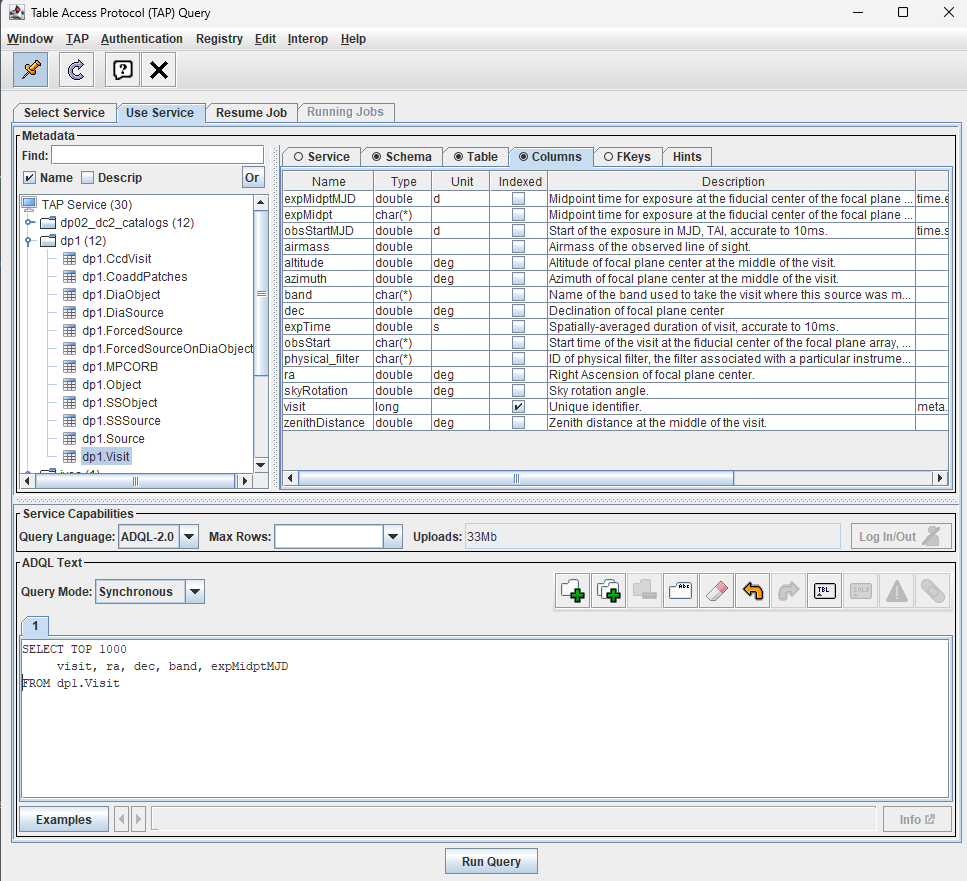
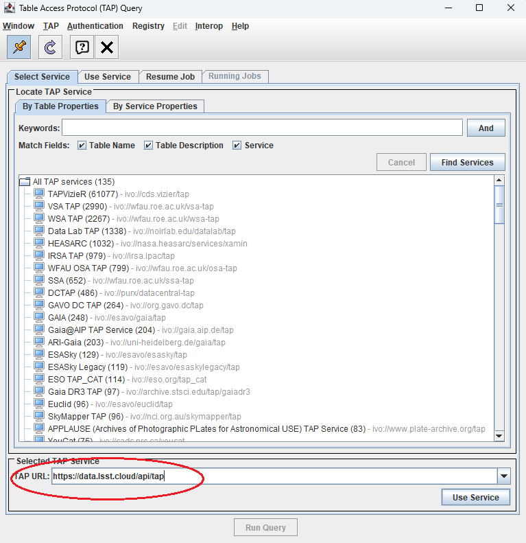

.. _api-101-3:

##############################
101.3. How to plot with TOPCAT
##############################

For the API Aspect of the Rubin Science Platform at data.lsst.cloud.

**Data Release:** DP1

**Last verified to run:** 2026-01-28

**Learning objective:** This tutorial provides a basic guide to plotting data within `TOPCAT <http://www.star.bris.ac.uk/~mbt/topcat/>`_
and to explore DP1.

**LSST data products:** The DP1 catalogs within th Rubin Science Platform (RSP) Table Access Protocol (TAP) service.

**Credit:** Based on tutorials developed by the Rubin Community Science team. Please consider acknowledging them if this
tutorial is used for the preparation of journal articles, software releases, or other tutorials.

**Get Support:** Everyone is encouraged to ask questions or raise issues in the `Support Category <https://community.lsst.org/c/support/6>`_
of the Rubin Community Forum. Rubin staff will respond to all questions posted there.

**1. Open TOPCAT and access DP1 Data.**
See API Tutorial 101-1 for instructions on how to access Rubin DP1 data with TOPCAT.

**2. Create DP1 Skymap**

Access the ``dp1.Visit`` table to create a skymap of Data Preview 1 visits.

**2.1 Use TAP Query window**

After starting TOPCAT and accessig the Rubin DP1 data through the VO protocol, where you add your credentials, click on ``dp1.Visit`` table.
Notice tabs in the right-hand window.  Click on "Colums" to see a description of each of the columns in this table.

	  TOPCAT window to add ADQL query. 

    Figure 1:  TAP Query window with dp1.Visit table selected, column descriptions visible, and ADQL query in ADQL Text box. 

**2.2 Run ADQL query**

Within the ADQL Text panel of the Table Access Protocol (TAP) Query window, copy the ADQL query below and add it to the ADQL text window, then click ``Run Query``.

It is recommended to construct a TAP query using spatial constraints, but his query has been limited to the top 1000 entries.  This should limit the time it takes to run the query.

.. code-block:: sql

  SELECT TOP 1000
       visit, ra, dec, band, expMidptMJD
  FROM dp1.Visit

    Figure 1:  View table returned from query.

**2.1. Review table.**

Text.
Insert figure

**2.2. Create Skymap of DP1 fields using the Sky 9lotting window and Aitoff projection**

Text describing image

Insert figure 

**3. Create g_psfMag Historgram for ECDFS field**

**3.1 Run ADQL query on dp1.Object table**

.. code-block:: sql

  SELECT TOP 1000
       coord_ra, coord_dec, g_psfMag
  FROM dp1.Object
    WHERE 1 = CONTAINS( POINT('ICRS', coord_ra, coord_dec), CIRCLE('ICRS', 53.13, -28.10, 0.2)
     )

**3.2 Plot Histogram**

Add Text

Add Figure

add image of histogram

**4. Create CMD with TOPCAT**

**4.1 Run query**

add code

**4.2 Create CMD**

add text

add image

add image of CDM
