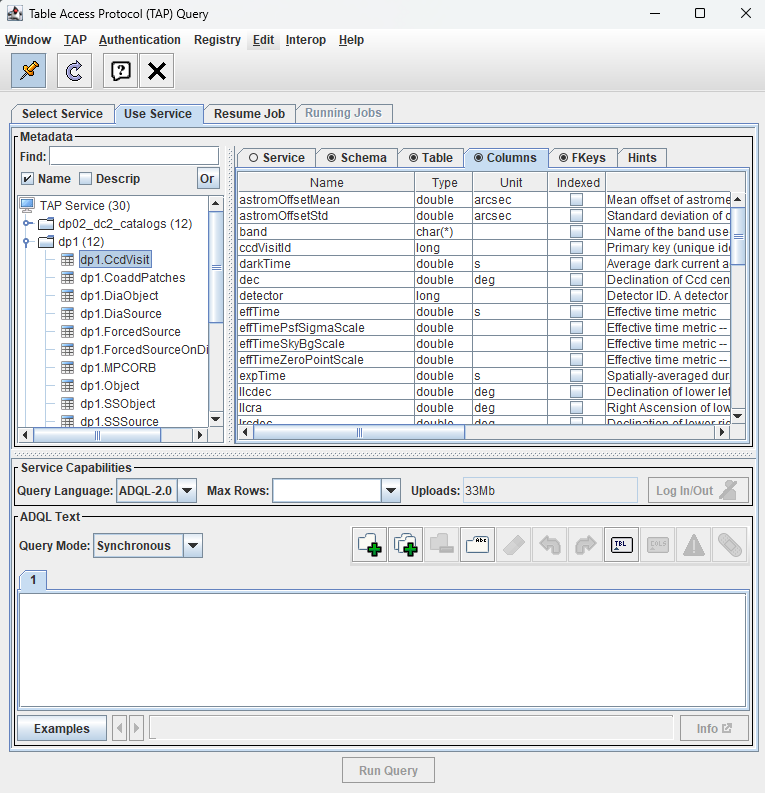
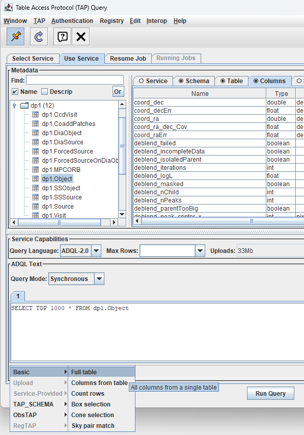

.. _api-101-3:

##########################################
101.3. How to plot a Histogram with TOPCAT
##########################################

For the API Aspect of the Rubin Science Platform at data.lsst.cloud.

**Data Release:** DP1

**Last verified to run:** 2025-01-15

**Learning objective:** This tutorial provides a basic guide to plotting data within `TOPCAT <http://www.star.bris.ac.uk/~mbt/topcat/>`_
and to explore DP1.

**LSST data products:** The DP1 catalogs within th Rubin Science Platform (RSP) Table Access Protocol (TAP) service.

**Credit:** Based on tutorials developed by the Rubin Community Science team. Please consider acknowledging them if this
tutorial is used for the preparation of journal articles, software releases, or other tutorials.

**Get Support:** Everyone is encouraged to ask questions or raise issues in the `Support Category <https://community.lsst.org/c/support/6>`_
of the Rubin Community Forum. Rubin staff will respond to all questions posted there.

**1. Open TOPCAT and access DP1 Data.**
See API Tutorial 101-1 for instructions on how to access Rubin DP1 data with TOPCAT.

**2. In the left Metadata panel of the Table Access Protocol (TAP) Query window, click on the dp1.Object table.**

	  It appears the same as in Figure 4, but the dp1.Object table is highlighted
	  in the left-hand Metadata panel and the column names, data types, units, and
	  descriptions for the columns in the dp1.Object table are shown in the
	  right-hand Metadata panel.

    Figure 1:  xxx

**3. Explore sample ADQL queries.**

Within the ADQL Text panel of the Table Access Protocol (TAP) Query window, select the Examples button located at the lower left and choose Full Table from the Basic menu.
A sample ADQL query will then be displayed in the text box. Figure 6 demonstrates a query that retrieves the top 1000 entries from the dp1.Object table.

This type of query is generally not recommended for routine use, as some tables contain a large volume of data.
The queries provided in the Examples menu are intended as starting templates and should be adapted within the ADQL text box to meet specific requirements,
or replaced with a predefined query (such as the one presented in Step 9).

	  It appears the same as in Figure 5, but the Example button has been clicked
	  and the Full Table menu item from the Basic menu item has been chosen and
	  highlighted.

    Figure 6:  The Table Access Protocol (TAP) Query window as in Figure 5, with
    the Full Table menu item from the Basic menu item chosen after clicking on
    the Examples button at the bottom of the ADQL Text panel.

**9. Avoid full-table queries. Construct a specific query to access information from the dp1.Object table.**

Because the dp1.Object table is large, it is good practice to always include spatial constraints and only retrieve necessary columns.

Search for objects within 0.5 degrees of the center of the Extended Chandra Deep Field South (ECDFS) field, RA, Dec =  53.13, 28.10 and retrieve g-band and r-band PSF magnitudes.
Copy the code block below and paste it into the ADQL text box, then click Run Query.

.. code-block:: sql

  SELECT objectId, coord_ra, coord_dec,
         g_psfMag, r_psfMag
  FROM dp1.Object
  WHERE CONTAINS(
            POINT('ICRS', coord_ra, coord_dec),
            CIRCLE('ICRS', 53.13, -28.10, 0.5)
        ) = 1
    AND g_psfMag IS NOT NULL
    AND r_psfMag IS NOT NULL

