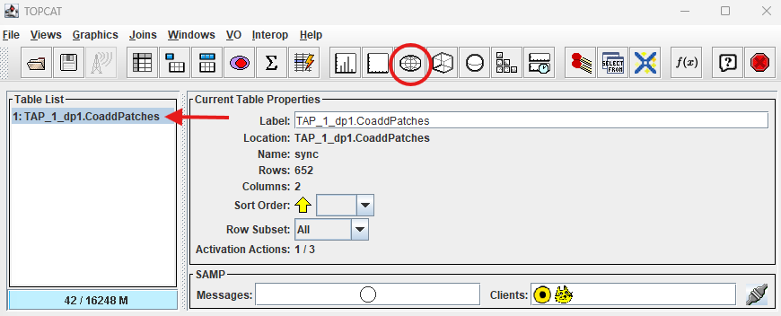
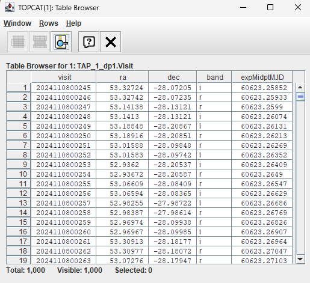
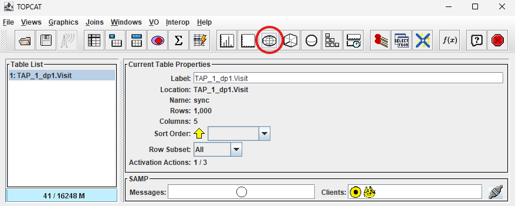
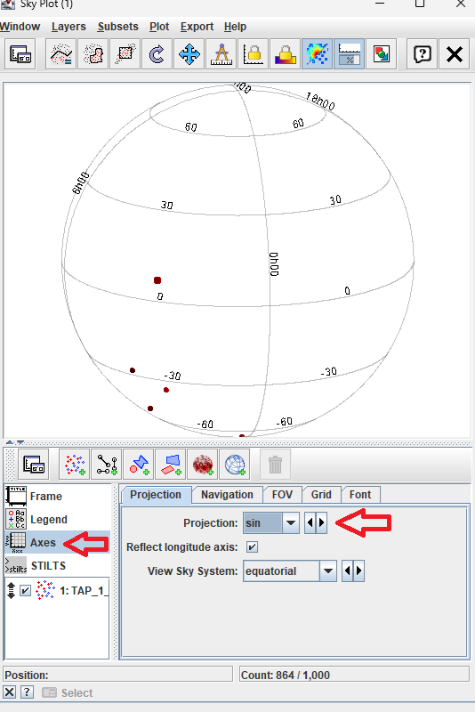
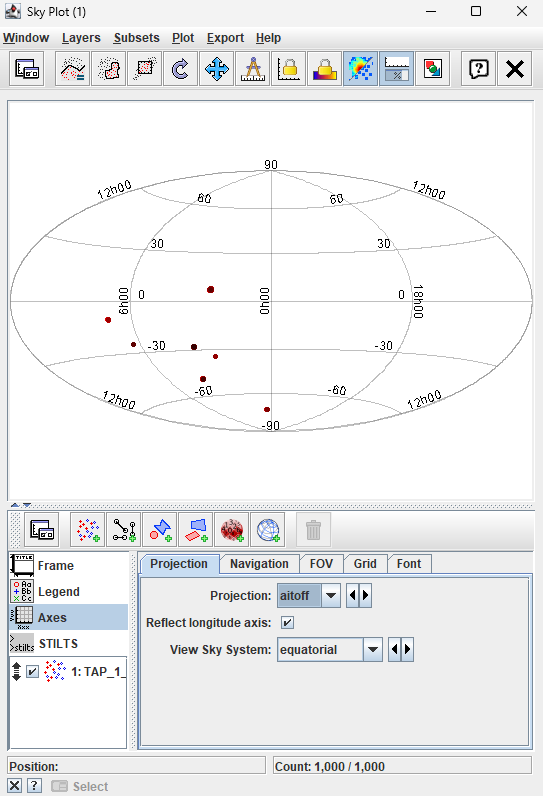
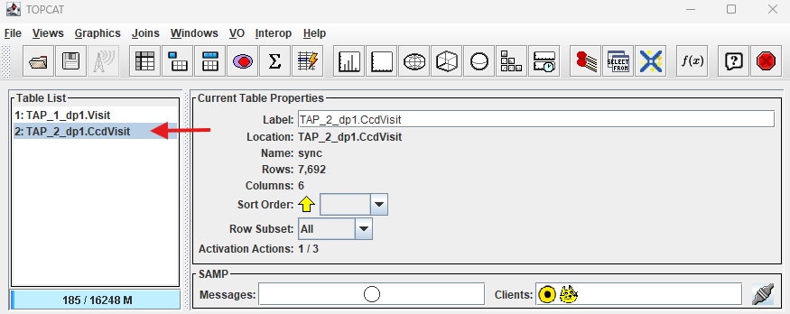
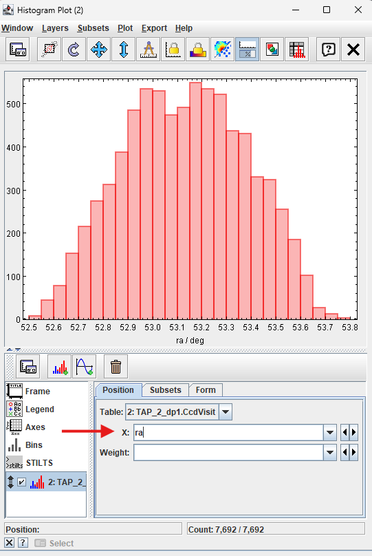
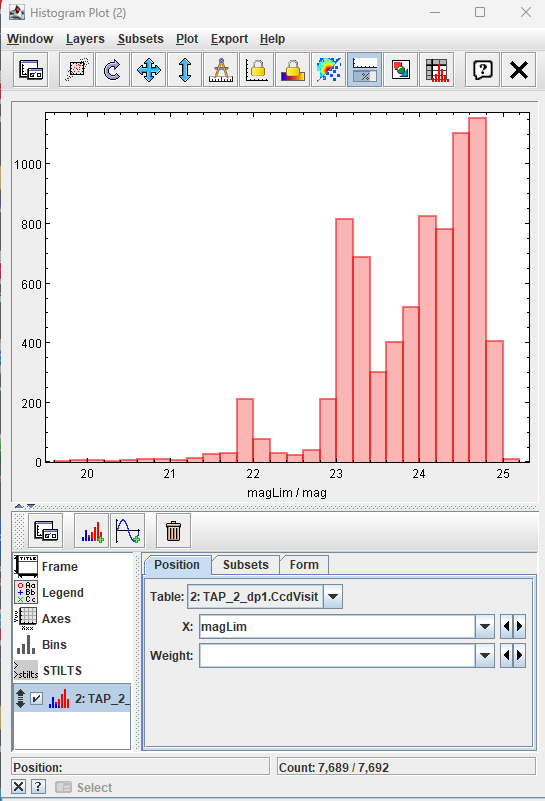
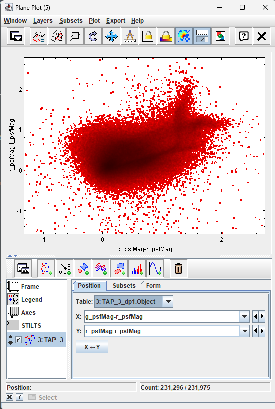

.. _api-101-3:

##############################
101.3. How to plot with TOPCAT
##############################

For the API Aspect of the Rubin Science Platform at data.lsst.cloud.

**Data Release:** DP1

**Last verified to run:** 2026-01-28

**Learning objective:** This tutorial provides a basic guide to plotting data within `TOPCAT <http://www.star.bris.ac.uk/~mbt/topcat/>`_
and to explore DP1.

**LSST data products:** The DP1 catalogs within the Rubin Science Platform (RSP) Table Access Protocol (TAP) service.

**Credit:** Based on tutorials developed by the Rubin Community Science team. Please consider acknowledging them if this
tutorial is used for the preparation of journal articles, software releases, or other tutorials.

**Get Support:** Everyone is encouraged to ask questions or raise issues in the `Support Category <https://community.lsst.org/c/support/6>`_
of the Rubin Community Forum. Rubin staff will respond to all questions posted there.

**1. Open TOPCAT and access DP1 Data.**
See API Tutorial 101-1 for instructions on how to access Rubin DP1 data with TOPCAT.

**2. Create DP1 Skymap**

Access the "dp1.CoaddPatches" table to create a skymap of Data Preview 1 visits.

**2.1 Use TAP Query window**

After starting TOPCAT and accessing the Rubin DP1 data through the VO protocol, where you add your credentials, click on "dp1.CoaddPatches" table.
Notice tabs in the right-hand window.  Click on "Columns" to see a description of each of the columns in this table.

.. figure:: images/api-103-1-1.png
    :name: api-103-1-1
    :alt: A screenshot of Table Access Protocol (TAP) Query window.
	  TOPCAT window to add ADQL query.

    Figure 1:  TAP Query window with dp1.CoaddPatches table selected, column descriptions visible, and ADQL query in ADQL Text box.

**2.2 Run ADQL query**

Within the ADQL Text panel of the Table Access Protocol (TAP) Query window, copy the ADQL query below and paste into the ADQL text window, then click "Run Query".

**NOTE: It is recommended to construct a TAP query using spatial constraints,
but his query has been limited to the top 1000 entries to reduce the amount of time required to retrieve results.**

.. code-block:: sql

  SELECT TOP 1000
       visit, ra, dec, band, expMidptMJD
  FROM dp1.Visit

Click on "Display table cell data" to view the data returned from the query.

    Figure 2:  Results window from query.

**2.3 Review table.**

Table with 1000 entries: visit number, RA, DEC, band and expMidptMJD values.

    Figure 3:  Data returned from query.

**2.4 Create Skymap of DP1 fields using the Sky plotting window and Aitoff projection**

To create a Skymap of data returned from the query, click on the "Sky plotting window".

    Figure 4:  Window before selecting "aitoff" project.

The default plot shows the seven fields contained in Data Preview 1 on a rotating globe.
Click on "Axes", then select "aitoff" from the "Projection" drop-down menu to change the skymap.

    Figure 5:  Skymap of dp1 fields on rotating globe.

This plot shows the seven fields on an "aitoff" projection.

    Figure 6:  Skymap of dp1 fields on aitoff projection.

**3. Create Histogram of dp1.CCDVisit table limiting magnitude in the ECDFS field**

Create a histogram in TOPCAT by using the Histogram button.

**3.1 Run ADQL query on dp1.Object table and plot histogram**

Copy the ADQL query below, add it to the window in the "ADQL Text" box (see Figure 1) and click "Run Query".

.. code-block:: sql

  SELECT visitId, ra, dec, band, seeing, magLim
    FROM dp1.CcdVisit
  WHERE CONTAINS(POINT('ICRS', ra, dec),CIRCLE('ICRS', 53.16, -28.1, 1.0))=1

Notice a new table (red arrow) is available in the TOPCAT window.  Select the table button to review the contents. Click the histogram button (red circle) to create a histogram.

    Figure 7:  New table from dp1.CCDVisit query.

**3.2 Plot Histogram**

In the "Histogram Plot" window, select "magLim" from the "X:" drop-down menu.

    Figure 8:  Initial histogram with "ra/deg" on the x-axis.

Histogram of magLim for the ECDFS field in dp1.CCDVisit table.

    Figure 9:  Histogram of "magLim" for the ECDFS field.

**4. Create Color-Color Diagram (CCD) with TOPCAT**

Create a CCD in TOPCAT by using the "Plane plotting window".

**4.1 Run query**

Copy the following query into the "ADQL Text" box in the TAP Query window (see figure 1), then click "Run Query".

.. code-block:: sql

  SELECT coord_ra, coord_dec,
         g_psfMag, i_psfMag, r_psfMag,
         g_cModelMag, i_cModelMag, r_cModelMag,
         g_psfFlux, g_psfFLuxErr,
         r_psfFlux, r_psfFLuxErr,
         i_psfFlux, i_psfFLuxErr,
         refExtendedness
  FROM dp1.Object
  WHERE CONTAINS(POINT('ICRS', coord_ra, coord_dec), CIRCLE('ICRS', 53, -28, 1))=1
        AND g_psfFlux/g_psfFluxErr > 5
        AND r_psfFlux/r_psfFluxErr > 5
        AND i_psfFlux/i_psfFluxErr > 5

**4.2 Create CCD**

Click on the "Plane plotting window" (icon next to the "Histogram" icon in Figure 7), add "g_psfMag-r_psfMag" in the "X:" selection box and "r_psfMag-i_psfMag" in the "Y:" box.
Put the cursor over the highest concentration of stars and zoom in to view  details.

    Figure 10:  Color-Color Diagram of ECDFS field.

