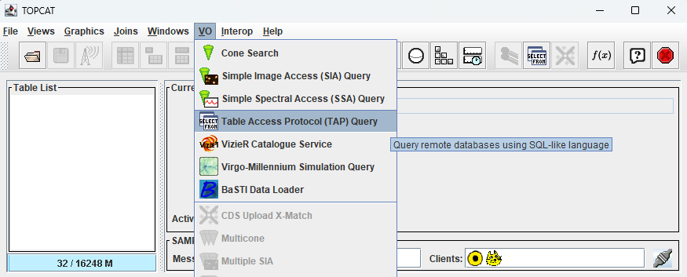
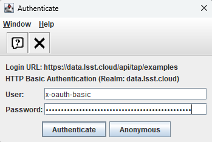
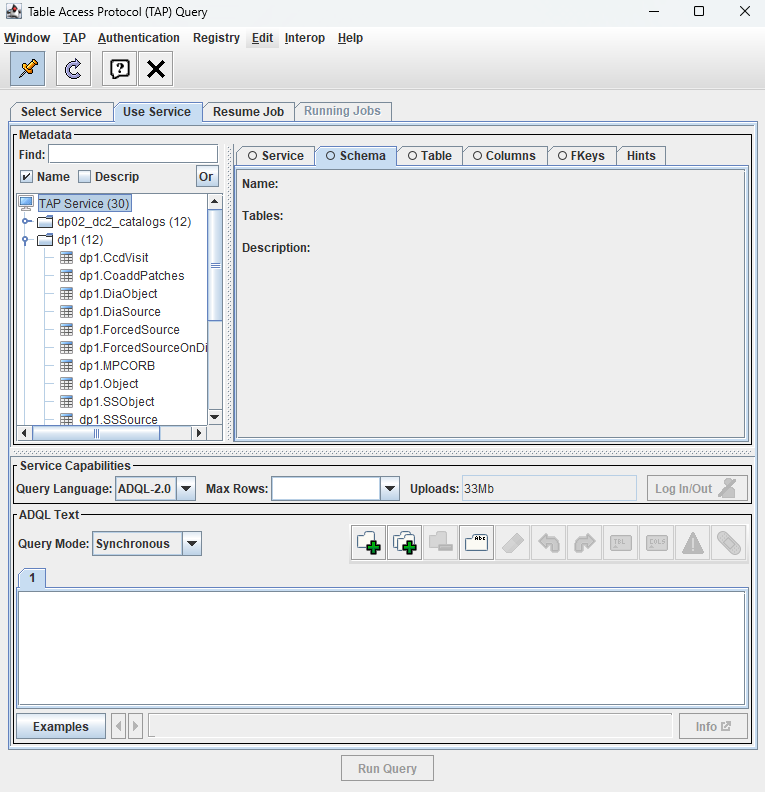
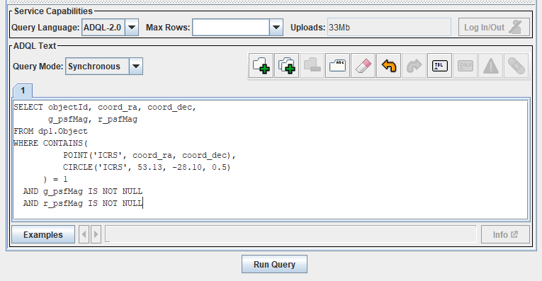
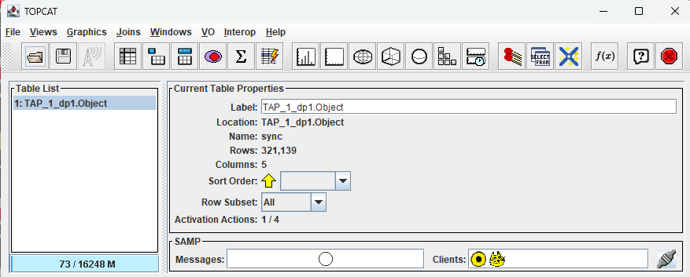
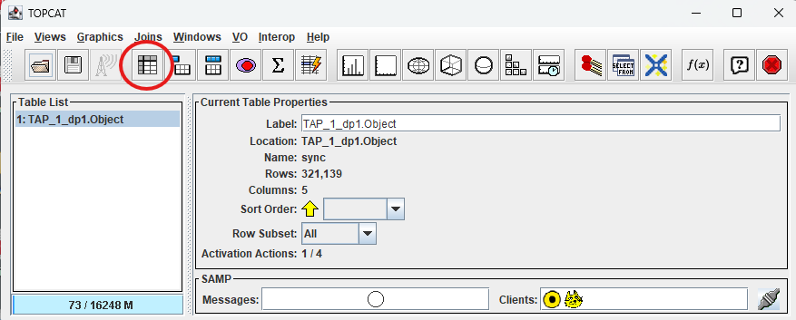
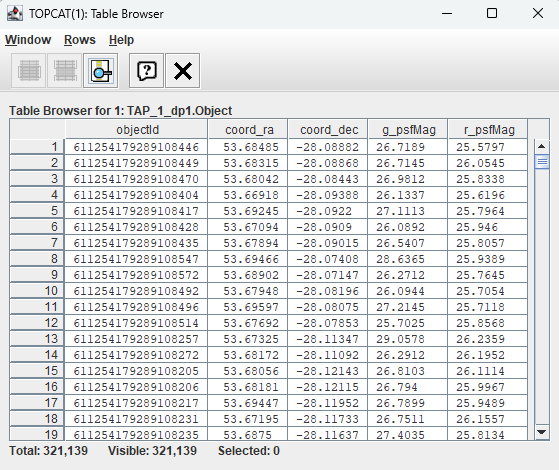

.. _api-es-101-1:

#####################################
101.1. Cómo empezar a utilizar TOPCAT
#####################################

Para la Faceta API de la Plataforma Científica de Rubin en data.lsst.cloud.

**Divulgación de Datos:** DP1

**Última verificación de ejecución:** 2025-06-06

**Objetivo de aprendizaje:** Este tutorial proporciona una guía básica para configurar `TOPCAT <http://www.star.bris.ac.uk/~mbt/topcat/>`_
para explorar DP1.

**Productos de datos LSST:** Los catálogos DP1 dentro del servicio de Protocolo de Acceso a Datos Tabulados (TAP, Table Access Protocol) de la Plataforma Científica de Rubin (RSP).

**Créditos:** Basado en tutoriales desarrollados por el equipo científico de la comunidad de Rubin. Por favor, considerar reconocer su trabajo si este
tutorial se utiliza para la preparación de artículos de revistas, lanzamientos de software u otros tutoriales.

**Soporte:** Se invita a toda la comunidad a hacer preguntas o plantear problemas en la `Categoría de asistencia <https://community.lsst.org/c/support/6>`_
del Foro de la Comunidad de Rubin. El equipo de Rubin responderá a todas las preguntas publicadas allí.

**1. Crear un token de acceso RSP.**
Consultar la página web sobre `Creación de tokens de usuario <https://rsp.lsst.io/guides/auth/creating-user-tokens.html>`_
para obtener una guía paso a paso sobre cómo crear un token de acceso RSP. Se recomienda que el token que cree tenga las
siguientes propiedades: un nombre que incluya "TOPCAT" como parte del mismo ("Token name"), permisos correspondientes a ``read:tap`` en la sección "Token scopes"
y sin fecha de caducidad. El token sólo será visible una vez.
*Se debe copiar y pegar el token en un archivo seguro para su uso en el futuro.*
No es necesario contar con un nuevo token para cada sesión de TOPCAT; el token se puede reutilizar, pero debe mantenerse seguro.

.. Importante::
    **Tener en cuenta que los tokens deben tratarse como contraseñas: no deben compartirse con otras personas.
    Se deben tomar precauciones para mantener los tokens seguros. Nunca se deben almacenar tokens en archivos indexados por git.**

**2. Iniciar TOPCAT en una computadora personal.**
Consultar la `página web de TOPCAT <http://www.star.bris.ac.uk/~mbt/topcat/>`_ para obtener instrucciones de descarga e instalación.

**3. Hacer clic en "Table Access Protocol (TAP) Query" (Consulta del Protocolo de Acceso a Datos Tabulados, TAP) en el menú "VO".**
Se abrirá una ventana independiente de consulta del Protocolo de Acceso a Datos Tabulados (TAP Query).

      resaltado por el cursor en el menú desplegable "VO".

    Figura 1: La ventana principal de TOPCAT, con el menú "VO" desplegado y la opción de consulta del Protocolo de Acceso a Datos Tabulados ("Table Access Protocol (TAP) Query") resaltada.

**4. Rellenar el campo pertinente "TAP URL" en la ventana y hacer clic en el botón "Use Service" (Usar servicio) en la ventana de Consulta del Protocolo de Acceso a Datos Tabulados (TAP Query).**
Para DP1, utilizar ``https://data.lsst.cloud/api/tap``.

.. figure:: images/api-101-1-2.png
    :name: api-es-101-1-2
    :alt: Captura de pantalla de la ventana de Consulta del Protocolo de Acceso a Datos Tabulados (TAP Query) en la que se ha rellenado el valor
      de la URL TAP con la URL
      https://data.lsst.cloud/api/tap . Un óvalo azul indica la ubicación del
      panel Servicio TAP seleccionado en la ventana (Selected TAP Service).

    Figura 2: Ventana de Consulta del Protocolo de Acceso a Datos Tabulados (TAP Query) con la ubicación del panel "Servicio TAP seleccionado" (Selected TAP Service) indicada por un óvalo azul.

**5. Completar la ventana de Autenticación que aparece.**
Rellenar ``x-oauth-basic`` en "User" (Usuario) y el token de seguridad en "Password" (Contraseña) y hacer clic en "OK".

      y la contraseña se muestra (por motivos de seguridad) como una serie de círculos negros rellenos.

    Figura 3: Ventana de Autenticación con los campos "User" (Usuario) y "Password" (Contraseña) completados.

**6. Observar que ahora se puede acceder al servicio RSP TAP desde la instancia propia de TOPCAT.**
Un indicador de que el servicio ya está accesible es que ha aparecido una lista de tablas DP1 disponibles en el panel de Metadatos (Metadata) de la ventana de Consulta TAP (TAP Query).

      La ventana de Consulta del Protocolo de Acceso a Datos Tabulados (TAP Query) muestra tres paneles, apilados verticalmente. El
      panel superior es el panel de Metadatos, y muestra una lista de esquemas y tablas DP1 que
      están disponibles para consultar. El panel central es el panel de Capacidades del Servicio (Service Capabilities), que muestra que
      el lenguaje de consulta disponible es ADQL-2.0. El panel inferior es el panel de Texto ADQL (ADQL Text), que
      indica que el Modo actual es Sincrónico (Synchronous); el cuadro de texto del panel inferior está vacío actualmente.

    Figura 4: Ventana de consulta del protocolo de acceso a datos tabulados (TAP Query); en el panel de metadatos
    se puede ver una lista de tablas DP1 disponibles para consulta.

**7. En el panel izquierdo de Metadatos (Metadata) de la ventana de Consulta del Protocolo de Acceso a Datos Tabulados (TAP Query), hacer clic en la tabla dp1.CcdVisit.**
Se debe tener en cuenta que los nombres de las columnas, los tipos de datos, las unidades y las descripciones de las columnas de la tabla dp1.CcdVisit se muestran en el panel derecho.

.. figure:: images/api-101-1-5.png
    :name: api-es-101-1-5
    :alt: Captura de pantalla de la ventana de Consulta del Protocolo de Acceso a Datos Tabulados (TAP Query).
      Se muestra igual que en la Figura 4, pero la tabla dp1.CcdVisit está resaltada
      en el panel de Metadatos de la izquierda y los nombres de las columnas, los tipos de datos, las unidades y las
      descripciones de las columnas de la tabla dp1.CcdVisit se muestran en el
      panel de Metadatos de la derecha.

    Figura 5: La ventana de Consulta del Protocolo de Acceso a Datos Tabulados (TAP Query) como en la Figura 4, pero aquí
    la tabla dp1.CcdVisit aparece resaltada en el panel de Metadatos de la izquierda y los
    nombres de columna, tipos de datos, unidades y descripciones de las columnas de la tabla dp1.CcdVisit
    se muestran en el panel de Metadatos de la derecha.

**8. En la parte inferior izquierda del panel de Texto ADQL (ADQL Text) de la ventana de Consulta del Protocolo de Acceso a Datos Tabulados (TAP Query), hacer clic en el botón "Examples" (Ejemplos) y seleccionar la opción "Full Table" en el menú Basic (Básico) para acceder a la tabla completa.**

.. figure:: images/api-101-1-6.png
    :name: api-es-101-1-6
    :alt: Captura de pantalla de la ventana de Consulta del Protocolo de Acceso a Datos Tabulados (TAP Query).
      Se muestra igual que en la Figura 5, pero se ha hecho clic en el botón Examples (Ejemplos)
      y se ha seleccionado y resaltado la opción "Full Table" (Tabla completa) del menú Basic (Básico).

    Figura 6: La ventana de Consulta del Protocolo de Acceso a Datos Tabulados (TAP Query) como en la Figura 5, con
    la opción "Full Table" (Tabla completa) del menú Basic (Básico) seleccionada después de hacer clic en
    el botón de Ejemplos (Examples) en la parte inferior del panel de Texto ADQL (ADQL Text).

**9. Observar que la consulta ADQL de ejemplo seleccionada aparece ahora en el cuadro de Texto ADQL (ADQL Text) de la ventana de Consulta del Protocolo de Acceso a Datos Tabulados (TAP Query). Ejecutar la consulta haciendo clic en el botón "Run Query" situado en la parte inferior de esta ventana.**

      Se muestra igual que en la Figura 5, pero la consulta ADQL de ejemplo seleccionada
      ahora aparece en el cuadro de Texto ADQL (ADQL Text).

    Figura 7: La ventana de Consulta del Protocolo de Acceso a Datos Tabulados (TAP Query) como en la Figura 5, con
    la consulta ADQL de ejemplo seleccionada que ahora aparece en el cuadro de Texto ADQL (ADQL Text).

**10. Observar que ha aparecido una nueva tabla, TAP_1_dp1.CcdVisit, en el panel Lista de Tablas (Table List) de la ventana principal de TOPCAT.**

      1. Una fila de íconos en la parte superior de la ventana. 2. Un panel Lista de Tablas a la izquierda
      de la ventana; que actualmente muestra una tabla, llamada TAP_1_dp1.CcdVisit,
      y está resaltada. 3. Un panel de Propiedades de la Tabla Actual (Current Table Properties) a la derecha de la ventana.
      4. Un pequeño panel SAMP justo debajo del panel de Propiedades de la Tabla Actual.

    Figura 8: La ventana principal de TOPCAT con una nueva tabla, TAP_1_dp1.CcdVisit, que aparece en el panel Lista de Tablas (Table List).

**11. Buscar la tabla de resultados en el panel "Lista de Tablas" (Table List) de la ventana principal de TOPCAT y, a continuación, mostrar los datos de las celdas de la tabla haciendo clic en el ícono "Display table cell data".**
Es el cuarto ícono desde la izquierda en la fila de íconos situada en la parte superior de la ventana principal de TOPCAT (tiene el aspecto de una tabla con la primera fila y la primera columna sombreadas en gris).

      1. Una fila de íconos en la parte superior de la ventana. 2. Un panel Lista de Tablas a la izquierda
      de la ventana; que actualmente muestra una tabla, llamada TAP_1_dp1.CcdVisit,
      y está resaltada. 3. Un panel de Propiedades de la Tabla Actual (Current Table Properties) a la derecha de la ventana.
      4. Un pequeño panel SAMP justo debajo del panel de Propiedades de la Tabla Actual.
      El ícono "Display table cell data" (Mostrar datos de las celdas de la tabla) se indica con un círculo azul.

    Figura 9: Igual que en la Figura 8, pero con el ícono "Display table cell data" (Mostrar datos de las celdas de la tabla) indicado con un círculo azul.

**12. Ver el contenido de la ventana del Navegador de Tablas TOPCAT que se ha abierto (TOPCAT Table Browser).**
Esta tabla en particular contiene 1000 filas y 51 columnas. Las barras de desplazamiento vertical y horizontal de esta ventana permiten ver el contenido completo de la tabla.

      denominada TAP_1_dp1.CcdVisit.

    Figura 10: La ventana del Navegador de Tablas (Table Browser), que muestra el contenido de la tabla recién creada.

**13. Explorar.**
En esta etapa, el conjunto de datos Rubin DP1 se puede explorar más a fondo mediante TOPCAT. En un futuro tutorial
se mostrará cómo graficar los datos Rubin DP1 con las funciones de gráficos de TOPCAT.
