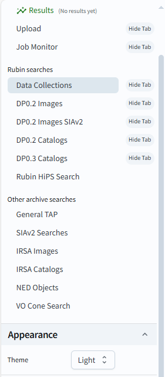

.. _portal-101-1:

#######################################
101.1. Navigate the user interface (UI)
#######################################

For the Portal Aspect of the Rubin Science Platform (RSP) at data.lsst.cloud.

**Data Release:** Data Preview 1

**Last verified to run:** 2025-06-16

**Learning objective:** Navigate the main components of the Portal's user interface (UI).

**LSST data products:** N/A

**Credit:** Originally developed by the Rubin Community Science team.
Please consider acknowledging them if this tutorial is used for the preparation of journal articles, software releases, or other tutorials.

**Get Support:** Everyone is encouraged to ask questions or raise issues in
the `Support Category <https://community.lsst.org/c/support/6>`_ of the Rubin Community Forum.
Rubin staff will respond to all questions posted there.

----

**1. Log in to the RSP.**
In a web browser go to the RSP using the URL `data.lsst.cloud <https://data.lsst.cloud/>`_.
On the RSP landing page (Figure 1), if "Log in" appears at upper right instead of your username, click "Log in" and follow the prompts to authenticate.

.. figure:: images/portal-101-1-1.png
    :name: portal-101-1-1
    :alt: The main landing page of the Rubin Science Platform, showing log in at upper right and three panels, one for each aspect: the Portal the Notebooks and the API.

    Figure 1: The main landing page of the Rubin Science Platform.

**2. Enter the Portal.**
On the RSP landing page (Figure 1) click on the Portal square to enter the Portal Aspect.

    Figure 2: The main landing page of the Portal Aspect.

On the Portal landing page (Figure 2) the default selected tab of the landing page is labeled Results.
Elements of the landing page:

- **A** - Rubin Portal sidebar menu (Figure 4) - select searches or reconfigure displayed tabs
- **B** - Rubin Logo (Figure 3) - display portal version information
- **C** - Results tab - return to query results
- **D** - Portal search tabs - refine search parameters for images, catalogs and general TAP

**3. Determine Rubin Portal version information.**

Click on the Rubin Logo (Figure 3) to view information related to the Rubin Portal and Firefly versions.

.. figure:: images/portal-101-1-3.png
    :name: portal-101-1-3
    :alt: Rubin Portal Version Information

    Figure 3: Rubin Portal Version Information.

**4. Open the sidebar menu.**
On the Portal landing page (Figure 2) click on the menu icon (three horizontal lines at upper left) to open the sidebar menu.

    Figure 4: The sidebar menu of the Portal Aspect.

**5. Review the sidebar menu.**
In the sidebar menu (Figure 4) notice that some of the menu options match the tabs (e.g., Data Collections),
and which tabs you see are configurable with the "Hide Tab" option. Opening this menu will allow you to navigate to a tab,
add a tab to the platform interface, or hide a tab from the interface. You can also reset options from this menu.
A description of each of the sidebar menu options is listed below.
Dismiss the sidebar menu by clicking on the X in the upper right corner of the menu.

- **Tab Selection:** Customize tabs displayed on the Rubin Portal.
- **Results:** Click on the Results tab to return to the results window.
- **Upload:** Allows you to upload a file.
- **Job Monitor:** Lists jobs associated with your user account.
- **Data Collections:** Select data collection for analysis within the Portal.
- **DP0.2 Images:** Simulated images from DP0.2.
- **DP0.2 Images SIAv2:** Simple Image Access Version 2.
- **DP0.2 Catalogs:** Catalogs for DP0.2.
- **DP0.3 Catalogs:** Catalogs for DP0.3.
- **Rubin HiPS Search:** Select image, target and dataset.
- **General TAP:** Search for coordinates, timeframe and objects.
- **SIAv2 Searches:** Simple Image Access search.
- **IRSA Images:** Search various data sets for images.
- **IRSA Catalogs:** Search various data sets for catalog objects.
- **NED Objects:** Search NASA/IPAC Extragalactic Database (NED).
- **VO Cone Search:** Virtual Observatory search.
- **Appearance:** Change to Dark/Light mode.

