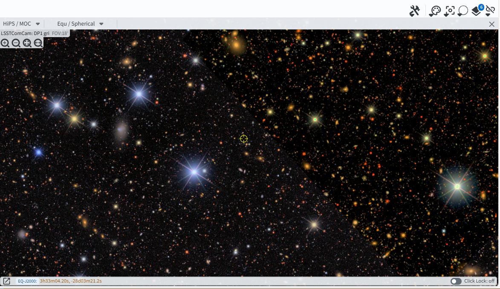

.. _portal-101-2:

###########################
101.2. Browse the HiPS maps
###########################

For the Portal Aspect of the Rubin Science Platform (RSP) at data.lsst.cloud.

**Data Release:** Data Preview 1

**Last verified to run:** 2025-06-28

**Learning objective:** Browse the all-sky color HiPS maps.

**LSST data products:** ``HiPS`` maps

**Credit:** Originally developed by the Rubin Community Science team.
Please consider acknowledging them if this tutorial is used for the preparation of journal articles, software releases, or other tutorials.

**Get Support:** Everyone is encouraged to ask questions or raise issues in the `Support Category <https://community.lsst.org/c/support/6>`_ of the Rubin Community Forum.
Rubin staff will respond to all questions posted there.

----

**1. Go to the RSP and enter the Portal Aspect.**
In a web browser, go to `data.lsst.cloud <https://data.lsst.cloud/>`_, log in and click on the "Portal" panel.

**2. In the sidebar select "Rubin HiPS Search".**
Click on the sidebar menu (three vertical lines in the upper left hand corner) and click on Rubin HiPS Search (Figure 1).

.. figure:: images/portal-101-2-1.png
    :name: portal-101-2-1
    :width: 200
    :alt: Select Rubin HiPS Search from sidebar.

    Figure 1: Select Rubin HiPS Search from sidebar.

**3. Select the target.**
Enter coordinates ``53.13,-28.10``, which are the center of the Extended Chanrda Deep Field South (ECDFS) field, and field of view of ``1`` degree (Figure 2).

    Figure 2: Enter coordinates and field of view.

**4. Select the gri HiPS color map.**
In the "Select Data Set" section, click on the drop down menu for the "Title" column and click in the box next to ``LSSTComCam: DP1 gri`` (Figure 3).

    Figure 3: Select the gri color HiPS map.

**5. Results.**
Results of the search are shown in Figure 4.
Use the scroll features on your mouse or use the zoom in an out buttons
(magnifying glass icons in the upper left-hand corner of the image)
to zoom in and pan around the image.

    Figure 4: The DP1 gri HiPS map centered on the ECDFS field.

