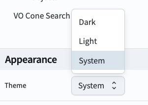

.. _portal-101-3:

##########################
101.3. Switch to dark mode
##########################

For the Portal Aspect of the Rubin Science Platform (RSP) at data.lsst.cloud.

**Data Release:** Data Preview 1

**Last verified to run:** 2025-06-16

**Learning objective:** Switch the color theme to dark mode.

**LSST data products:** N/A

**Credit:** Originally developed by the Rubin Community Science team.
Please consider acknowledging them if this tutorial is used for the preparation of journal articles, software releases, or other tutorials.

**Get Support:** Everyone is encouraged to ask questions or raise issues in the `Support Category <https://community.lsst.org/c/support/6>`_ of the Rubin Community Forum.
Rubin staff will respond to all questions posted there.

----

**1. Go to the RSP and enter the Portal Aspect.**
In a web browser, go to `data.lsst.cloud <https://data.lsst.cloud/>`_, click on the "Portal" panel, and log in.

**2. Open the sidebar menu.**
At upper left, click on the "menu" icon (three horizontal bars) to open the sidebar.

**3. Open the Appearance menu.**
At the bottom of the sidebar, click on "Appearance".

**4. Choose "Dark" as the theme.**
Choose to display the Portal in Dark mode, Light mode, or match it to your system settings.

    Figure 1: The Appearance menu in the Portal's sidebar offers Dark mode.
