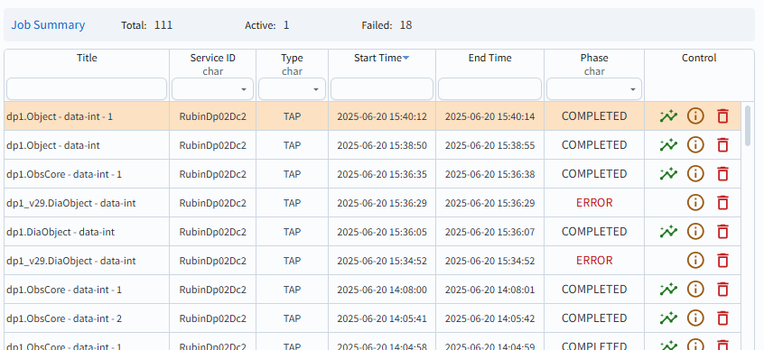
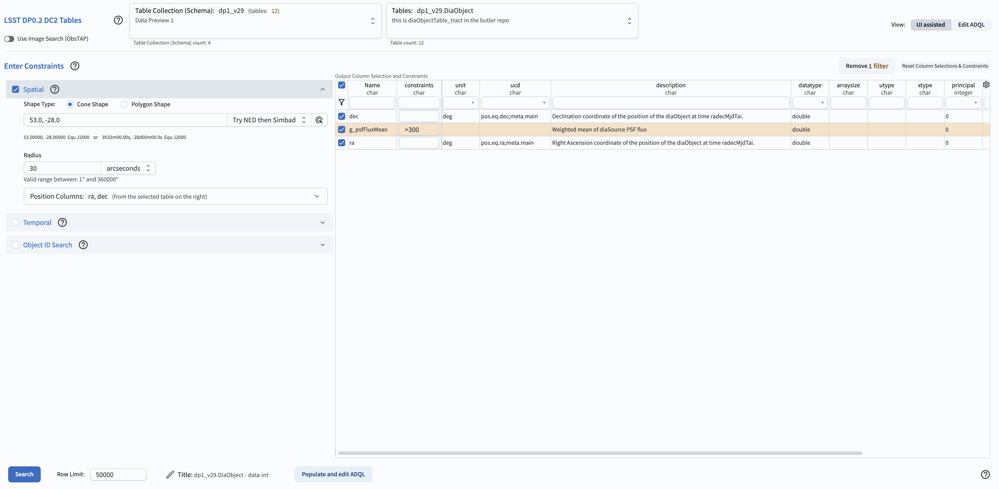
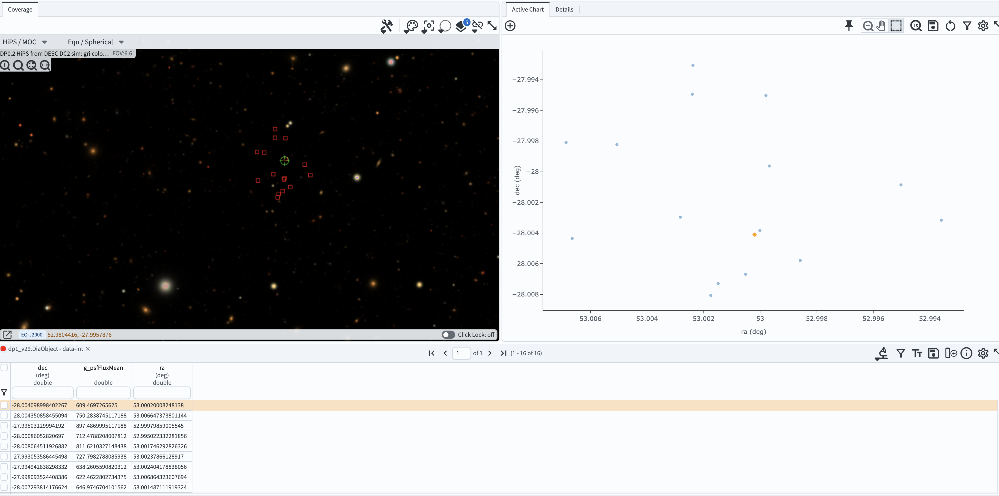
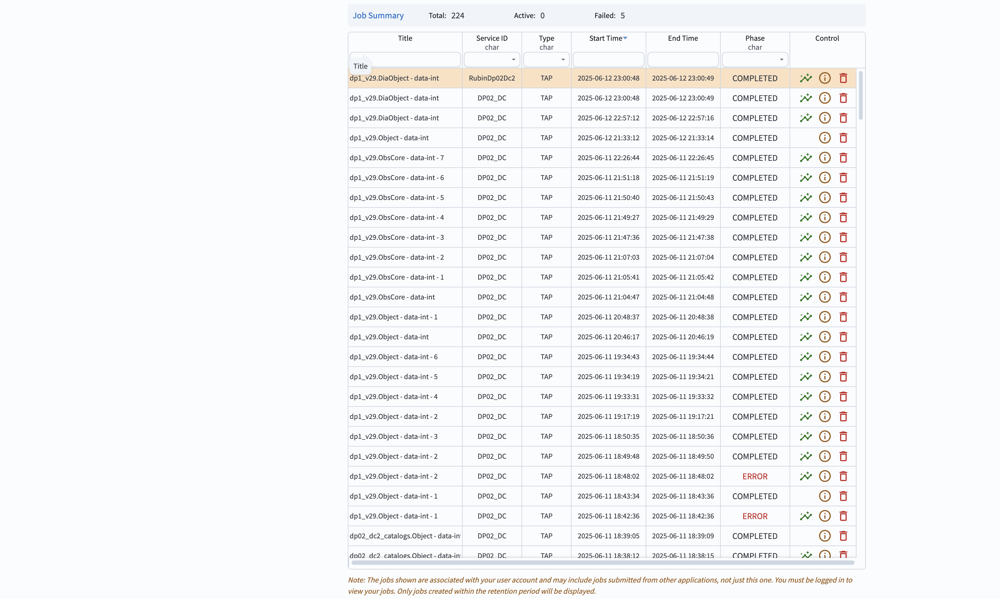
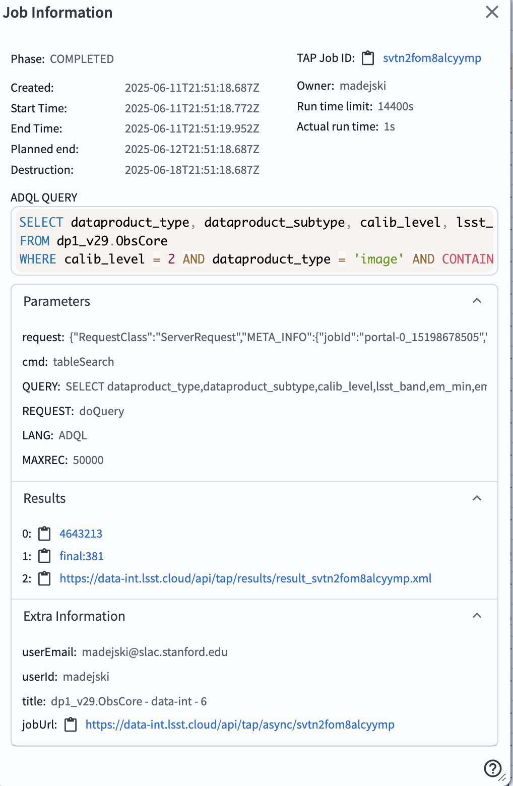

.. _portal-101-4:

#############################################
101.4. Use the query job monitor (get job ID)
#############################################

For the Portal Aspect of the Rubin Science Platform at data.lsst.cloud.

**Data Release:** DP1

**Last verified to run:** 2025-06-12

**Learning objective:** Use the Job Monitor to obtain the status and ID of, and delete, submitted query jobs.

**LSST data products:** ``DiaObject`` table

**Credit:** Originally developed by the Rubin Community Science team. Please consider acknowledging them if this tutorial is used for the preparation of journal articles, software releases, or other tutorials.

**Get Support:** Everyone is encouraged to ask questions or raise issues in the `Support Category <https://community.lsst.org/c/support/6>`_ of the Rubin Community Forum. Rubin staff will respond to all questions posted there.

**1. Go to the RSP.**
In a web browser go to the Rubin Science Platform (RSP) using the URL `data.lsst.cloud <https://data.lsst.cloud/>`_.

    Figure 1: The main landing page of the Rubin Science Platform.

**2. Log in.**
On the RSP landing page (Figure 1), if "Log in" appears at upper right instead of your username, click "Log in" and follow the prompts to authenticate.

**3. Enter the Portal.**
On the RSP landing page (Figure 1) click on the Portal square to enter the Portal Aspect.

.. figure:: images/portal-101-4-2.png
    :name: portal-101-4-2
    :alt: The main landing page of the Portal Aspect, showing tabs across the top and instructions in the middle.

    Figure 2: The main landing page of the Portal Aspect.

**4. Create a sample job.**
For the purpose of this tutorial, create any query using the default UI - an example is given below.

**5.  Example of a sample job.**
Select the "'DP0.2 Catalogs" tab.
Select "dp1_v29" for the "Table Collection (Schema)".
Select "dp1_v29.DiaObject" from the drop-down in the "Tables" tab.
Request a search for all objects in the 30 arc seconds radius around direction RA = 53.0 deg., Dec. = -28.8 deg by entering those parameters in the "Enter Constraints - Spatial".
In the "Output Column Selection and Constraints", check ``dec``, ``ra``, and ``g_psfFluxMean``.
Enter ``>300`` as the constraint for ``g_psfFluxMean``.
Click on the "funnel" on the uper left side of the table to restrict the table to display the selected entries, and/or those where constraints were set.

    Figure 3: The screenshot with the parameters entered for a sample search.

**6. Execute the search.**
Click "Search" on the lower left.

The result of the search will be an image on the upper left, and a table of observations corresponding to your search on the bottom.

    Figure 4: The screenshot with the results of your sample search.

**7.  Examine the job monitor.**
Click on the "Job Monitor" tab on the top.
The job monitor will have all jobs submitted by you (created within the retention period).
The jobs listed are in the chronological order (most recent first).
You can return to any of those jobs by clicking the line corresponding to the particular job.

    Figure 5:  The screenshot illustrating the job monitor.

**8. Learn about individual jobs.**  In the column with a header "control" click on the green "wave" for a job of choice - this will bring you to that job, and if completed - will reveal the results.
Click on the circle with a letter "i" - this will show your search converted to an ADQL query as well as the job ID.

Clicking on the red "garbage can" will delete the job.

An example of informaton for a recent job is in the figure below.

    Figure 6:  The screenshot illustrating information about a recent job, available from the job monitor.
