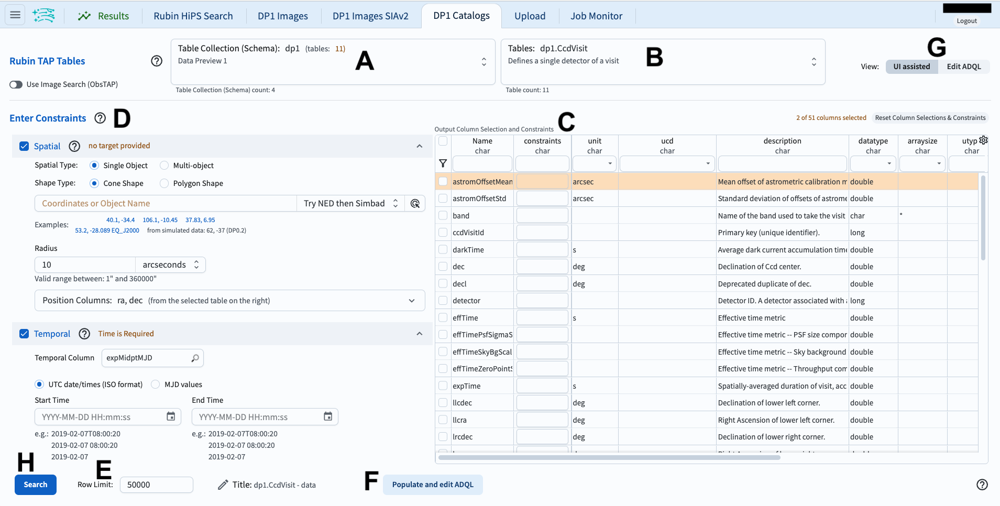
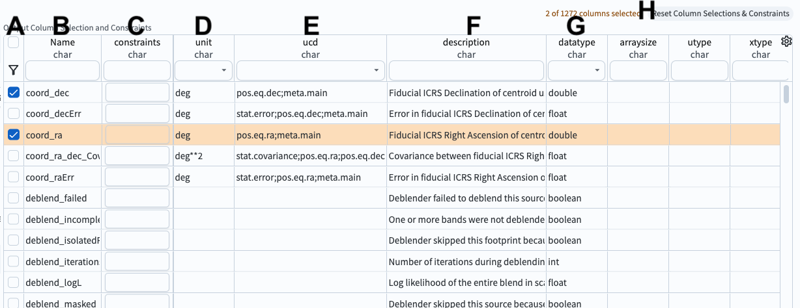
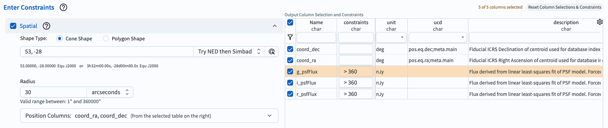

.. _portal-102-1:

#############################
102.1. Query for catalog data
#############################

For the Portal Aspect of the Rubin Science Platform (RSP) at data.lsst.cloud.

**Data Release:** Data Preview 1

**Last verified to run:** 2025-06-16

**Learning objective:** Navigate the main components of the Portal's user interface (UI).

**LSST data products:** ``Object`` table

**Credit:** Originally developed by the Rubin Community Science team.
Please consider acknowledging them if this tutorial is used for the preparation of journal articles, software releases, or other tutorials.

**Get Support:** Everyone is encouraged to ask questions or raise issues in the `Support Category <https://community.lsst.org/c/support/6>`_ of the Rubin Community Forum.
Rubin staff will respond to all questions posted there.

----

**1. Log in to the RSP and enter the Portal Aspect.**
In a web browser go to `data.lsst.cloud <https://data.lsst.cloud/>`_, select the Portal Aspect, and log in.

**2. Select the DP1 Catalogs tab.**
On the Portal landing page, click on the tab labeled "DP1 Catalogs".

**3. Mouse-over for pop-up notes.**
In the "DP1 Catalogs" tab (Figure 1) use the mouse to hover-over the components of the UI and see pop-up explanations of the functionality.

    Figure 1: The Portal User Interface (UI) for querying catalogs.

**4. Review the UI components.**
In the Portal UI (Figure 1) review the 8 main components labeled A through H, which are used together to query (search) and retrieve data.

* A: Drop-down menu of the collections available. The DP1 catalogs are selected by default.
* B: Drop-down menu of the tables available for the selected catalog. The ``Object`` table is selected by default.
* C: Schema interface to apply column constraints on, and select rows to be returned from the selected table.
* D: Entry fields for spatial constraints to be applied to the selected table (e.g., coordinates, cone or polygon areas).
* E: Entry field to set the maximum number of rows to return from the selected table.
* F: Button to convert the search constraints set with C, D, and E into an ADQL statement.
* G: Toggle to switch between this graphical UI and the alternative ADQL UI.
* H: Button to execute the query; to apply the search constraints and retrieve data into the results tab.

    Figure 2: The example schema interface for the ``Object`` table, with two columns selected (``coord_ra``, ``coord_dec``).

**5. Review the schema interface components.**
In the table schema interface (Figure 2) review the 8 components labeled A through H, which are used to apply search constraints on the table data.

* A: Selection boxes. Click a box to include the column in the query. Click the funnel icon to view only selected columns.
* B: Names. Column names are short, descriptive, and unique within a table. Click on "Name" to sort by name.
* C: Constraints. Apply limits on column values by typing in desired constraints (e.g., :math:`>, <, =, !=`).
* D: Units. The units for the values that will be returned.
* E: Unified Content Descriptor (UCD). Vocabulary standards set by the `International Virtual Observatory Alliance <https://www.ivoa.net/>`_.
* F: Descriptions of the column's data.
* G: Data type. E.g., integer (int), double precision (double), boolean.
* H: Button to clear (reset) all column selections and constraints.

**6. Find columns of interest.**
In the table schema interface (Figure 2) notice that the columns are searchable.
Type a word, or use the drop-down menu, at the top of every column to find columns of interest.
For example, in the entry field under "Name" type "Flux" and click "enter" or "return" to see all column names with "Flux" in them.
Clear the entry field and click "enter" or "return" again to see all columns names (all rows of the schema interface).

**7. Enter constraints.**
At left, click on "Spatial" to include spatial constraints (a cone search) centered on RA, Dec = 53, -18 deg.
Limit the radius to 30 arcseconds.
In the table, select the ``coord_ra``, ``coord_dec``, ``g_psfFlux``, ``r_psfFlux``, and ``i_psfFlux`` to return data in those columns.
Add constraints that only objects with fluxes greater than 360 nJy will be returned.
This is an example of a very simple query.

    Figure 3: An example query for the DP1 ``Objects`` catalog set up in the UI.

**8. Click search.**
At lower left, click the blue button named "Search".
This query will return 24 rows of the ``Object`` table.