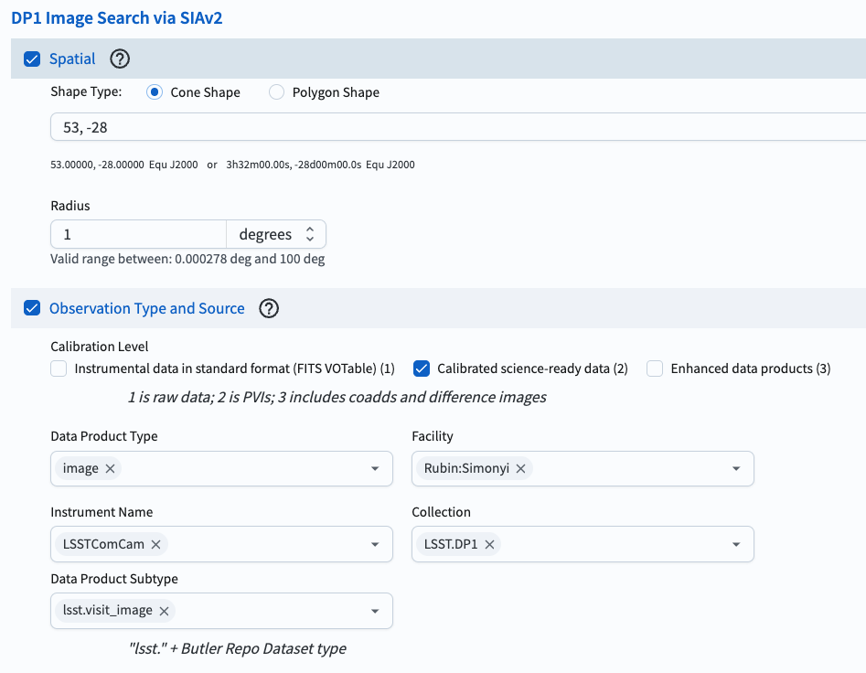
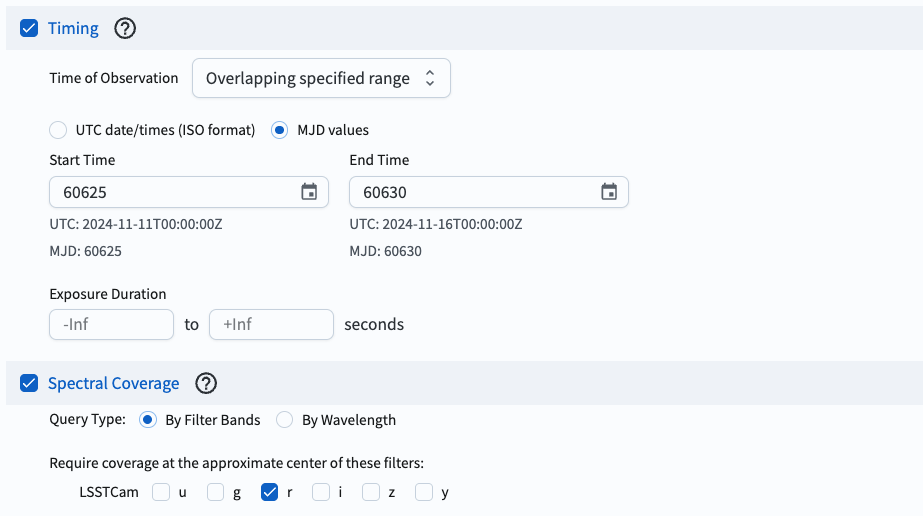
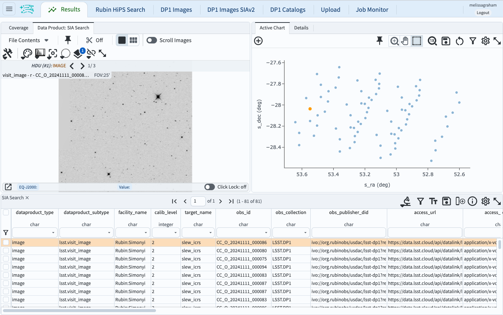

.. _portal-102-2:

##################################
102.2. Query for images with SIAv2
##################################

For the Portal Aspect of the Rubin Science Platform at data.lsst.cloud.

**Data Release:** DP1

**Last verified to run:** 2025-06-28

**Learning objective:** Use the Simple Image Access (SIA) service to query for and retrieve images.

**LSST data products:** ``visit_image``

**Credit:** Originally developed by the Rubin Community Science team.
Please consider acknowledging them if this tutorial is used for the preparation of journal articles, software releases, or other tutorials.

**Get Support:** Everyone is encouraged to ask questions or raise issues in the `Support Category <https://community.lsst.org/c/support/6>`_ of the Rubin Community Forum. Rubin staff will respond to all questions posted there.

----

**1. Log in to the RSP and enter the Portal Aspect.**
In a web browser go to `data.lsst.cloud <https://data.lsst.cloud/>`_, select the Portal Aspect, and log in.

**2. Select the Images SIAv2 tab.**
On the Portal landing page tabs (or from the sidebar menu), click on "DP1 Images SIAv2".

**3. Set the spatial constraints.**
Check the box next to "Spatial".
For "Shape Type" select Cone Shape.
Use the approximate center of the ECDFS field, RA, Dec = 53.0, -28.0 degrees.
Use a radius of 1 degree, about the size of the field.

**4. Set the observation type and source.**
Check the box next to "Observation Type and Source".
Select calibration level 2 (for PVIs: processed visit images),
set the data product type to image, the facility to Rubin:Simonyi,
the instrument name to LSSTComCam, the collection to LSST.DP1,
and the data product subtype to be "lsst.visit_image".

    Figure 1: Setting the constraints on the images' Spatial and Observation Type and Source.

**5. Set the timing.**
Check the box next to "Timing".
For "Time of Observation" select "Overlapping specified range".
Select "MJD values" and enter 60625 for the "Start Time" and 60630 for the "End Time".

**6. Set the spectral coverage (filter).**
Select "Query Type" as by filter bands, and select the r-band.

    Figure 2: Setting the constraints on the images' Timing and Spectral Coverage.

**7. Execute the search.**
Click on the "Search" button at lower left.

**8. Review the results.**
The results interface enables interactive visualization of the 81 visit images which meet the search criteria.

    Figure 3: The image results interface.

Next steps: see the tutorials in the series on manipulating the image results interface.

