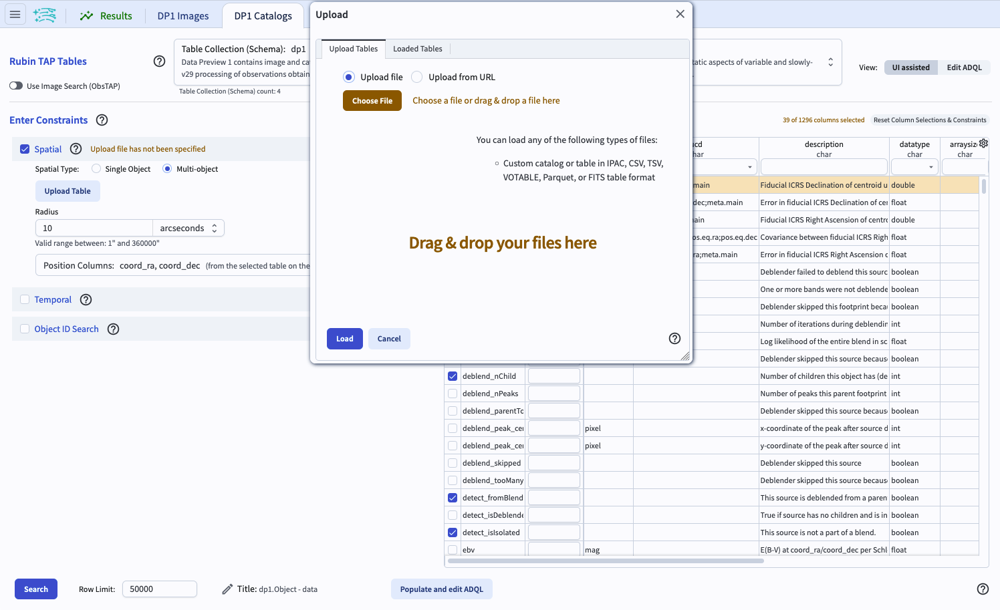
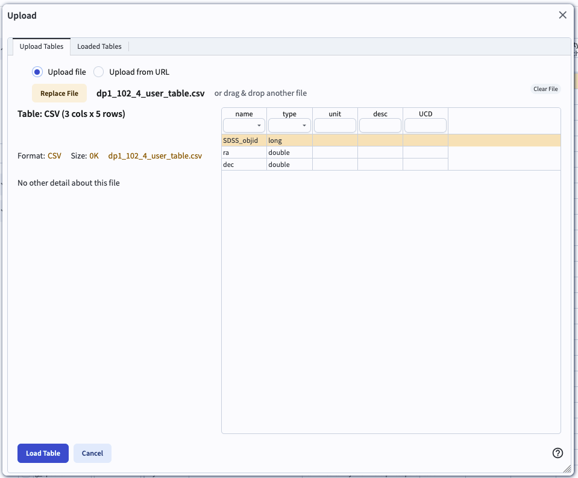
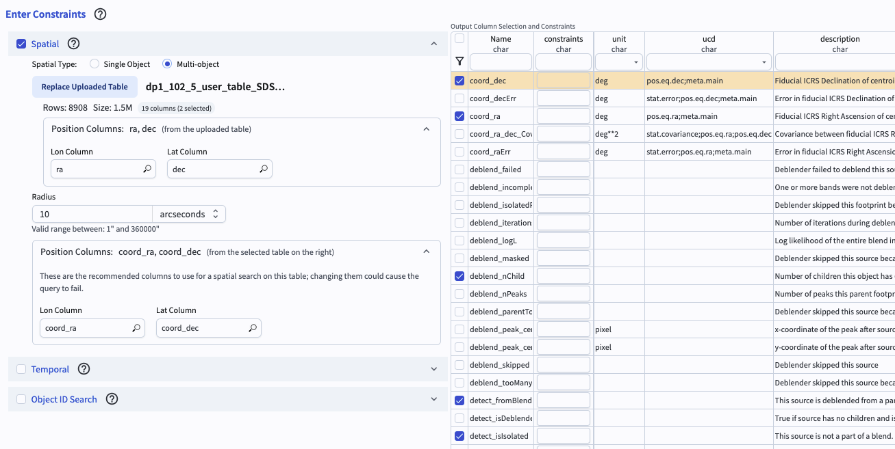

.. _portal-102-4:

#############################
102.4. User table upload and crossmatch
#############################

For the Portal Aspect of the Rubin Science Platform (RSP) at data.lsst.cloud.

**Data Release:** Data Preview 1

**Last verified to run:** 2025-09-05

**Learning objective:** Use user-uploaded tables for cross-matching

**LSST data products:** ``Object`` table

**Credit:** Originally developed by the Rubin Community Science team.
Please consider acknowledging them if this tutorial is used for the preparation of journal articles, software releases, or other tutorials.

**Get Support:** Everyone is encouraged to ask questions or raise issues in the `Support Category <https://community.lsst.org/c/support/6>`_ of the Rubin Community Forum.
Rubin staff will respond to all questions posted there.

----

**1. Log in to the RSP and enter the Portal Aspect.**
In a web browser go to `data.lsst.cloud <https://data.lsst.cloud/>`_, select the Portal Aspect, and log in.

**2. Select the DP1 Catalogs tab.**
On the Portal landing page, click on the tab labeled "DP1 Catalogs".

**3. Enter Constraints.** 
Check the box to the left of the "Spatial" section (uncheck the other two if checked), and click on the "Multi-object" button.

    Figure 1. 

**4. Upload a table to the Portal.** 
Download the file with an example user table to your computer using the `link to file in GitHub containing the catalog <https://github.com/lsst/dp1_lsst_io/tree/main/docs/tutorials/portal/102/>`_. Click on "upload file". 

**5. Load table.** 
After uploading, the pop-up window will show a list of the columns it found, named according to the header. Make sure that the ra and dec columns in the file are labeled "ra" and "dec" and are displayed in the list.  Click the "Load Table" button.

    Figure 2. The interface to upload a table.

**6. Select columns.** 
Click the arrow next to "Position Columns (from the selected table on the right. Indicate which of the DP1 catalog columns to use for the spatial matching. Leave the search radius at the default of 10 arcseconds.

    Figure 3. 

**7. Click search.** 
At lower left, click the blue button named "Search".

.. figure:: images/portal-102-4-4.png
    :name: portal-102-4-4
    :alt: 

    Figure 4.
