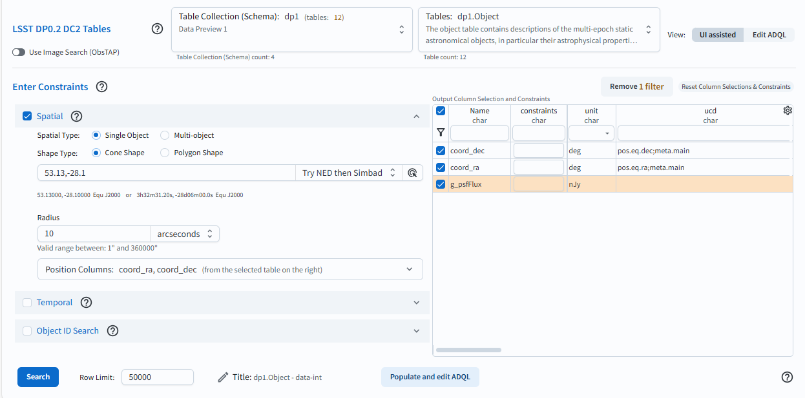
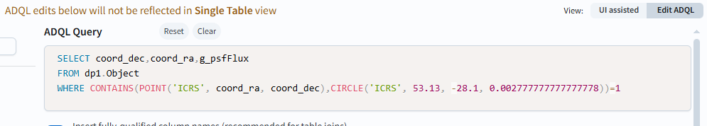

.. _portal-103-1:

#################################
103.1. Convert a UI query to ADQL
#################################

For the Portal Aspect of the Rubin Science Platform at data.lsst.cloud.

**Data Release:** DP1

**Last verified to run:** 2025-06-28

**Learning objective:** Convert a query with constraints into an
`Astronomy Data Query Language (ADQL) <https://www.ivoa.net/documents/latest/ADQL.html>`_ statement.

**LSST data products:** ``Object`` table

**Credit:** Originally developed by the Rubin Community Science team.
Please consider acknowledging them if this tutorial is used for the preparation of journal articles, software releases, or other tutorials.

**Get Support:** Everyone is encouraged to ask questions or raise issues in the `Support Category <https://community.lsst.org/c/support/6>`_ of the Rubin Community Forum.
Rubin staff will respond to all questions posted there.

----

**1. Set up a query in the user interface.**
Navigate to the "DP1 Catalogs" tab in the Portal UI.
Enter search constraints as in Figure 1.

    Figure 1: The Portal user interface with a query set up.

**2. Convert UI to ADQL query.**
Click on the button labeled "Populate and edit ADQL", located bottom-center in Figure 1.
The UI will switch to the ADQL interface and will populate the ADQL Query box with an ADQL statement that represents the exact same query (Figure 2).

    Figure 2: The Portal's ADQL interface, automatically populated with the UI query from Figure 1, converted into an ADQL statement.

**3. Edit and/or execute query.**
Edit the query or click the Search button at lower left to execute it.
Results will appear in the Results tab.

**Warning!**
If changes are made to the ADQL statement and then the interface is toggled back to the "Single Table (UI assisted)" interface using the button at lower right in Figure 1,
those changes will not be reflected in the UI.
The conversion only works in one direction: from the UI to ADQL.

Next steps: for more details on the format of ADQL statments, proceed to the next tutorial.