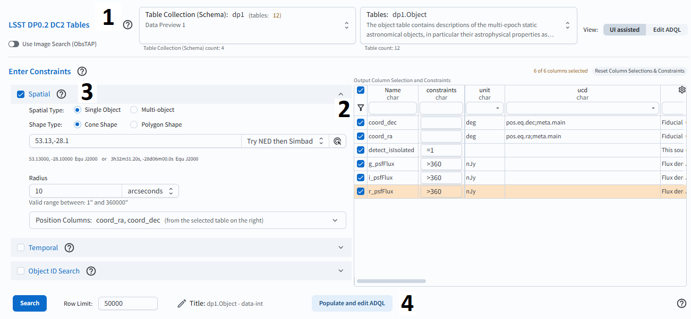
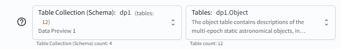
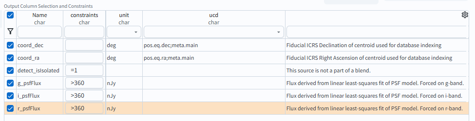
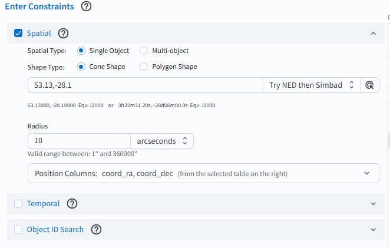
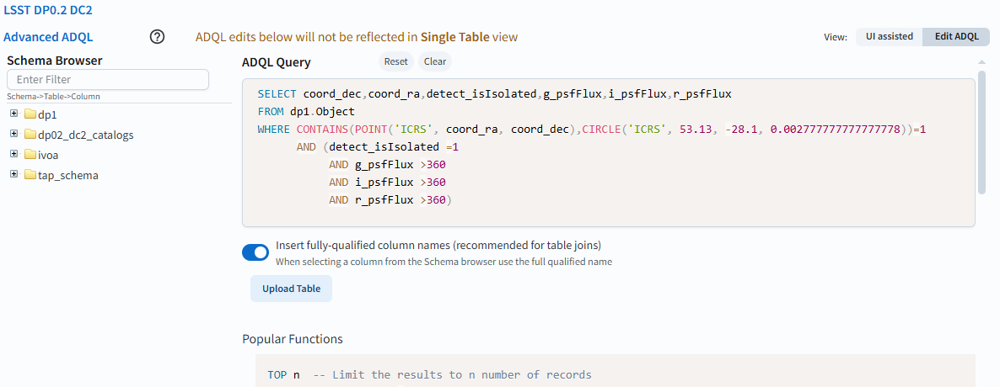

.. _portal-103-1:

#################################
103.1. Convert a UI query to ADQL
#################################

For the Portal Aspect of the Rubin Science Platform at data.lsst.cloud.

**Data Release:** DP1

**Last verified to run:** 2025-06-12

**Learning objective:** Convert a query with constraints set in the user interface (UI) into an `Astronomy Data Query Language (ADQL) <https://www.ivoa.net/documents/latest/ADQL.html>`_ statement.

**LSST data products:** ``Object`` table

**Credit:** Originally developed by the Rubin Community Science team.
Please consider acknowledging them if this tutorial is used for the preparation of journal articles, software releases, or other tutorials.

**Get Support:** Everyone is encouraged to ask questions or raise issues in the `Support Category <https://community.lsst.org/c/support/6>`_ of the Rubin Community Forum. Rubin staff will respond to all questions posted there.

----

**Tutorial Overview.**
Navigate to the "DP0.2 Catalogs" tab in the Portal UI. Labels in Figure 1 represent steps used in this tutorial.

    Figure 1: The Portal UI screen.

**1. Select schema and table.**
As shown in Figure 2, select "dp1" in "Table Collection (Schema)" and "dp1.Object" table in "Tables".

    Figure 2: The Portal UI Table Collection Schema and Tables options.

**2. Choose search criteria.**
In the "Output Column Selection and Constraints" table, check boxes by the rows
``coord_dec, coord_ra, detect_isIsolated, g_psfFlux, r_psfFlux, i_psfFlux``, and then hit the filter button (see Figure 2).
For all flux rows, enter a constraint ``>360``.
For the "detect_isIsolated" enter ``=1``.

    Figure 3: Select constraints in "Output Column Selection and Constraints" table.

**3. Enter spatial constraints.**
Under "Enter Constraints" check "Spatial" and enter ``53.13, -28.10``.
For "Radius" enter 10 arc minutes.
Leave "Temporal" and Object ID Search" unchecked.

    Figure 4: Enter spatial constraints.

**4. Convert UI to ADQL query.**
Click on the button labeled "Populate and edit ADQL", located bottom-center in Figure 1.
The UI will switch to the ADQL interface and will populate the ADQL Query box with an ADQL statement that represents the exact same query, as shown in Figure 1.

    Figure 5: The Portal's ADQL interface, automatically populated with the UI query from Figure 1, converted into an ADQL statement.

**5. Execute query.**
Click the Search button at lower left.
The query will be executed and the results will appear in the Results tab.

**Warning!**
If changes are made to the ADQL statement and then the interface is toggled back to the "Single Table (UI assisted)" interface using the button at lower right in Figure 2, those changes will not be reflected in the UI.
The conversion only works in one direction: from the UI to ADQL.

