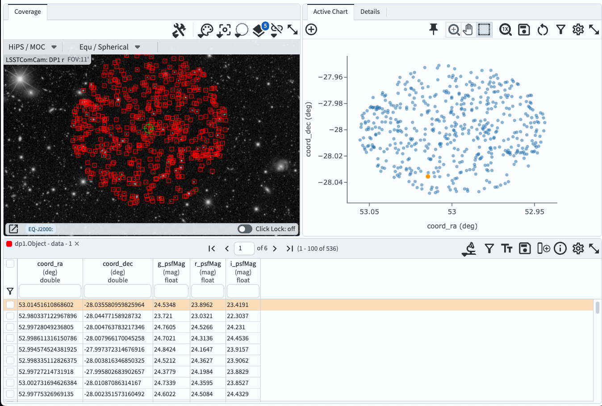

.. _portal-103-2:

#######################################
103.2. Query for catalog data with ADQL
#######################################

For the Portal Aspect of the Rubin Science Platform at data.lsst.cloud.

**Data Release:** DP1

**Last verified to run:** 2025-06-12

**Learning objective:** Prepare and execute an `Astronomy Data Query Language (ADQL) <https://www.ivoa.net/documents/latest/ADQL.html>`_ query in the Portal.

**LSST data products:** ``Object`` table

**Credit:** Originally developed by the Rubin Community Science team.
Please consider acknowledging them if this tutorial is used for the preparation of journal articles, software releases, or other tutorials.

**Get Support:** Everyone is encouraged to ask questions or raise issues in the `Support Category <https://community.lsst.org/c/support/6>`_ of the Rubin Community Forum. Rubin staff will respond to all questions posted there.

----

**1. Go to the Portal's DP0.2 Catalogs tab.**
If needed, reload the webpage in the browser to clear any previously-entered constraints.
The interface should look like Figure 1.

.. figure:: images/portal-103-2-1.png
    :name: portal-103-2-1
    :alt: The Portal UI with no constraints set.

    Figure 1: The Portal UI with no query constraints entered.

**2. Switch to the ADQL interface.**
Select "Edit ADQL" at upper right in Figure 1 to go to the ADQL interface.
The ADQL Query box will be empty (Figure 2).

    Figure 2: The ADQL interface with no query entered.

**3. Enter an ADQL statement in the box.**
For example, copy paste the statement below.
It is the same query as was used above in Option 1.

.. code-block:: SQL

  SELECT coord_dec,coord_ra,detect_isIsolated,g_cModelFlux,
       i_cModelFlux,r_cModelFlux,u_cModelFlux,
       y_cModelFlux,z_cModelFlux
  FROM dp1_v29.Object
  WHERE CONTAINS(POINT('ICRS', coord_ra, coord_dec),
      CIRCLE('ICRS', 53, -28, 0.05))=1
      AND (detect_isIsolated =1
           AND g_cModelFlux >360
           AND i_cModelFlux >360
           AND r_cModelFlux >360
           AND u_cModelFlux >360
           AND y_cModelFlux >360
           AND z_cModelFlux >360)

**4. Execute the ADQL query.**
Click the Search button at lower left.
The query will be executed and the results will appear in the Results tab.

.. figure:: images/portal-103-2-3.png
    :name: portal-103-2-3
    :alt: Default search results from a query.

    Figure 3: The default results view layout obtained by executing of the query described above. Interacting with query results is covered in a separate tutorial.

