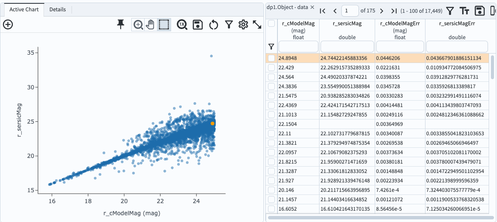

.. _portal-103-3:

##########################################
103.3. Convert flux to magnitude with ADQL
##########################################

For the Portal Aspect of the Rubin Science Platform at data.lsst.cloud.

**Data Release:** DP1

**Last verified to run:** 2025-06-16

**Learning objective:** Convert fluxes to magnitudes using a special ADQL function.

**LSST data products:** ``Object`` table

**Credit:** Originally developed by the Rubin Community Science Team.
Please consider acknowledging them if this tutorial is used for the preparation of journal articles, software releases, or other tutorials.

**Get Support:** Everyone is encouraged to ask questions or raise issues in the `Support Category <https://community.lsst.org/c/support/6>`_ of the Rubin Community Forum.
Rubin staff will respond to all questions posted there.

----

Magnitude conversions
=====================

While the ``Object`` table has columns for PSF and cModel magnitudes, all other photometry measures are provided only in fluxes (in nJy).
These fluxes can be retrieved as AB magnitudes using the ``scisql_nanojanskyToAbMag()`` function, which applies the equation :math:`m = -2.5 log(f) + 31.4`, where :math:`m` is magnitude and :math:`f` is flux.

**Warning!** Fluxes measured in difference images can be negative.
Negative fluxes should not be converted to magnitudes using this special ADQL function.

**Note:** for a demonstration of how to convert fluxes to magnitudes *after* a query is executed,
see the tutorial on how to add a column to the results table.

----

**1. Go to the DP1 Catalogs ADQL interface.**
Clear any past ADQL query statements from the query box.

**2. Set up a query that returns magnitudes.**
The following query returns the *r*-band cModel and Sersic magnitudes, and their errors, for objects brighter than 25th magnitude in *r*-band.
The query uses the ``AS`` functionality to name the newly-calculated magnitude columns.
The query includes a spatial constraint: a circle with radius 0.2 degrees near the center of the ECDFS field.

.. code-block:: SQL

  SELECT r_cModelMag,
         scisql_nanojanskyToAbMag(r_sersicFlux) AS r_sersicMag,
         r_cModelMagErr,
         scisql_nanojanskyToAbMagSigma(r_sersicFlux, r_sersicFluxErr) AS r_sersicMagErr
  FROM dp1.Object
  WHERE CONTAINS(POINT('ICRS', coord_ra, coord_dec),
        CIRCLE('ICRS', 53.13, -28.1, 0.2))=1
  AND r_cModelMag < 25
  AND scisql_nanojanskyToAbMag(r_sersicFlux) < 25

**3. View the results.**
Figure 1 shows the results interface, with the table containing only magnitudes and the default plot using the first two columns.

    Figure 1: The table panel in the results interface shows no flux columns, but magnitude and magnitude error columns.

