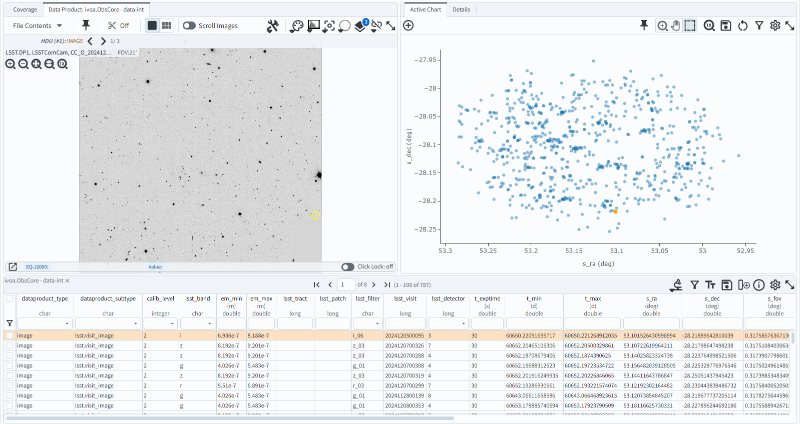

.. _portal-103-5:

#################################
103.5. Query for images with ADQL
#################################

For the Portal Aspect of the Rubin Science Platform at data.lsst.cloud.

**Data Release:** DP1

**Last verified to run:** 2025-06-20

**Learning objective:** Query for image data with `Astronomy Data Query Language (ADQL) <https://www.ivoa.net/documents/latest/ADQL.html>`_.

**LSST data products:** ``visit_image``

**Credit:** Originally developed by the Rubin Community Science team.
Please consider acknowledging them if this tutorial is used for the preparation of journal articles, software releases, or other tutorials.

**Get Support:** Everyone is encouraged to ask questions or raise issues in the `Support Category <https://community.lsst.org/c/support/6>`_ of the Rubin Community Forum. Rubin staff will respond to all questions posted there.

----

**1. Create ADQL query.**
Use the Portal UI interface to create an image query or click on the Edit ADQL button and copy the query below. Notice, the calibration
level and coordinates can be changed in the Portal UI interface or in the Edit ADQL query box.
Edit the query as necessary, then hit Search.

.. code:: sql

  SELECT dataproduct_type,dataproduct_subtype,calib_level,lsst_band,em_min,em_max,lsst_tract,lsst_patch,
         lsst_filter,lsst_visit,lsst_detector,t_exptime,t_min,t_max,s_ra,s_dec,s_fov,obs_id,
         obs_collection,o_ucd,facility_name,instrument_name,s_region,access_url,access_format
  FROM dp1.ObsCore
  WHERE calib_level = 2 AND dataproduct_type = 'image'
        AND CONTAINS(POINT('ICRS', 53, -28), s_region)=1
        AND ( 483e-9 BETWEEN em_min AND em_max )

**2.  Examine the resulting image(s).**
Click on the "Search" button.
This will result in the image on the upper left corresponding to the first entry in the table on the bottom,
and the scatter point of telescope pointings on the upper right, as shown in the screenshot below.
Other images can be examined by clicking other entries in the table on the bottom.

    Figure 1: The screenshot of the image, the scatter plot, and the table resulting from executing the ADQL query.

