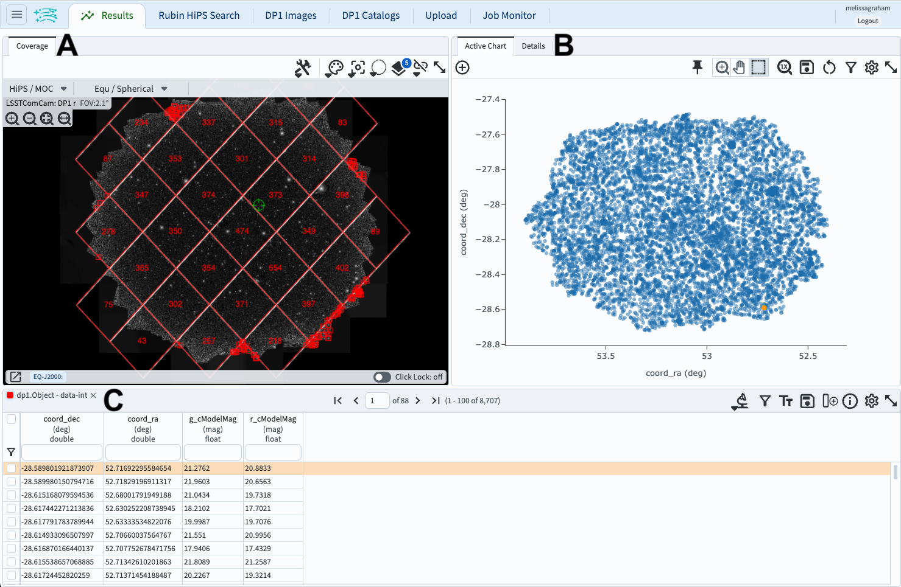
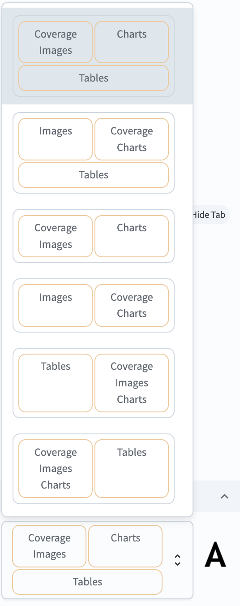
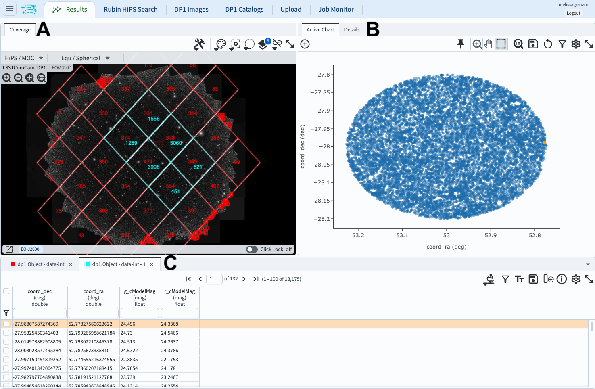

.. _portal-104-1:

##############################################
104.1. Navigate the catalog results interface
##############################################

For the Portal Aspect of the Rubin Science Platform at data.lsst.cloud.

**Data Release:** DP1

**Last verified to run:** 2025-06-29

**Learning objective:** Navigate the multi-panel interface for catalog data results.

**LSST data products:** ``Object`` table

**Credit:** Originally developed by the Rubin Community Science team.
Please consider acknowledging them if this tutorial is used for the preparation of journal articles, software releases, or other tutorials.

**Get Support:** Everyone is encouraged to ask questions or raise issues in the `Support Category <https://community.lsst.org/c/support/6>`_ of the Rubin Community Forum.
Rubin staff will respond to all questions posted there.

----

**1. Log in to the Portal Aspect of the RSP.**
Log in to the Portal, click on the DP1 Catalogs tab, and switch to the ADQL interface.

**2. Execute a query.**
Enter the query below into the ADQL box, and click "Search".
This query returns coordinates and magnitudes for objects near the center of the ECDFS field that are brighter than 22 mag in *g* and *r*.

.. code-block:: SQL

  SELECT coord_dec, coord_ra, g_cModelMag, r_cModelMag
  FROM dp1.Object
  WHERE CONTAINS(POINT('ICRS', coord_ra, coord_dec),
        CIRCLE('ICRS', 53.0, -28.0, 1.0)) =1
        AND g_cModelMag < 22 AND r_cModelMag < 22

**3. View the results interface.**
The default layout of the results interface is shown in Figure 1.

    Figure 1: The results interface after a query has been executed defaults to a screens split three ways: the coverage map (A), the active chart (B), and the table (C).

**3.1. Coverage chart.**
The coverage chart's default location is upper left; A in Figure 1.
The default view is a `HEALPix <https://healpix.sourceforge.io/>`_ grid showing the number of returned objects per grid region.
Small color squares mark individual objects outside the grid.
The background is an r-band `HiPS <https://aladin.cds.unistra.fr/hips/>`_ map of the ``deep_coadd`` images.

**3.2. Active chart.**
The active chart's default location is upper right; B in Figure 1.
The default plot will be the first two columns of the returned data table.
In Figure 1, this is RA vs. Dec.
This plot will switch to a two-dimensional histogram if so many objects are returned that individual points cannot be distinguished.

**3.3. Table.**
The table's default location is along the bottom; C in Figure 1.
A scrollable, filterable table of the returned data, with the first row selected by default and shown in orange.
Note that the orange point in the active chart corresponds to the selected row.

**4. View layout options.**
At upper left, click on the menu icon (three horizontal lines) to open the sidebar menu.
Under "Results Layout", click on the icon of the default layout ("up-down" arrows, or "A" in Figure 2) to see all layout options.

    Figure 2: The sidebar menu with options for the results view layout.

**5. Change the layout.**
In the sidebar menu in Figure 2, choose the two-panel view of coverage charts on the left and tables on the right.
Notice that the active chart (the plot) is still available as a tab at upper left.
Reopen the sidebar menu to try other layouts and return to the default three-panel view.

**6. Execute a different query.**
Click on the tab "DP1 Catalogs" to return to the ADQL interface.
Change the query to return fainter objects in a smaller region, using the ADQL below.
Execute the query.

.. code-block:: SQL

  SELECT coord_dec, coord_ra, g_cModelMag, r_cModelMag
  FROM dp1.Object
  WHERE CONTAINS(POINT('ICRS', coord_ra, coord_dec),
        CIRCLE('ICRS', 53.0, -28.0, 0.2)) =1
        AND g_cModelMag < 25 AND r_cModelMag < 25

**7. View multiple query results.**
The results interface is now populated with data from the new query (Figure 3).
The table (C in Figure 3) now has two tabs, one for the old query (red) and one for the new (cyan).
The coverage chart (A in Figure 3) includes markers for both queries, in colors that match the table.
The active chart (B in Figure 3) is the default plot for the new query, the selected table.
You can delete the unwanted query results by clicking "X" in the corresponding tab above the table.

    Figure 3: Similar to Figure 1, but with the results of two queries.

**7. Switch between multiple query results.**
Click on the tab for the first query and note that the coverage chart, table, and active chart change.

**8. Delete unwanted query results.**
In the table, click on the X in the tab for the first query results (the leftmost one) to delete them.
