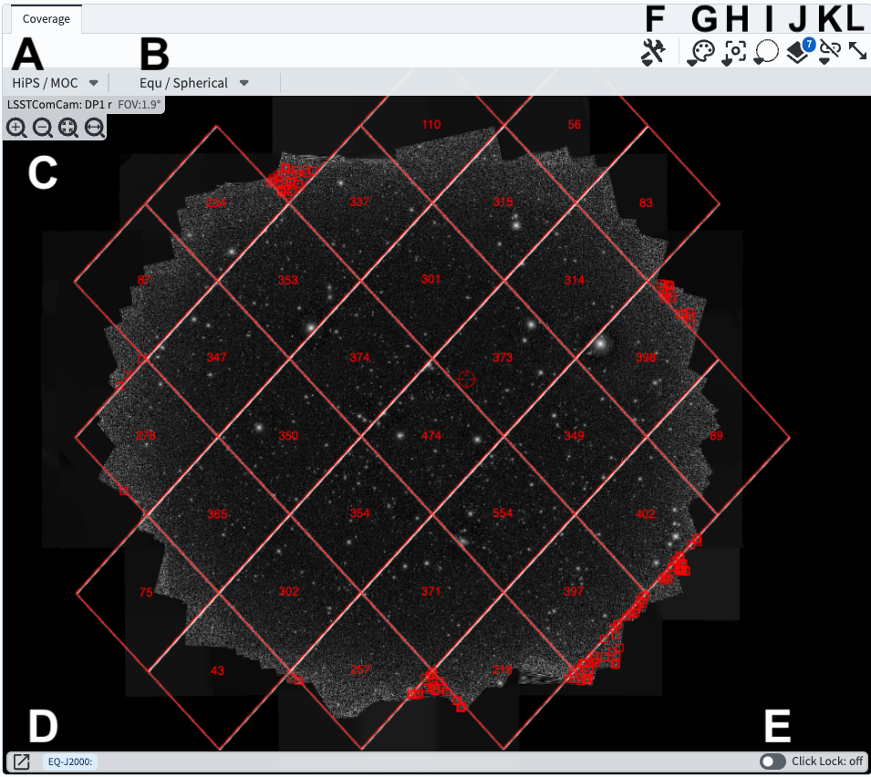
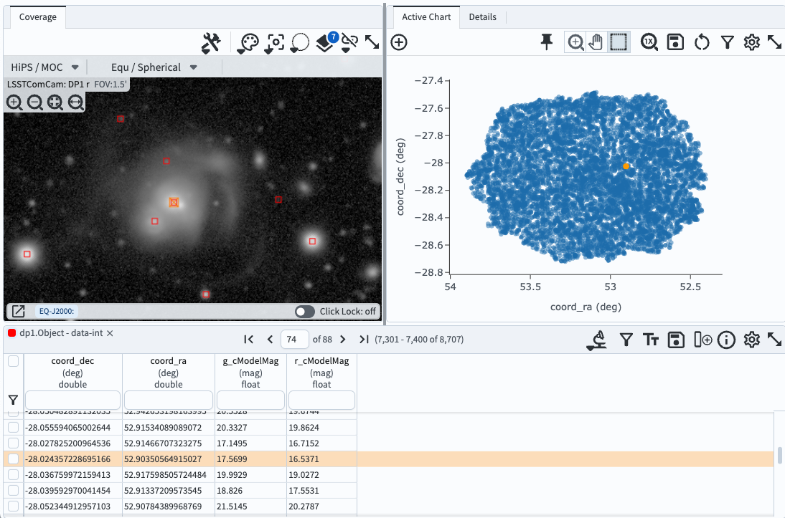

.. _portal-104-2:

#####################################
104.2. Use the results coverage chart
#####################################

For the Portal Aspect of the Rubin Science Platform at data.lsst.cloud.

**Data Release:** DP1

**Last verified to run:** 2025-06-29

**Learning objective:** Use the coverage chart in the results interface.

**LSST data products:** ``Object`` table

**Credit:** Originally developed by the Rubin Community Science team.
Please consider acknowledging them if this tutorial is used for the preparation of journal articles, software releases, or other tutorials.

**Get Support:** Everyone is encouraged to ask questions or raise issues in the `Support Category <https://community.lsst.org/c/support/6>`_ of the Rubin Community Forum.
Rubin staff will respond to all questions posted there.

**Terminology:**

* `HiPS <https://aladin.cds.unistra.fr/hips/>`_: Hierarchical Progressive Surveys
* `MOC <https://www.ivoa.net/documents/MOC/>`_: Multi-Order Coverage map
* `ADQL <https://www.ivoa.net/documents/latest/ADQL.html>`_: Astronomy Query Data Language
* `HEALPix <https://healpix.sourceforge.io/>`_: Hierarchical Equal Area isoLatitude Pixelation of a sphere
* `regions <https://ds9.si.edu/doc/ref/region.html>`_ file: a standard format for marking regions in an image
* `WCS <https://fits.gsfc.nasa.gov/fits_wcs.html>`_: World Coordinate System (the convention that defines the coordinates per pixel)
* PNG: Portable Network Graphic

----

**1. Log in to the Portal Aspect of the RSP.**
Log in to the Portal, click on the DP1 Catalogs tab, and switch to the ADQL interface.

**2. Execute a query.**
Enter the query below into the ADQL box, and clear "Search".
This query returns coordinates and magnitudes for objects near the center of the ECDFS field
that are brighter than 22 mag in *g* and *r*.

.. code-block:: SQL

  SELECT coord_dec, coord_ra, g_cModelMag, r_cModelMag
  FROM dp1.Object
  WHERE CONTAINS(POINT('ICRS', coord_ra, coord_dec),
        CIRCLE('ICRS', 53.0, -28.0, 1.0)) =1
        AND g_cModelMag < 22 AND r_cModelMag < 22

**3. View the coverage chart**.
The default view is a HEALPix grid showing the number of returned objects per grid region.
Small color squares mark individual objects outside the grid.
The background is the r-band HiPS map of the DP1 ``deep_coadd`` images.

    Figure 1: The coverage chart panel in the results interface.

**3. Mouse-over for pop-up notes.**
In the coverage chart panel (Figure 1) use the mouse to hover over the menus and icons to see pop-up explanations of the functionality.

**4. Explore menus and icons.**
In the coverage chart panel (Figure 1) click on each of the drop-down menus and icons listed below, and see the pop-up windows of options and tools.

* A: **HiPS/MOC** options to change the underlying HiPS map or add a MOC layer.
* B: **WCS** options to choose the orientation and projection of the underlying HiPS map.
* C: **Zoom** in, out, or to fit the window. (It is also possible to use the mouse to zoom.)
* D: **WCS Coordinates** of the mouse position. Click the box-and-arrow icon at left to view coordinates in a separate window.
* E: **Toggle lock** to "on" to lock the WCS Coordinates to the location of the last mouse click, and "off" for continuous position.
* F: **Tools** menu with options to save, reset, or orient the display; add compass, ruler, points, etc.
* G: **Color table** menu to choose a different color map.
* H: **Recenter** by entering coordinates for the desired display center.
* I: **Spatial selection** (not currently active for HiPS maps).
* J: **Overlays** manipulation to change the options or color for the HEALPix and points overlay.
* K: **Image lock** and alignment (tools for when multiple images are displayed).
* L: **Expand panel** to have the coverage chart take the full browser window.

**5. Zoom in.**
Above C in Figure 1, click the "zoom in" icon (magnifying glass with a + inside) 5-6 times to zoom in, until individual object markers are displayed instead of the HEALPix grid (Figure 2).

**6. Select a single object.**
Click on any individual marker, and notice that it's row will be highlighted orange in the table panel and its symbol will be orange in the active chart (Figure 2).

    Figure 2: The coverage chart panel, zoomed in to show individual markers, with one object selected.

**7. Option: save a PNG of the coverage chart.**
Click on the tools icon (F in Figure 1) and select the disk icon next to "Save...".
Leave the default selection of PNG file and click "Save".
An image of the coverage chart will automatically download.
Note the option to export the overlays as a regions file.

**8. Reset the coverage chart.**
Click on the tools icon (F in Figure 1) and select the circular arrow icon next to "Save..." to restore to default options.
