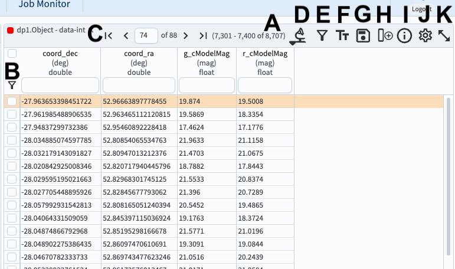
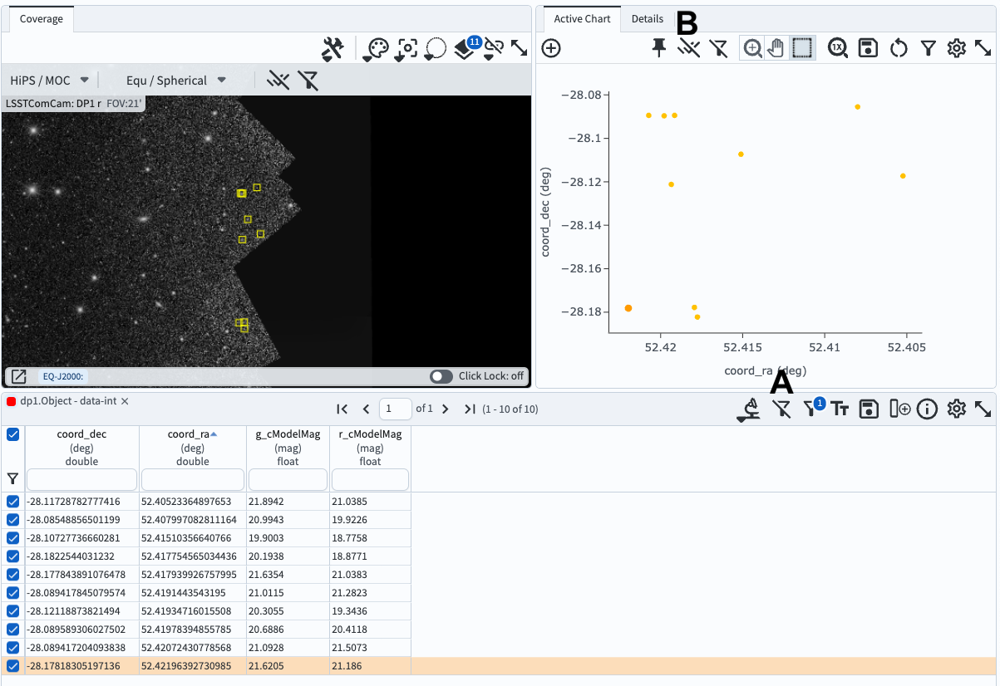
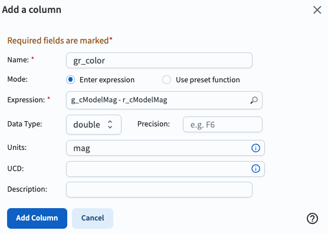

.. _portal-104-3:

############################
104.3. Use the results table
############################

For the Portal Aspect of the Rubin Science Platform at data.lsst.cloud.

**Data Release:** DP1

**Last verified to run:** 2025-06-29

**Learning objective:** Use the results table from a catalog query.

**LSST data products:** ``Object`` table

**Credit:** Originally developed by the Rubin Community Science Team.
Please consider acknowledging them if this tutorial is used for the preparation of journal articles, software releases, or other tutorials.

**Get Support:** Everyone is encouraged to ask questions or raise issues in the `Support Category <https://community.lsst.org/c/support/6>`_ of the Rubin Community Forum.
Rubin staff will respond to all questions posted there.

----

**1. Log in to the Portal and execute a query.**
Go to the Portal's DP1 Catalogs tab, switch to the ADQL interface, and execute the query below.
This query returns coordinates and magnitudes for objects near the center of the ECDFS field
that are brighter than 22 mag in *g* and *r*.

.. code-block:: SQL

  SELECT coord_dec, coord_ra, g_cModelMag, r_cModelMag
  FROM dp1.Object
  WHERE CONTAINS(POINT('ICRS', coord_ra, coord_dec),
        CIRCLE('ICRS', 53.0, -28.0, 1.0)) =1
        AND g_cModelMag < 22 AND r_cModelMag < 22

**2. View the table in the results interface**.
It should appear similar to Figure 1.

    Figure 1: The table panel in the results interface. The first row has been selected and is highlighted orange.

**3. Mouse-over for pop-up notes.**
In the table panel (Figure 1) use the mouse to hover over the column headers and icons see pop-up explanations.

**4. Explore menus and icons.**
In the table panel (Figure 1) click on each of the items below and review the functionality.

* A: **Table length** - number of rows returned.
* B: **Filter** - show only selected rows.
* C: **Navigate** the pages of the table or jump to a page.
* D: **Actions** - generate new TAP searches (advanced, not covered in this tutorial).
* E: **Column filters** - show or hide the header row for table filter entries.
* F: **Text view** - switch the table view to text mode.
* G: **Save** file (download table); a variety of formats are offered.
* H: **Add a column** that is derived from existing columns.
* I: **Information** about the query job that produced these results.
* J: **Table options** - open a pop-up window to show, hide, or filter columns.
* K: **Expand panel** - have the table take the full browser window.

**5. Sort the table.**
Click on the table header ``coord_ra`` to sort the table by the Right Ascension coordinate.
Any column can be sorted in this way.

**6. Select rows and use the filter.**
Select the first 10 rows after sorting by RA, then click the funnel (B in Figure 1).
The coverage map and the active chart will also update to display only data from the selected rows, as in Figure 2.

    Figure 2: The full results interface with only 10 rows selected in the table.

**7. Remove the filter and selection.**
Click the "unfilter" icon at upper right in the table panel to remove the filter (A in Figure 2).
Click the "unselect" icon at upper right in the active chart panel to unselect all objects (B in Figure 2).

**8. Add a column to the table.**
Select the "Add a column" icon (H in Figure 1), and enter the name and expression to derive the new column from existing columns, as shown in Figure 3.

    Figure 3: The pop-up window for adding a derived column to the table, populated to add the g-r color.

