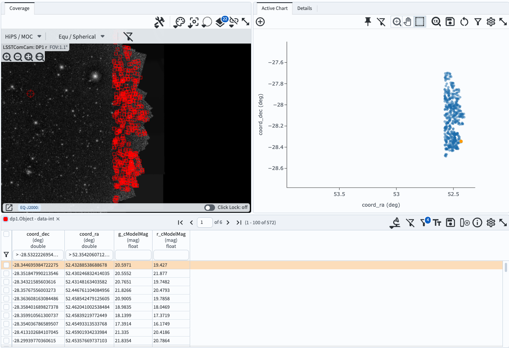

.. _portal-104-4:

##########################################
104.4. Use the results active chart (plot)
##########################################

For the Portal Aspect of the Rubin Science Platform at data.lsst.cloud.

**Data Release:** DP1

**Last verified to run:** 2025-06-29

**Learning objective:** Use the components of the results active chart (plot) panel.

**LSST data products:**  ``Object`` table

**Credit:** Originally developed by the Rubin Community Science team.
Please consider acknowledging them if this tutorial is used for the preparation of journal articles, software releases, or other tutorials.

**Get Support:** Everyone is encouraged to ask questions or raise issues in the `Support Category <https://community.lsst.org/c/support/6>`_ of the Rubin Community Forum.
Rubin staff will respond to all questions posted there.

**Terminology:**

* `ADQL <https://www.ivoa.net/documents/latest/ADQL.html>`_: Astronomy Query Data Language
* PNG: Portable Network Graphic
* color: The difference in magnitude (brightness) between adjacent bands (e.g., g-r, r-i).
* CMD: color-magnitude diagram, a plot with a color on one axis and magnitude on the other.

----

**1. Log in to the Portal and execute a query.**
Go to the Portal's DP1 Catalogs tab, switch to the ADQL interface, and execute the query below.
This query returns coordinates and magnitudes for objects near the center of the ECDFS field
that are brighter than 22 mag in *g* and *r*.

.. code-block:: SQL

  SELECT coord_dec, coord_ra, g_cModelMag, r_cModelMag
  FROM dp1.Object
  WHERE CONTAINS(POINT('ICRS', coord_ra, coord_dec),
        CIRCLE('ICRS', 53.0, -28.0, 1.0)) =1
        AND g_cModelMag < 22 AND r_cModelMag < 22

**2. View the default active chart in the results interface**.
It should appear similar to Figure 1.
If many more rows are returned, the default plot will automatically switch from scatter plot (as in Figure 1) to a 2D histogram (heatmap).

.. figure:: images/portal-104-4-1.png
    :name: portal-104-4-1
    :alt: The default view of the active chart panel.

    Figure 1: The active chart panel in the results interface. The first two columns are plotted as the x- and y-axes by default.

**3. Mouse-over for pop-up notes.**
In the active chart panel (Figure 1) use the mouse to hover over the menus and icons to see pop-up explanations of the functionality.
Hover the mouse over any point in the plot, and a pop-up of the coordinates will appear.

**4. Select an object.**
Click on any point in the plot and it will be colored orange and highlighted in the table panel and in the coverage map.
Click on the "Details" tab (item A in Figure 1) to see the values for all returned columns for the selected object.

**5. Explore menus and icons.**
In the active chart panel (Figure 1) click on each of the icons listed below and review the information, options, and tools.

* A: **Details** - show all columns values for selected plot point.
* B: **Pin** - keep this chart as a tab in the active chart panel.
* C: **Zoom** - enter zoom mode (click-and-drag in the plot to zoom in).
* D: **Pan** - enter pan mode (click-and-drag in the plot to pan around).
* E: **Select** - enter select mode (click-and-drag to create a selection box).
* F: **Unzoom** - reset zoom back to default.
* G: **Save** - open a pop-up window with the option to save the plot as a PNG file.
* H: **Restore** - undo all plot manipulation and restore to the default as in Figure 1.
* I: **Filter** - open a pop-up window to manipulate the filters applied to the data.
* J: **Settings** - open a pop-up window to manipulate the plotted data.
* K: **Expand panel** - have the active chart take the full browser window.
* L: **Add chart** - add a new chart (a new plot) to the active chart panel.

**6. Zoom, pan, and unzoom.**
Click on the zoom icon (C in Figure 1) to enter zoom mode.
Click-and-drag in the plot to zoom in.
Click on the pan icon (D in Figure 1) to enter pan mode.
Click-and-drag in the plot to recenter the plotted data.
Click on the zoom reset icon (H in Figure 1) to restore all settings to the default plot.

**7. Use the box select tool.**
Click on the box icon (E in Figure 1).
Click-and-drag in the plot to select points (A in Figure 2).
Two new icons will appear to "select" (B in Figure 2) or "filter on" (C in Figure 2) the points.

.. figure:: images/portal-104-4-2.png
    :name: portal-104-4-2
    :width: 600
    :alt: Using the selection box tool in the active chart panel.

    Figure 2: After using the "box select" tool to create a box in the plot (A), two new icons appear (B and C).

**8. Select objects.**
Click on the select icon (B in Figure 2).
These points will be marked with a different color in the active chart and the coverage chart, and will be selected in the table, as shown in Figure 3.

.. figure:: images/portal-104-4-3.png
    :name: portal-104-4-3
    :alt: The full Portal Results tab with points selected in the active chart.

    Figure 3: The results interface after points have been selected in the active chart.

**9. Filter on selected objects.**
Unselect objects by clicking again on the select icon (B in Figure 2).
Repeat step 7.
Click on the filter icon (C in Figure 2).
The selected objects will now be the *only* points shown in the active chart, the coverage map, and the table, as in Figure 4.

    Figure 4: The results interface after points have been selected and filtered on in the active chart.

**10. Remove the filter.**
Click on the filter icon (C in Figure 2) to remove the filter and return to the default plot of Figure 1.
