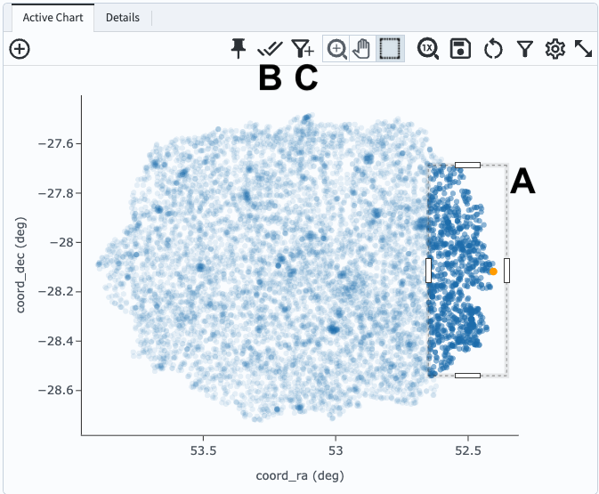

.. _portal-104-4:

############################
104.4. Use the results table
############################

For the Portal Aspect of the Rubin Science Platform at data.lsst.cloud.

**Data Release:** DP1

**Last verified to run:** 6/16/2025

**Learning objective:** Use the results table from a catalog query.

**LSST data products:** DP1 Object catalogs

**Credit:** Originally developed by the Rubin Community Science Team.
Please consider acknowledging them if this tutorial is used for the preparation of journal articles, software releases, or other tutorials.

**Get Support:** Everyone is encouraged to ask questions or raise issues in the `Support Category <https://community.lsst.org/c/support/6>`_ of the Rubin Community Forum.
Rubin staff will respond to all questions posted there.

----

**1. Log in to the Portal Aspect of the RSP and execute a query.**
Go to the Portal's DP0.2 Catalogs tab, switch to the ADQL interface, and execute the query below.
This query will retrieve a small sample of objects brighter than 25th magnitude).

.. code-block:: SQL

  SELECT coord_dec, coord_ra, detect_isIsolated, refExtendedness,
         u_cModelFlux, g_cModelFlux, r_cModelFlux,
         i_cModelFlux, z_cModelFlux, y_cModelFlux
  FROM dp1.Object
  WHERE CONTAINS(POINT('ICRS', coord_ra, coord_dec),
        CIRCLE('ICRS', 53.0, -28.0, 0.167)) =1
        AND (detect_isIsolated =1 AND refExtendedness =1
             AND u_cModelFlux >360 AND g_cModelFlux >360
             AND r_cModelFlux >360 AND i_cModelFlux >360
             AND z_cModelFlux >360 AND y_cModelFlux >360)

**2. View the default table** (Figure 1).
Only one query has been executed, so there is only one tab in the table panel (A in Figure 1).

.. figure:: images/portal-104-4-1.png
    :name: portal-104-4-1
    :alt: The default view of the table panel.

    Figure 1: The table panel that results from the query in step 1. The first row has been clicked on and is highlighted orange.

**3. Mouse-over for pop-up notes.**
In the table panel (Figure 1) use the mouse to hover over the column headers and icons see pop-up explanations.

**4. Explore menus and icons.**
In the table panel (Figure 1) click on each of the items below and review the functionality.

* C: **Navigate** the pages of the table or jump to a page.
* D: **Actions** - generate new TAP searches (advanced, not covered in this tutorial).
* E: **Filter** - show or hide the header row for table filter entries.
* F: **Text view** - switch the table view to text mode.
* G: **Save** file (download table); a variety of formats are offered.
* H: **Add a column** that is derived from existing columns.
* I: **Information** about the query job that produced these results.
* J: **Table options** - open a pop-up window to show, hide, or filter columns.
* K: **Expand panel** - have the table take the full browser window.

**5. Sort the table.**
Click on the table header ``coord_ra`` to sort the table by the Right Ascension coordinate.
Any column can be sorted in this way.

**6. Select rows.**
Click on the boxes at left (B in Figure 1) for the first 10 rows.
Notice how these objects are colored differently in the coverage and active chart, as in Figure 2.

    Figure 2: The full Results tab after 10 rows have been selected in the table panel.

**7. Filter on the selected rows.**
Click the filter icon (under B in Figure 1).
See how all panels update to show only the selected objects, as in Figure 3.

    Figure 3: The full Results tab after 10 rows have been selected in the table panel, and filtered on.

**8. Remove the filter and selection.**
Click the "unfilter" icon at upper right in the table panel to remove the filter (A in Figure 3).
Click the "unselect" icon at uppre right in the active chart panel to unselect all objects (B in Figure 3).
