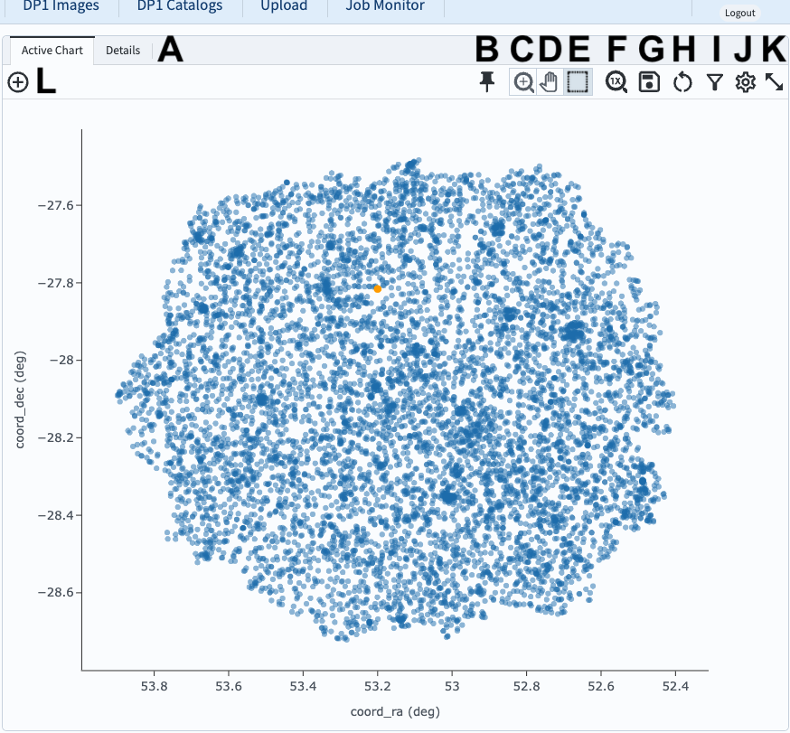
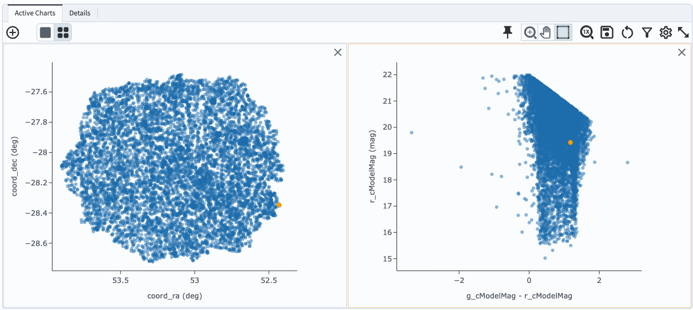
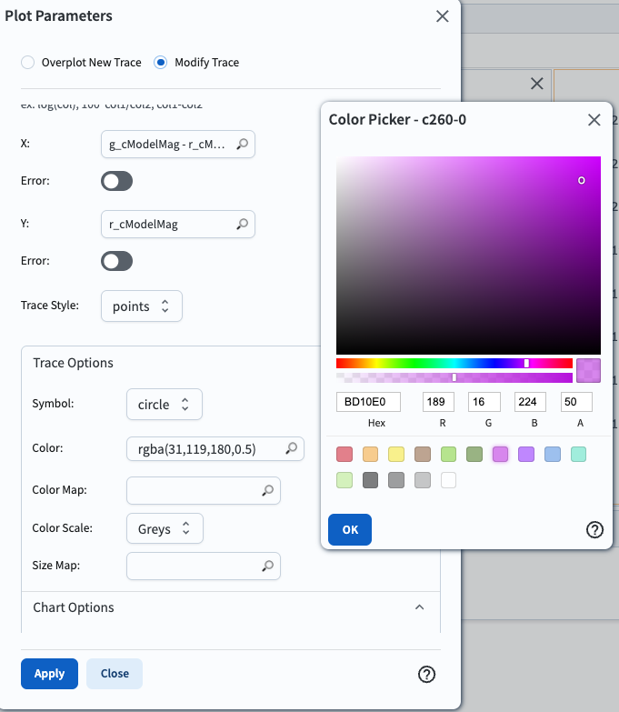
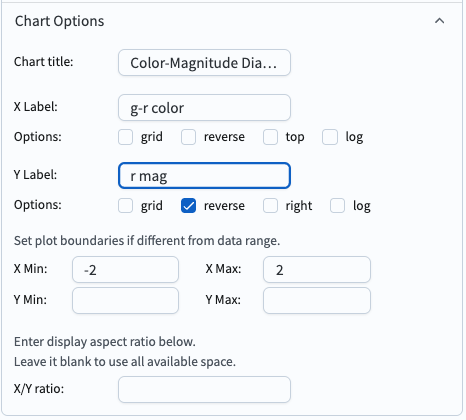
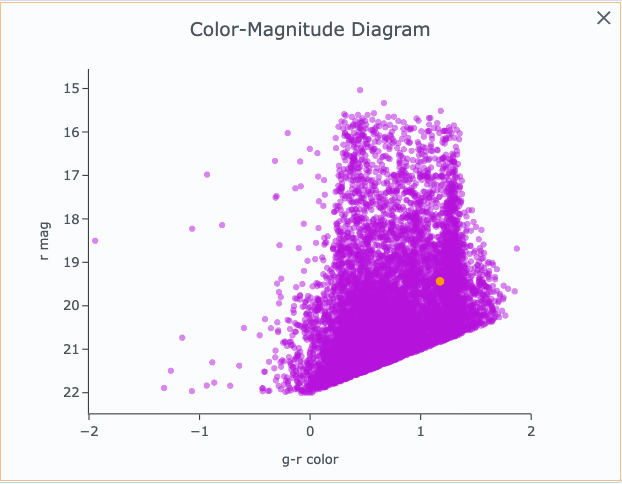

.. _portal-104-5:

################################
104.5. Add a custom chart (plot)
################################

For the Portal Aspect of the Rubin Science Platform at data.lsst.cloud.

**Data Release:** DP1

**Last verified to run:** 2025-06-29

**Learning objective:** Add a customized plot to the results active chart.

**LSST data products:**  ``Object`` table

**Credit:** Originally developed by the Rubin Community Science team.
Please consider acknowledging them if this tutorial is used for the preparation of journal articles, software releases, or other tutorials.

**Get Support:** Everyone is encouraged to ask questions or raise issues in the `Support Category <https://community.lsst.org/c/support/6>`_ of the Rubin Community Forum.
Rubin staff will respond to all questions posted there.

----

**1. Log in to the Portal and execute a query.**
Go to the Portal's DP1 Catalogs tab, switch to the ADQL interface, and execute the query below.
This query returns coordinates and magnitudes for objects near the center of the ECDFS field
that are brighter than 22 mag in *g* and *r*.

.. code-block:: SQL

  SELECT coord_dec, coord_ra, g_cModelMag, r_cModelMag
  FROM dp1.Object
  WHERE CONTAINS(POINT('ICRS', coord_ra, coord_dec),
        CIRCLE('ICRS', 53.0, -28.0, 1.0)) =1
        AND g_cModelMag < 22 AND r_cModelMag < 22

**2. View the default active chart in the results interface**.
It should appear similar to Figure 1.
If many more rows are returned, the default plot will automatically switch from scatter plot (as in Figure 1) to a 2D histogram (heatmap).

    Figure 1: The active chart panel in the results interface. The first two columns are plotted as the x- and y-axes by default.

**3. Open the "Add New Chart" window.**
Click on the plus sign in the circle (L in Figure 1).
The "Add New Chart" pop-up window will appear.

**4. Select columns for the X and Y axes.**
In this example, for a color-magnitude diagram, set the X to ``g_cModelMag - r_cModelMag`` and the Y to ``r_cModelMag``.
Click OK.

    Figure 2: The active chart panel with a new plot added.

**5. Customize the symbol color.**
Click on the newly added plot so that it has a light orange box around it, indicating it is selected.
Click on the "Settings" icon to open the "Plot Parameters" pop-up window (the gear symbol; J in Figure 1).
Under "Trace Options", next to "Color", click the magnifying glass to open the color picker and choose a point color, as in Figure 3.

    Figure 3: Changing the symbol color with the color picker.

**6. Change the plot title and axes.**
Under "Chart Options", set the title and X and Y labels, choose to reverse the Y axis, and set the X minimum and maximum values as in Figure 4.
Then click "Apply" and close the pop-up window.

    Figure 4: Changing the title and axes.

**7. View the customizations.**
The newly added chart is now customized, as in Figure 5.

    Figure 4: A customized plot in the active chart.
