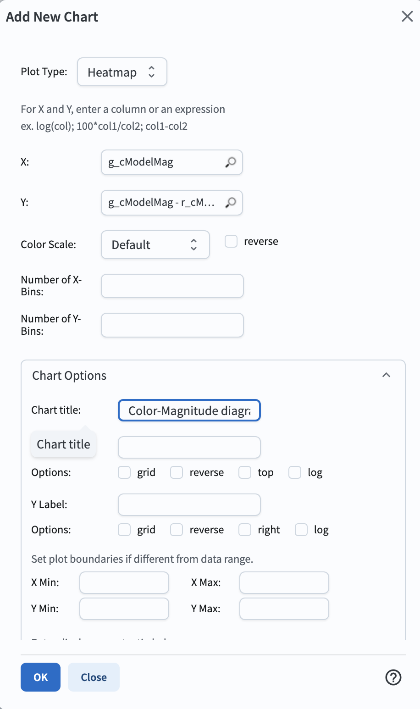

.. _portal-104-6:

###################################
104.6. Plot histograms and heatmaps
###################################

For the Portal Aspect of the Rubin Science Platform at data.lsst.cloud.

**Data Release:** DP1

**Last verified to run:** 2025-06-30

**Learning objective:** Create histograms and heatmaps in the results active chart.

**LSST data products:**  ``Object`` table

**Credit:** Originally developed by the Rubin Community Science team.
Please consider acknowledging them if this tutorial is used for the preparation of journal articles, software releases, or other tutorials.

**Get Support:** Everyone is encouraged to ask questions or raise issues in the `Support Category <https://community.lsst.org/c/support/6>`_ of the Rubin Community Forum.
Rubin staff will respond to all questions posted there.

----

**1. Log in to the Portal aspect of the Rubin Science Platform and execute a query.**
Go to the Portal's DP1 Catalogs tab, switch to the ADQL interface.
Copy-paste the query below into the box, which will retrieve g- and r-band magnitudes for a sample of extended objects (galaxies) with fluxes greater than 360 nJy.
Click "Search".

.. code-block:: SQL

   SELECT coord_dec, coord_ra,
   g_cModelMag,
   r_cModelMag,
   g_extendedness,
   r_extendedness
   FROM dp1.Object
   WHERE CONTAINS(POINT('ICRS', coord_ra, coord_dec),
   CIRCLE('ICRS', 53.0, -28.0, 0.3)) =1
   AND g_extendedness = 1
   AND r_extendedness = 1
   AND g_cModelFlux > 360
   AND r_cModelFlux > 360

**2. Add a new chart, and choose histogram.**
The default plot in "Active Charts" panel shows the number of objects as a function of position in the selected region.
In the Active Chart panel, click on the "+" button in the upper-left corner of the panel.
In the "Add New Chart" pop-up window select "Histogram" as the plot type and enter ``g_cModelMag`` as the column (Figure 1).
Click "OK".

    Figure 1: The "Add New Chart" pop-up window, set up for a histogram.

**3. Delete the default chart.**
Remove the default plot of ``coord_ra`` vs. ``coord_dec`` by clicking on the "x" in the upper right corner of the plot.

**4. Add a new chart, and choose heatmap.**
Open the "Add New Chart" pop-up window.
Select "Heatmap" as the plot type and enter ``g_cModelMag`` for X and the expression ``g_cModelMag`` - ``r_cModelMag`` for Y (Figure 2).
Leave the Color Scale as "Default".
Click "OK".

    Figure 2: The "Add New Chart" pop-up window, set up for a heatmap.

**5. View the histogram and the heatmap.**
The Active Charts panel now displays a 1-dimensional histogram of the g-band magnitudes at left, and a 2-dimensional histogram (a heatmap) of the g-band magnitude vs. the g-r color at right, as in Figure 3.

    Figure 3: The Active Charts panel displays the g-magnitude histogram and the color-magnitude diagram.
