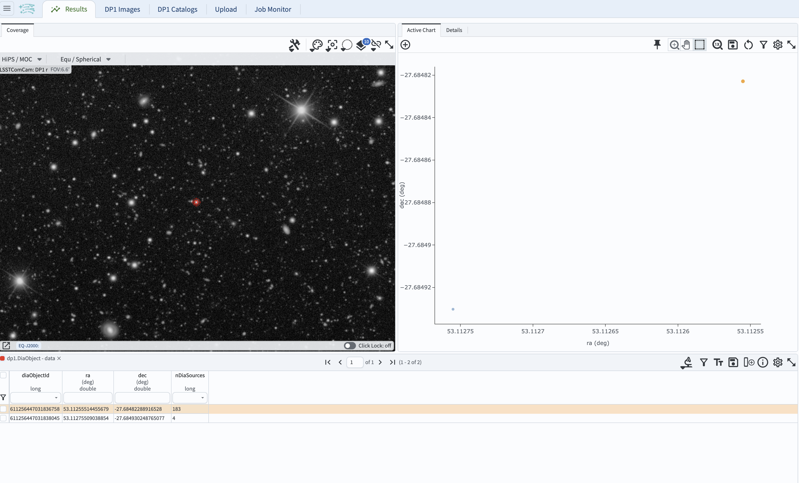
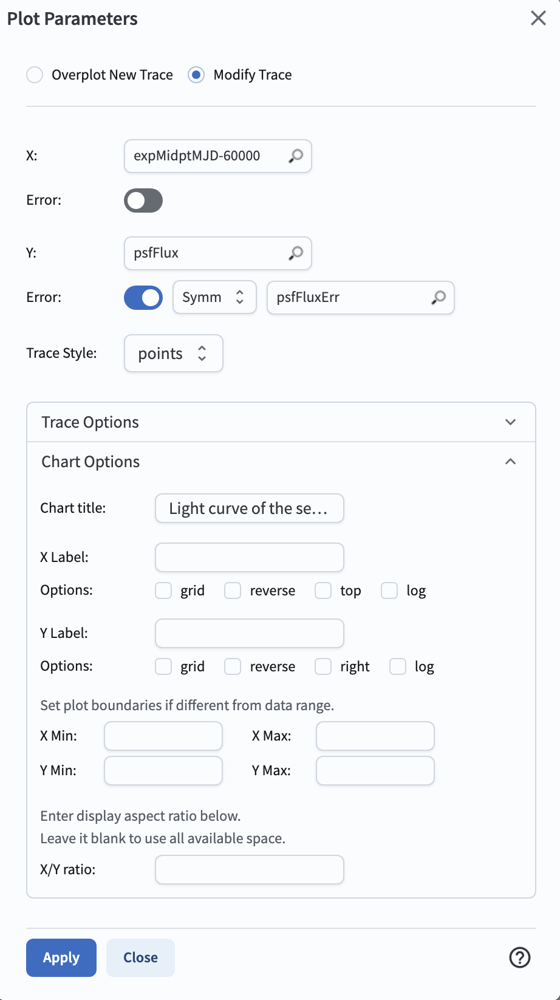
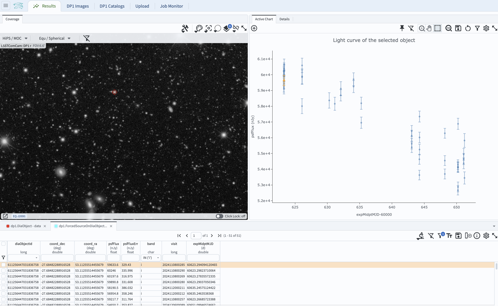

.. _portal-104-7:

##############################################
104.7. Plot a light curve of a variable object
##############################################

For the Portal Aspect of the Rubin Science Platform at data.lsst.cloud.

**Data Release:** DP1

**Last verified to run:** 2025-07-01

**Learning objective:** Plot a light curve of an object with known coordinates.

**LSST data products:** ``DiaObject`` and ``ForcedSourceOnDiaObject`` tables

**Credit:** Originally developed by the Rubin Community Science team.
Please consider acknowledging them if this tutorial is used for the preparation of journal articles, software releases, or other tutorials.

**Get Support:** Everyone is encouraged to ask questions or raise issues in the `Support Category <https://community.lsst.org/c/support/6>`_ of the Rubin Community Forum.
Rubin staff will respond to all questions posted there.

**Advisory:**
Photometry for light curves sound use the ``ForcedSourceOnDiaObject`` table, which contains forced photometry at the location of all ``DiaObjects``.
The recommended way to extract photometry from the ``ForcedSourceOnDiaObject`` table is by ``diaObjectId``, not by spatial queries on the forced source table; it is more efficient to use ``diaObjectId``.

----

**1. Log in to the Portal and execute a query.**
Go to the Portal's DP1 Catalogs tab, switch to the ADQL interface (click on "Edit ADQL" tab), and enter the query below.
This step will return the ``diaObjectId`` for the known object with the coordinates in the query.
Click the Search button at lower left.

.. code-block:: SQL

        SELECT
        diaObjectId, ra, dec, nDiaSources
        FROM dp1.DiaObject
        WHERE CONTAINS(POINT('ICRS', ra, dec),
        CIRCLE('ICRS', 53.112562, -27.684829, 0.00028)) = 1

**2. Retrieve the object ID from the results.**
The query results will appear in the results interface.
The default "Coverage Chart" marks the ``DiaObjects`` on the HiPS map and the default "Active Chart" plots RA vs. Dec.
The table on the bottom displays the returned ``DiaObjects``, and it is the one with the large number of detections
(``diaObjectId`` = 611256447031836758) that is the time domain object of interest.

    Figure 1: The default results view obtained by executing the query.

**3. Execute a ADQL query to retrieve the object's light curve.**
This query joins the ``ForcedSourceOnDiaObject`` table (containing fluxes and flux errors) with the ``Visit`` table (containing the MJD observation epoch) on their common column ``visit``.

.. code-block:: SQL

        SELECT
        src.diaObjectId, src.coord_dec, src.coord_ra,
        src.psfFlux, src.psfFluxErr, src.band, visinfo.visit, visinfo.expMidptMJD
        FROM dp1.ForcedSourceOnDiaObject as src
        JOIN dp1.Visit as visinfo
        ON visinfo.visit = src.visit
        WHERE diaObjectId = 611256447031836758

**4. Change the plot to show flux vs. time.**
To change the plot from the default of RA vs. Dec, click on the "gear" above the plot, and enter the parameters as in the screenshot below.
Click "Apply" - this will result in the light curve measured in several filters.

    Figure 2: The box with selection of parameters for the plot of the light curve of the selected target as a fnction of observation epoch (in MJD-60000).

**5. Select the filter to show a single-band light curve.**
In the table at the bottom of the screen, click on the box below the column header "band" and check only "i",
and the plot will update to be just the *i*-band light curve.

    Figure 3: The light curve of the selected target in the *i* band as a function of observation epoch (in MJD-60000).

