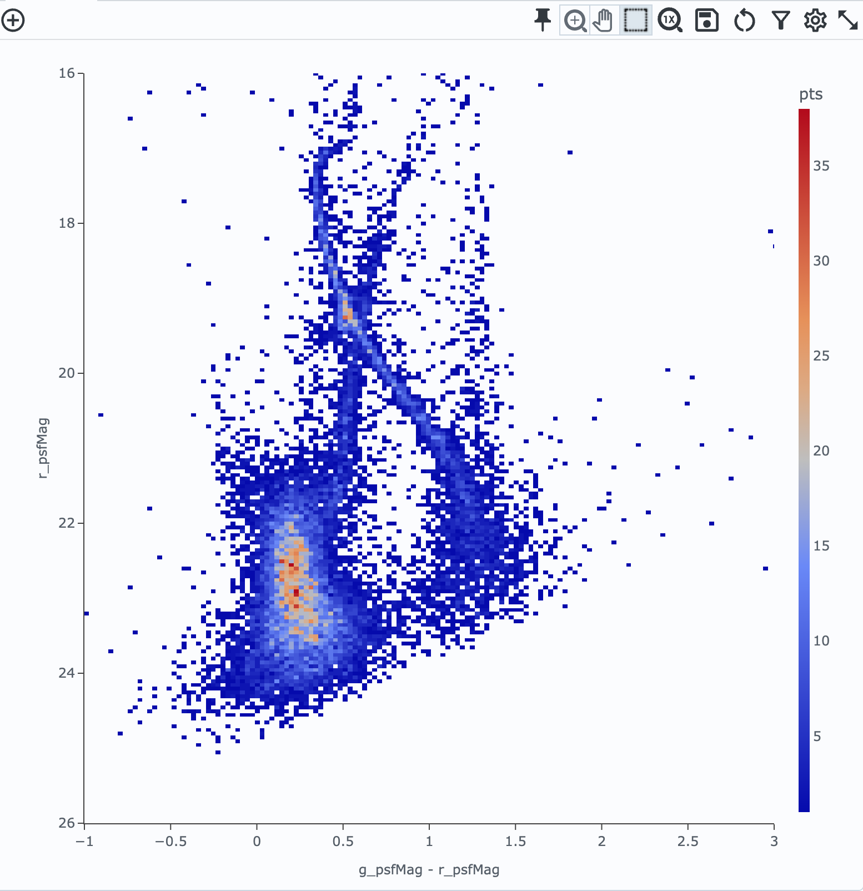
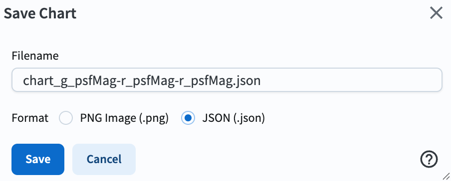

.. _portal-104-8:

#################################################
104.8. Saving portal visualizations as JSON files
#################################################

For the Portal Aspect of the Rubin Science Platform at data.lsst.cloud.

**Data Release:** DP1

**Last verified to run:** 2026-05-21

**Learning objective:** Make a color-magnitude diagram and save it as JSON file.

**LSST data products:** ``Object`` table

**Credit:** Originally developed by the Rubin Community Science team.
Please consider acknowledging them if this tutorial is used for the preparation of journal articles, software releases, or other tutorials.

**Get Support:** Everyone is encouraged to ask questions or raise issues in the `Support Category <https://community.lsst.org/c/support/6>`_ of the Rubin Community Forum.
Rubin staff will respond to all questions posted there.

**Advisory:** Saving plots as JSON files offers one primary advantage over standard static image formats. It preserves the "live" state of the visualization rather than flattening it into static pixels. Because the file is saved as structured text rather than a "dead" image, it can be fully reconstructed in a Notebook later and use Python to programmatically change titles, adjust styles, or add annotations without needing to regenerate the plot from scratch.

**Related tutorials:** The 300-level Notebook tutorial demonstrates how to enhance JSON-based visualizations.

----

**1. Log in to the Portal and execute a query.**
Go to the Portal's DP1 Catalogs tab, switch to the ADQL interface (click on "Edit ADQL" tab), and enter the query below.
Click the Search button at lower left.
This step will return PSF photometry in *g* and *r* bands for the point-like objects with signal-to-noise ratio > 5 in both bands in the 47 Tuc field.

.. code-block:: SQL

        SELECT g_psfMag, r_psfMag
        FROM dp1.Object
        WHERE CONTAINS(POINT('ICRS', coord_ra, coord_dec),
        CIRCLE('ICRS', 6.128, -72.09, 1))=1
        AND (refExtendedness =0)
        AND g_psfFlux/g_psfFluxErr > 5
        AND r_psfFlux/r_psfFluxErr > 5

**2. Plot a color-magnitude diagram.**
Add a new chart and select the "Heatmap" plot type. Use color (``g_psfMag``-``r_psfMag``) on the x-axis and magnitude (``r_psfMag``) on the y-axis. Select 200 bins in X and 200 bins in Y. Set the X Min, X Max values to -1, 3, and the Y Min, Y Max values to 16, 26. Select "reverse" under "Chart Options" for the y-axis to display brighter magnitudes (i.e., lower numbers) toward the top of the plot.

    Figure 1: *g*-*r* versus *r* color-magnitude diagram for stars in the 47 Tuc field.

**3. Save the plot as a JSON file.**
Click the floppy disk icon at the top of the plot interface, then select "JSON" from the format options to save the plot. The file will be saved to your local computer.

    Figure 2: Screenshot demonstrating how to save the plot as a JSON file.