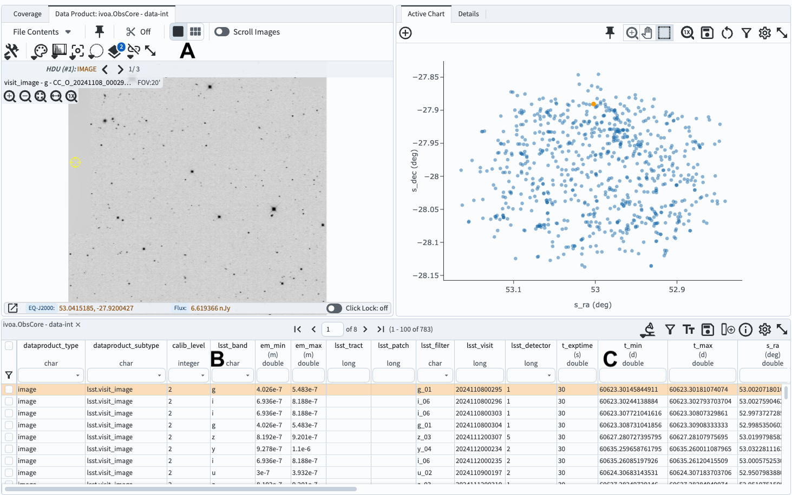

.. _portal-105-1:

###########################################
105.1. Navigate the image results interface
###########################################

For the Portal Aspect of the Rubin Science Platform at data.lsst.cloud.

**Data Release:** DP1

**Last verified to run:** 6/24/2025

**Learning objective:** Navigate the multi-panel interface for image data results.

**LSST data products:** DP1 Processed Visit Images ("Calexps")

**Credit:** Originally developed by the Rubin Community Science team.
Please consider acknowledging them if this tutorial is used for the preparation of journal articles, software releases, or other tutorials.

**Get Support:** Everyone is encouraged to ask questions or raise issues in the `Support Category <https://community.lsst.org/c/support/6>`_ of the Rubin Community Forum.
Rubin staff will respond to all questions posted there.

----

**1. Log in to the Portal Aspect of the RSP.**
Log in to the Rubin Science Platform, and select the Portal aspect.
There, go to the Portal's "General TAP" tab, and switch to the UI interface.
If the "General TAP" tab is not available click on the "hamburger" icon on the upper left, and click on the "General TAP" entry.
This will result in an additional tab on top.

**2. Select the appropriate table and enter the image coordinates.**
Select "ivoa" for the "Table Collection (Schema)" on the left, and "ivoa.ObsCore" on the right (should be the default).
For Observation Type and Source, select "PVIs (2)".
For "Location" select "Observation boundary contains point" and enter ``53.0, -28.0`` in the associated box.
Unselect "Timing" and "Object ID Search" boxes.
Click on "Search".

**3. Review the Results tab layout.**
The default layout of the Results tab is shown in Figure 1.

    Figure 1: The results of the query above, which defaults to the screen split three ways:

* an image associated with the first entry in the tabular data below at upper left,

*  default plot at upper right (corresponding to the first two columns in the table,

* the tabular data below, with entries corresponding to individual images.

**4. Select another image of those retuned via your search.**
Click on another line in your table.
An image corresponding that entry will display in the upper left.

**5. Display multiple images.**
Click on the icon displaying six little boxes above the single image.
This will result in a display of images corresponding to the first eight entries in the table.

.. figure:: images/portal-105-1-2.png
    :name: portal-105-1-2
    :alt: The Results tab after a query has been executed but displaying multiple images.

    Figure 2: The results of the query above, but displaying multiple images, corresponding to first eight entries in the table below.

**6.  Restrict the epochs of observations.**
Return to the main Portal Aspect screen, and enter the parameters as in part (2) above, but don't click on "search" yet.
Click on the box next to "Timing".
For "Time of Observation" select "Overlapping specified range".
Select "MJD values" and enter the desired range, for example, ``60600`` and ``606500`` for the "Start Time" and "End Time".
Click "Search".
This will limit the retrieved images to only those obtained during the specified time interval.

**7. Select images obtained with specific filter.**
Click on the "down arrow" in the header of the column "lsst band".
Select only one filter (say ``g``) and click "search".
This will further restrict the selected images.
