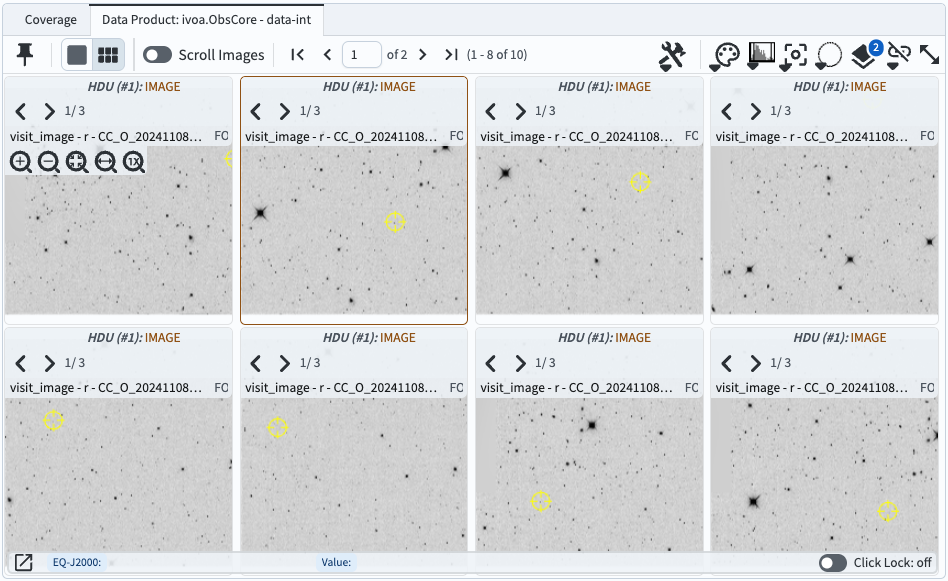

.. _portal-105-1:

###########################################
105.1. Navigate the image results interface
###########################################

For the Portal Aspect of the Rubin Science Platform at data.lsst.cloud.

**Data Release:** DP1

**Last verified to run:** 6/27/2025

**Learning objective:** Navigate the multi-panel interface for image data results.

**LSST data products:** ``visit_image``

**Credit:** Originally developed by the Rubin Community Science team.
Please consider acknowledging them if this tutorial is used for the preparation of journal articles, software releases, or other tutorials.

**Get Support:** Everyone is encouraged to ask questions or raise issues in the `Support Category <https://community.lsst.org/c/support/6>`_ of the Rubin Community Forum.
Rubin staff will respond to all questions posted there.

----

**1. Execute an ADQL query for visit images**
Log in to the Portal Aspect, select the "DP1 Images" tab and click on "Edit ADQL" at upper right.
Enter the following ADQL statement and click "Search" at lower left.
This query will return all process visit images that overlap coordinates RA, Dec = 53.0, -28.0 degrees.

.. code-block:: SQL

  SELECT dataproduct_type,dataproduct_subtype,calib_level,
         lsst_band,em_min,em_max,lsst_tract,lsst_patch,
         lsst_filter,lsst_visit,lsst_detector,t_exptime,
         t_min,t_max,s_ra,s_dec,s_fov,obs_id,obs_collection,
         o_ucd,facility_name,instrument_name,obs_title,
         s_region,access_url,access_format
  FROM ivoa.ObsCore
  WHERE obs_collection = 'LSST.DP1' AND calib_level = 2
  AND dataproduct_type = 'image' AND instrument_name = 'LSSTComCam'
  AND dataproduct_subtype = 'lsst.visit_image'
  AND CONTAINS(POINT('ICRS', 53, -28), s_region)=1

**2. Review the results interface for images.**
As shown in Figure 1, the default layout displays the selected image at upper right,
a default plot of RA vs. Dec at upper left, and the table with image metadata at the bottom.

.. figure:: images/portal-105-1-1.png
    :name: portal-105-1-1
    :alt: The Results tab after a query has been executed.

    Figure 1: The results of the query above, which defaults to the screen split three ways:

**3. Select a different image to display.**
Click on another row of the table so that it is highlighted in orange, and it will display at upper left.

**4. Subset images by filtering the table.**
In the table column for ``lsst_band``, use the drop-down table in the header to select only *r*-band images (B in Figure 1).
For column ``t_min`` enter ``< 60623.28`` to select only images for which the shutter opened before MJD 60623.26 (C in Figure 1).
This will filter the table down to 10 images.

**5. Display multiple images.**
To display up to eight images side-by-side, click on the icon displaying six little boxes above the single image (A in Figure 1).

    Figure 2: The results of the query above, but displaying multiple images, corresponding to first eight entries in the table.

**6. Hide the active chart (plot).**
Open the left sidebar using the menu icon at upper left.
Under "Results Layout", select a side-by-side view of the coverage/images panel and the tables panel, as in Figure 3.
The layout should now resemble Figure 4.
Note that it might be necessary to choose the right tab in the left panel in order to see the images instead of the coverage map or active chart.

    Figure 3: The Portal sidebar, under "Results Layout".

    Figure 4: A side-by-side view of images and the table.

