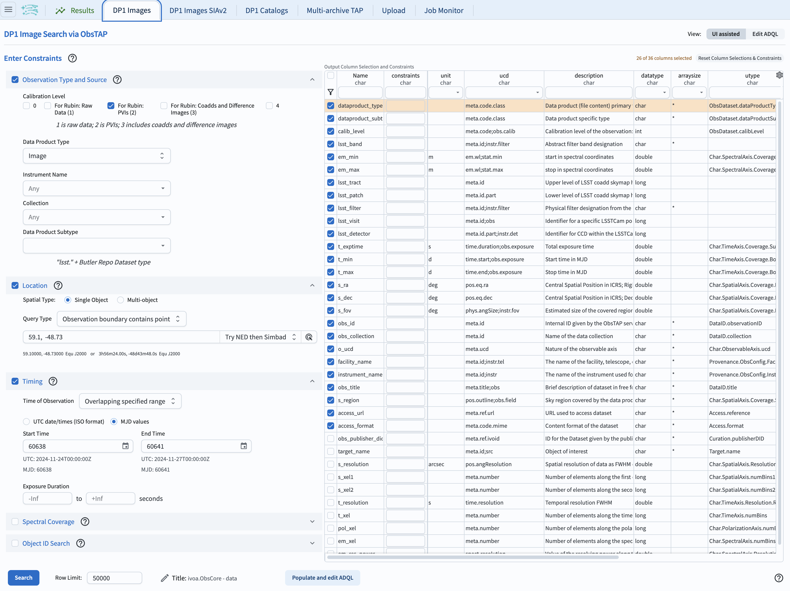
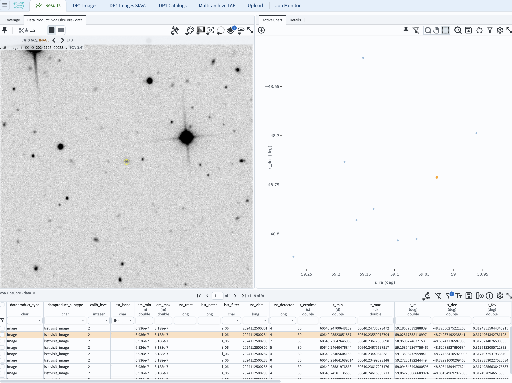
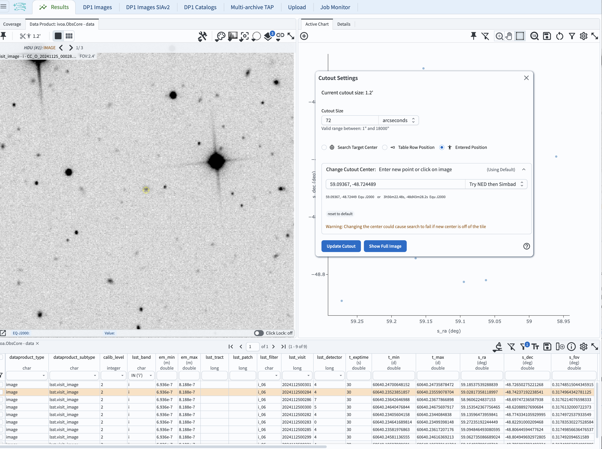
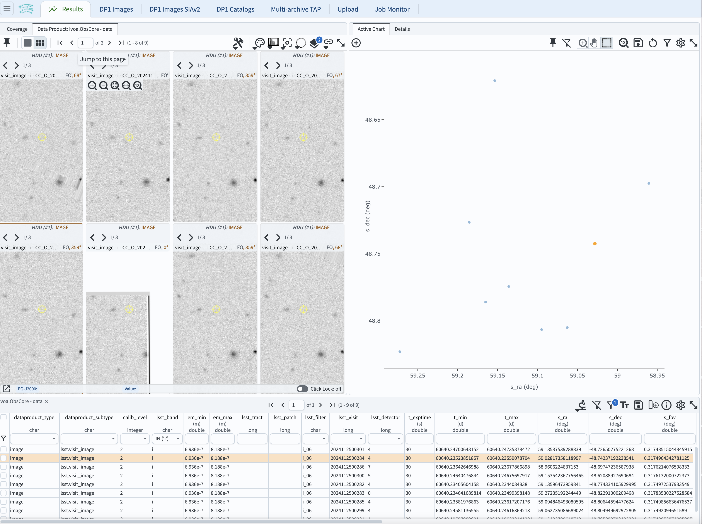

.. _portal-105-5:

################################
105.5. Use the image cutout tool
################################

For the Portal Aspect of the Rubin Science Platform at data.lsst.cloud.

**Data Release:** DP1

**Last verified to run:**  September 6, 2025

**Learning objective:** View image cutouts instead of full-frame images in Firefly.

**LSST data products:**

**Credit:** Originally developed by the Rubin Community Science team.
Please consider acknowledging them if this tutorial is used for the preparation of journal articles, software releases, or other tutorials.

**Get Support:** Everyone is encouraged to ask questions or raise issues in the `Support Category <https://community.lsst.org/c/support/6>`_ of the Rubin Community Forum.
Rubin staff will respond to all questions posted there.

----

**1. Log in to the Portal Aspect of the RSP.**
Go to `data.lsst.cloud <https://data.lsst.cloud>`_ , select the Portal Aspect, and click on the "DP1 Images" tab at the top.

**2. Enter the Observation Type and Source, and the coordinates of the image to be examined.**
The example below uses the Euclid Deep Field South (ECDS) containing the location of RA = 59.1, Dec = -48.73.
In the "Location" tab on the left, request "Observation boundary contains point" and enter those coordinatres ihe box just below.
Select Processed Visit Images (PVIs) by clicking on the "PVIs (2)" box in the "Observation Type and Source" tab on the left.

**3. Restrict the observation epochs.**
In the "Timing" tab, for the "Time of Observation" select "Overlaping specific range"..." and enter 60638 and 60641 as start time and End Time.
Click the "Search" button.

    Figure 1: The screenshot of the Portal Aspect of the RSP with selection of the parameters as above.

**4. Select a single-band observaton.**
In the table on the bottom, in the column with the header "lsst band" select "i" from the dropdown menu.

**5. Select the cutout tool.**
Above the image on the upper left, click on "scissors" which will select the cutout tool.
The pop-up window will allow for some choices:  the default is "Search Target Center".

.. figure:: images/portal-105-5-2.png
    :name: portal-105-5-2
    :alt: The screenshot resulting from executing the seach above, with the pop-up window resulting from clicking on "scissors" (marked with an arrow).

    Figure 2: The screenshot resulting from executing the seach above, with the pop-up window resulting from clicking on "scissors" (marked as "A).

Click on "Show cutout".
Examine the upper left-hand panel of your screen showing the cutout of the image, centered on the coordinates entered in Step 1.
At this point, it is possible to return the full image by clicking on the scissors, and clicking on "Show Full Image".

**6. Change the coordinates of the cutout.**
Click on the "scissors" again to display the pop-up window.
Change the cutout center by clicking on the circle next to "Entered Position".
Click on the "Change Cutout Center" box and enter your desired coordinates (which need to be within the selected PVI).
As an example, enter 59.09367, -48.724489 .
Click on "Update Cutout", which will show a single cutout corresponding to the first entry in the table below.

    Figure 3:  The screenshot revealing the cutout centered on the selected coordinates, with the pop-up window where the cutout center coordinates were entered.

**7. Display multiple cutouts.**

Click on the icon with six little rectangles on the upper left (marked with the red arrow).
This will reveal cutouts from the first eight images (as listed in the table below).

    Figure 4:  The screenshot revealing the eight cutouts centered on the selected coordinates.

**7. Align the orientation of the multiple cutouts.**

Click on the "image alignment" tool icon (next-to-the-righmost icon above the eight images.
Under the "Align and Lock" option, click on the "by WCS" choice.

    Figure 5:  The screenshot revealing the eight cutouts centered on the selected coordinates, but aligned to WCS.

