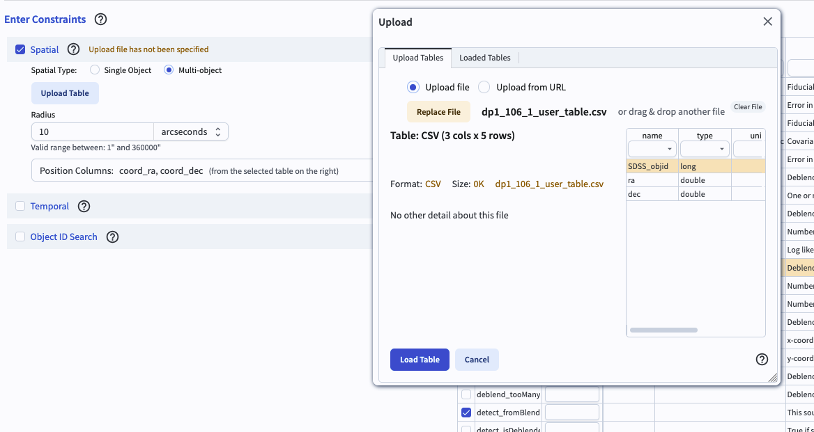
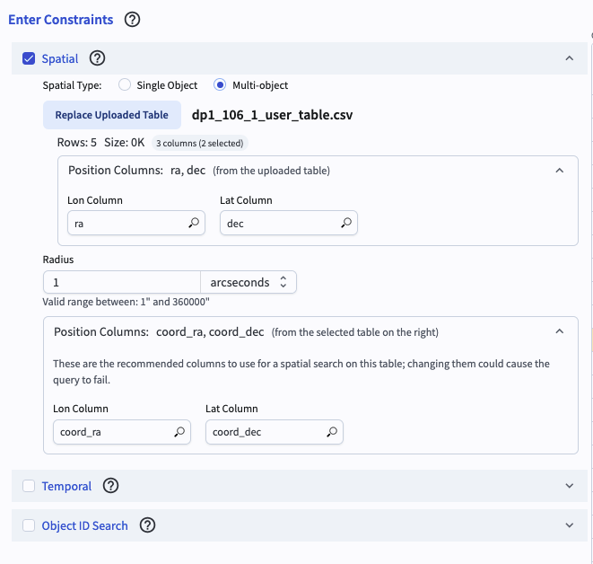
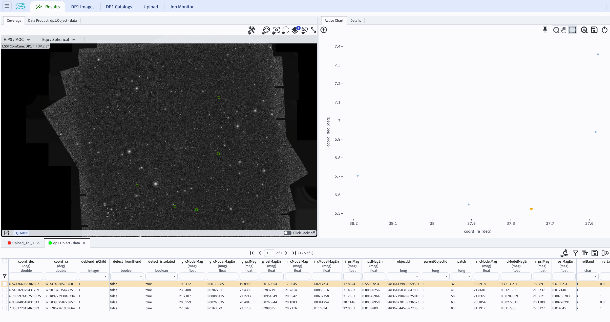

.. _portal-106-1:

################################################
106.1. Upload a table and spatially cross-match
################################################

For the Portal Aspect of the Rubin Science Platform (RSP) at data.lsst.cloud.

**Data Release:** Data Preview 1

**Last verified to run:** 2025-09-26

**Learning objective:** How to upload a table and cross-match by coordinate

**LSST data products:** ``Object`` table

**Credit:** Originally developed by the Rubin Community Science team.
Please consider acknowledging them if this tutorial is used for the preparation of journal articles, software releases, or other tutorials.

**Get Support:** Everyone is encouraged to ask questions or raise issues in the `Support Category <https://community.lsst.org/c/support/6>`_ of the Rubin Community Forum.
Rubin staff will respond to all questions posted there.

----

**1. Log in to the RSP and enter the Portal Aspect.**
In a web browser go to `data.lsst.cloud <https://data.lsst.cloud/>`_, select the Portal Aspect, and log in.

**2. Select the DP1 Catalogs tab.**
On the Portal landing page, click on the tab labeled "DP1 Catalogs". Leave the default table selection.

**3. Enter Constraints.**
Check the box to the left of the "Spatial" section (uncheck the other two if checked), and click on the "Multi-object" button next to "Spatial Type". This will make a pop-up window appear with the interface to upload a table.

.. figure:: images/portal-106-1-1.png
    :name: portal-106-1-1
    :alt: The user interface for the Portal, with drop-down menus to select and upload files.

    Figure 1. The interface to upload a table.

**4. Create a table to upload.**
Copy the example table below and save it as a CSV file called ``dp1_106_1_user_table.csv``. Avoid using the "+" prefix for positive infinity (i.e., "+inf") in any of your columns. These values are not recognized as valid float values, and the entire column will be interpreted as a character type.

.. code-block::

    SDSS_objid,ra,dec
    1237667228761784409,37.74742808,6.524779178
    1237667229298524386,37.58392949,6.939873543
    1237667229835395444,37.57851835,7.358364681
    1237670016195560108,37.90737626,6.548163852
    1237670016195691261,38.18971577,6.703589365

**5. Upload a table to the Portal.**
In the pop-up window for table uploads, select "Upload file" and click on "Choose File". Select the CSV file containing the user table and click the "Load Table" button.

    Figure 2. The pop-up window after uploading a table, with a list of columns shown.

**6. Select columns and set the radius for cross-matching.**
Click the drop down menu under "Position Columns (from the uploaded table). Indicate which of the uploaded table columns to use for spatial matching (default "ra" and "dec"). Click the drop down menu under "Position Columns (from the selected table on the right) and check that the default "coord_ra" and "coord_dec" are shown. Set the search radius to 1 arcseconds.

    Figure 3. The interface to select the position columns and set the radius to be used for cross-matching.

**7. Click search.**
At the lower left, click the blue button named "Search". Leave the default row limit.

**8. Review the results**. The search returns matches for all five of the objects from the user-uploaded table. The results interface includes a table with the default column selections from the DP1 Object table and the "ra" and "dec" columns from the uploaded table.

    Figure 4. The catalog results interface after the cross-match query was executed.
