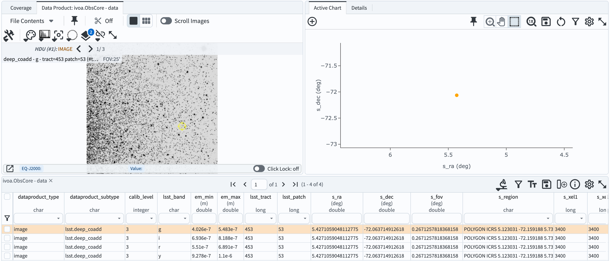
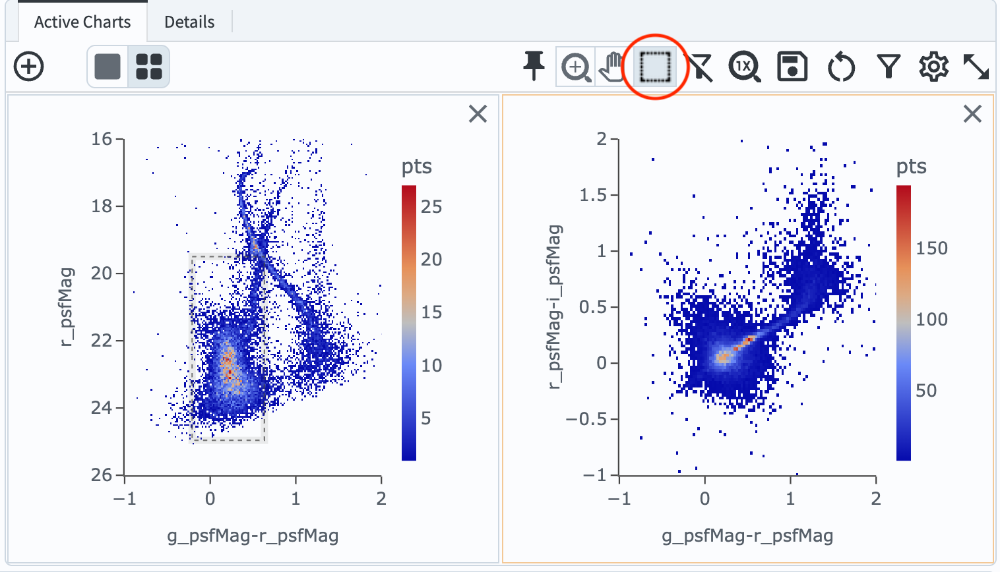

.. _portal-301-1:

##############################
301.1. 47 Tuc Globular Cluster
##############################

For the Portal Aspect of the Rubin Science Platform at data.lsst.cloud.

**Data release:** DP1

**Last verified to run:** 2025-07-11

**Learning objective:** Understand the observations and data available for the 47 Tuc field.

**LSST data products:** ``deep_coadd`` images, ``Visit``, ``CcdVisit``, and ``Object`` tables

**Credit:** Originally developed by the Rubin Community Science team.
Please consider acknowledging them if this tutorial is used for the preparation of journal articles, software releases, or other tutorials.

**Get support:** Everyone is encouraged to ask questions or raise issues in the `Support Category <https://community.lsst.org/c/support/6>`_ of the Rubin Community Forum.
Rubin staff will respond to all questions posted there.

**Related tutorials:** The 100-level Portal tutorials demonstrate how to use the Portal interface. The 200-level tutorials explore the individual catalogs and image types.

----

1. Introduction
===============

This tutorial explores the LSSTComCam observations for the "47 Tuc" field, including magnitude limits, visit distribution with time, data quality, and the distributions of stars and galaxies in color-magnitude and color-color diagrams.

47 Tuc is a bright, dense star cluster in the constellation Tucana. The ComCam field targeting this cluster is centered at (RA, Dec) = (6.128, –72.090) degrees. It is representative of the crowded fields that LSST will encounter in the Milky Way. 47 Tuc overlaps with the Small Magellanic Cloud (SMC) on the sky, but these are distinct objects: 47 Tuc is a globular cluster of the Milky Way's halo, while the SMC is a dwarf satellite galaxy orbiting around the Milky Way.

**Central coordinates:** (RA, Dec) = 6.128, –72.090 degrees

**1.1. Log in to the Portal Aspect of the RSP.**
In a web browser, navigate to `data.lsst.cloud <https://data.lsst.cloud/>`_ and select the "Portal" panel.

**1.2. Browse the ugr color HiPS map.**
`Go to the ugr color HiPS map for the 47 Tuc field <https://data.lsst.cloud/portal/app/?api=hips&uri=https://data.lsst.cloud/api/hips/v2/dp1/deep_coadd/color_ugr&ra=6.128&dec=-72.09&sr=50m>`_.

2. Examine a deep coadd image
=============================

**2.1. Select the "DP1 Images" tab.**
If it does not appear across the top of the user interface, click the "menu" icon at upper left to open the left-hand menu.

**2.2. Switch to the "Edit ADQL" interface.**
Click on the "Edit ADQL" button at upper right.

**2.3. Execute the ADQL query for deep coadd images.**
Copy-paste the following ADQL query into the query box and click "Search" at lower left.
This query will retrieve all images of subtype ``deep_coadd`` that contain the central coordinates of the 47 Tuc field.

.. code-block:: SQL

  SELECT dataproduct_type, dataproduct_subtype, calib_level, lsst_band,
       em_min, em_max, lsst_tract, lsst_patch,
       s_ra, s_dec, s_fov, s_region, s_xel1, s_xel2, obs_id, obs_collection, o_ucd,
       facility_name, instrument_name, obs_title, access_url,
       access_format, obs_publisher_did
  FROM ivoa.ObsCore
  WHERE obs_collection = 'LSST.DP1' AND calib_level = 3 AND dataproduct_type = 'image'
        AND instrument_name = 'LSSTComCam' AND dataproduct_subtype = 'lsst.deep_coadd'
        AND CONTAINS(POINT('ICRS', 6.128, -72.090), s_region)=1

**2.4. View the results.**
The query will return 4 ``lsst.deep\_coadd`` results -- one for each of the *griy* bands -- without coverage in the centeral region,
because coadd images were not generated for the center of 47 Tuc due to saturation.
The results interface will appear similar to Figure 1.

    Figure 1: The results of the ``deep_coadd`` image search.

**2.5. Explore the images.**
Use the image display interface to zoom, pan, rescale, and generally explore the deep images of the 47 Tuc field.

3. Create a patch coverage map
==============================

**3.1. Return to the image query interface.**
Navigate back to the "DP1 Images" tab, and switch to the "Edit ADQL" interface.
Delete the previous query from the box.

**3.2. Execute a new image query.**
Copy-paste the following ADQL query into the query box and click "Search" at lower left.
This query will retrieve all images of subtype ``deep_coadd`` that were obtained with the *r*-band filter and overlap the ~1 degree 47 Tuc field (not just its central coordinates).

.. code-block:: SQL

  SELECT dataproduct_type, dataproduct_subtype, calib_level, lsst_band,
         em_min, em_max, lsst_tract, lsst_patch,
         s_ra, s_dec, s_fov, s_region, s_xel1, s_xel2, obs_id, obs_collection, o_ucd,
         facility_name, instrument_name, obs_title, access_url,
         access_format, obs_publisher_did
  FROM ivoa.ObsCore
  WHERE obs_collection = 'LSST.DP1' AND calib_level = 3 AND dataproduct_type = 'image'
        AND instrument_name = 'LSSTComCam' AND dataproduct_subtype = 'lsst.deep_coadd'
        AND CONTAINS(POINT('ICRS', s_ra, s_dec), CIRCLE('ICRS', 6.128, -72.090, 1))=1
        AND ( 622e-9 BETWEEN em_min AND em_max )

**3.3. Switch to the Coverage map.**
In the results interface, switch from image display to Coverage map.
The boundaries of the 64 patches are overlaid onto a HiPS coverage map, as in Figure 2.

    Figure 2: The search results showing the coadd footprints ("patches") on the HiPS coverage map.

**3.4. Explore the coverage map.**
In the coverage map, click any patch and its corresponding image will be highlighted in the table and plot.

4. Make visit summary plots
===========================

**4.1. Go to the catalog query interface.**
Click on the "DP1 Catalogs" tab and then on the "Edit ADQL" button.

**4.2. Execute a query on the Visit table.**
This query will retrieve the coordinates, band, and MJD for all visits from the ``Visit`` table with central coordinates within the 47 Tuc field.

.. code-block:: SQL

  SELECT ra, dec, band, expMidptMJD
  FROM dp1.Visit
  WHERE CONTAINS(POINT('ICRS', ra, dec), CIRCLE('ICRS', 6.128, -72.090, 1))=1
  ORDER BY expMidptMJD ASC

**4.3. View the query results.**
In the results interface, the central coordinates of all visits are automatically marked on the Coverage map, illustrating how the field was dithered.

**4.4. Obtain the filter distribution.**
Use the filter function in the table to select each of the *griy* values from the "band" column in turn, and note how many observations there were in each filter. There should be 10 *g*, 32 *r*, 19 *i*, and 5 *y*-band visits.
Remove the filter constraint before continuing.

Visit dates cumulative histogram
--------------------------------

The ADQL query for visits included an "ORDER BY" statement to return a table that is sorted by ``expMidptMJD`` in ascending order.
Use this to plot a cumulative histogram of exposure acquisition dates.

**4.5. Add a new column.**
Add a new column to the table by clicking the column+ icon.
Click "Use preset function", and select "Number rows in current sort order".
Give the new column a name (e.g., "cumulative_expnum") and click "Add Column".

**4.6. Create the histogram.**
In the "Active Chart" panel, click the icon of the plus sign in a circle to open the "Add New Chart" popup.
Choose "Plot Type: Scatter", then plot column "expMidptMJD" on the x-axis, and "cumulative_expnum" on the y-axis.
Set the "Trace Style" to "connected points", and click "OK".

**4.7. View the plot.**
The resulting plot should look like Figure 3, showing the growing number of exposures with MJD.

    Figure 3: The figure showing the cumulative number of exposures obtained with time.

Visit image quality plots
-------------------------

Derived quantities that characterize the quality of images and their properties are found in the ``CcdVisit`` table.

**4.8. Return to the catalog query interface.**
Click on the "DP1 Catalogs" tab and then on the "Edit ADQL" button.
Delete the last query statement.

**4.9. Execute a query on the CcdVisit table.**
This query retrieves a table of all CcdVists (visit and detector combinations) that were observed of the 47 Tuc field.

.. code-block:: SQL

  SELECT visitId, ra, dec, band, seeing, magLim
  FROM dp1.CcdVisit
  WHERE CONTAINS(POINT('ICRS', ra, dec),CIRCLE('ICRS', 6.128, -72.090, 1.0))=1
  ORDER BY visitId

**4.10. View the results.**
The query returns 594 results, with the central locations of each detector for each CcdVisit overplotted on the coverage map.

**4.11. Create histograms of seeing and magnitude limit.**
In the "Active Chart" panel, create two new plots that show a histogram of the ``seeing`` column and a histogram of the ``magLim`` column (the 5-sigma limiting magnitude of each detector image).
It will look like Figure 4.

    Figure 4: The two histograms showing the distribution of seeing and limiting magnitude over all LSSTComCam detectors and visits, in all bands, in DP1.

5. Analyze object photometry
============================

The ``Object`` table, which contains detections and measurements from the ``deep_coadd`` images.

**5.1. Return to the catalog query interface.**
Delete the last ADQL statement.

**5.2. Execute a query on the Object table.**
This query will retrieve the PSF and cModel magnitudes, PSF fluxes and flux errors in *g*, *r*, and *i* bands, as well as the ``refExtendedness`` parameter, for 38,607 objects with SNR>5 measurements in all three bands in the 47 Tuc field.

.. code-block:: SQL

  SELECT coord_ra, coord_dec,
         g_psfMag, r_psfMag, i_psfMag,
         g_cModelMag, r_cModelMag, i_cModelMag,
         g_psfFlux, g_psfFLuxErr,
         r_psfFlux, r_psfFLuxErr,
         i_psfFlux, i_psfFLuxErr,
         refExtendedness
  FROM dp1.Object
  WHERE CONTAINS(POINT('ICRS', coord_ra, coord_dec), CIRCLE('ICRS', 6.128, -72.090, 1))=1
        AND g_psfFlux/g_psfFluxErr > 5
        AND r_psfFlux/r_psfFluxErr > 5
        AND i_psfFlux/i_psfFluxErr > 5

**5.3. Select point-like objects.**
Filter the table for only point-like objects ("stars") by filtering the ``refExtendedness`` column to be equal 0.

**5.4. Create a color-magnitude diagram.**
Add a chart and select the "Heatmap" plot type.
Use color (``g_psfMag``-``r_psfMag``) on the x-axis and magnitude (``r_psfMag``) on the y-axis.
Select 300 bins in X and 200 bins in Y.
Set the X Min, X Max values to -1, 3, and the Y Min, Y Max values to 16, 26.
Select "reverse" under "Options" for the y-axis to display brighter magnitudes (i.e., lower numbers) toward the top of the plot.

**5.5. Create a color-color diagram.**
Open a new plot window by clicking the "Add a chart" button. Make another heatmap for the color-color diagram by plotting ``r_psfMag``-``i_psfMag`` vs. ``g_psfMag``-``r_psfMag``. Select 200 bins in both X and Y. Set the X Min and Y Min to -1, and X Max and Y Max to 2.
Place the two figures side-by-side, as in Figure 5.

    Figure 5: Color-magnitude and color-color diagrams of stars in the 47 Tuc field. The red box in the color-magnitude diagram represents stellar populations in the outer SMC. 47 Tuc lies more than 2 degrees from the main body of the SMC, but a diffuse stellar population from the SMC extends into the 47 Tuc field, contributing to the color-magnitude diagram of 47 Tuc.

6. Exercises for the learner
============================

Try plotting the color-color and color-magnitude diagrams for galaxies (``refExtendedness`` = 1) instead.
Recall that cModel magnitudes are better suited for extended sources.

