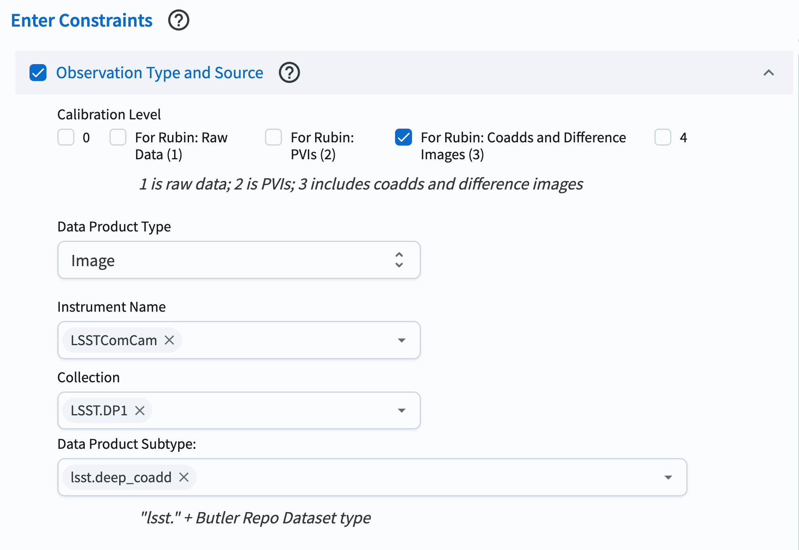
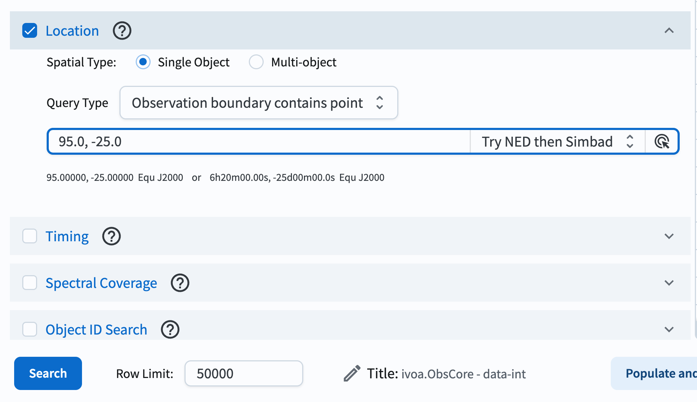
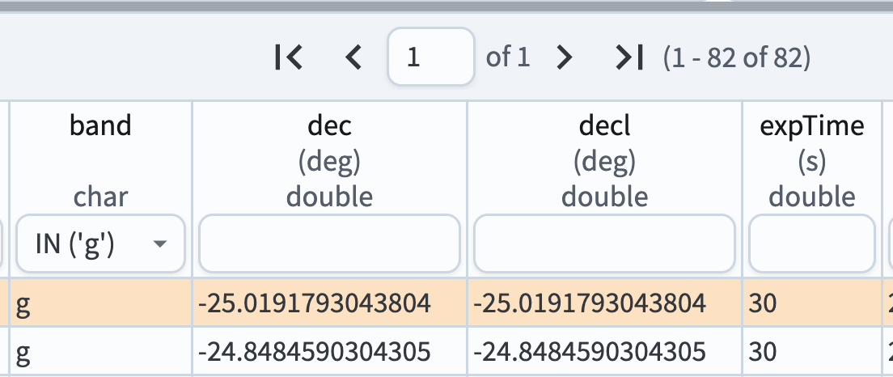
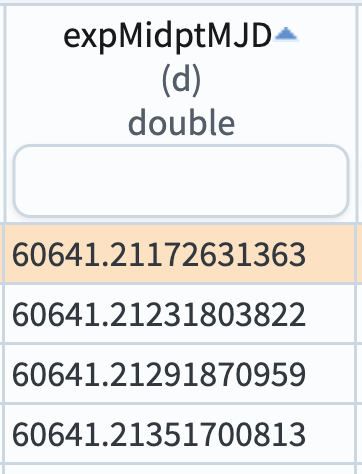
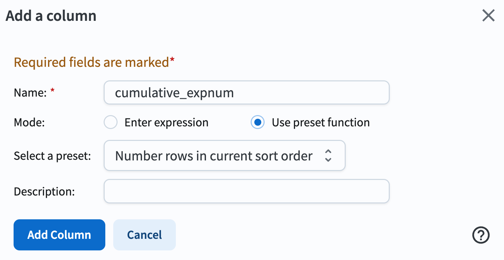
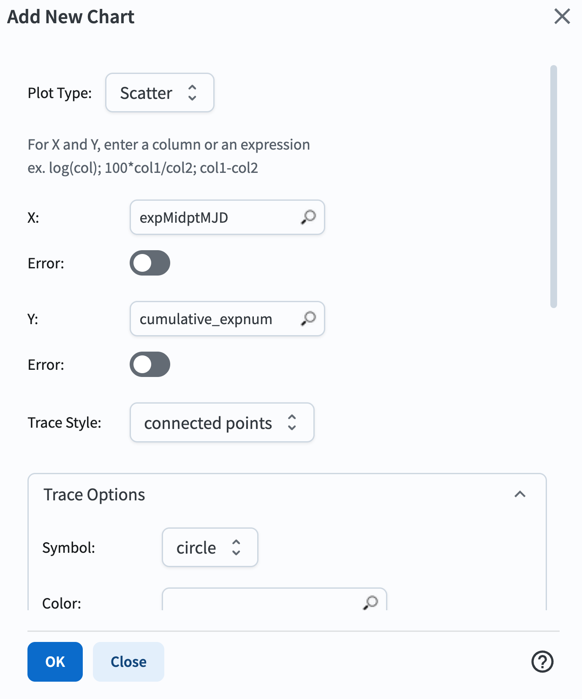
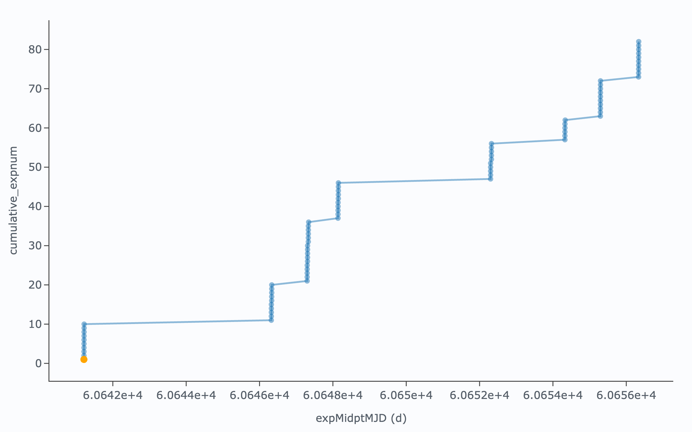
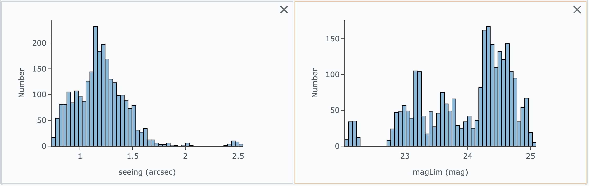
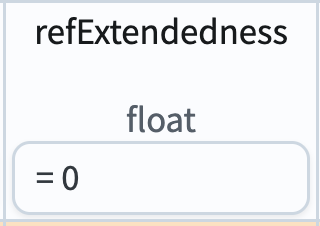
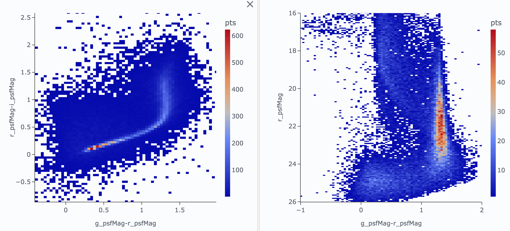

.. _portal-301-6:

################################################
301.6. Low Galactic Latitude Field (Coming Soon)
################################################

For the Portal Aspect of the Rubin Science Platform at data.lsst.cloud.

**Data Release:** DP1

**Last verified to run:** *yyyy-mm-dd*

**Learning objective:** Understand the observations and data available for the Low Galactic Latitude field.

**LSST data products:** *List the catalogs and images used.*

**Credit:** Originally developed by the Rubin Community Science team.
Please consider acknowledging them if this tutorial is used for the preparation of journal articles, software releases, or other tutorials.

**Get Support:** Everyone is encouraged to ask questions or raise issues in the `Support Category <https://community.lsst.org/c/support/6>`_ of the Rubin Community Forum.
Rubin staff will respond to all questions posted there.

----

This tutorial examines the Data Preview 1 (DP1) data products in the "RubinSV\_95\_-25" field, including magnitude limits, visit distribution with time, data quality, and the distributions of stars and galaxies in color-magnitude and color-color diagrams.

The field denoted "RubinSV\_95\_-25" is sometimes referred to as the "low-latitude field" because it was at the lowest Galactic latitude of any of the fields observed during LSSTComCam on-sky commissioning. RubinSV\_95\_-25 is centered at (RA, Dec) = (95.0, -25.0) degrees, corresponding to Galactic longitude/latitude of (l, b) = (232.5, -17.6) degrees. It is relatively far from the Galactic plane, and not representative of the crowded fields that LSST will see in the Milky Way disk. Nonetheless, it contains the highest source density of any of the LSSTComCam fields in DP1. The region covered spans a diameter of about 1 degree.

**1. Log in to the Portal Aspect of the RSP.**

See :doc:`/tutorials/portal/101/portal-101-1.rst`.

**2. Retrieve and examine a deep\_coadd image.**

Use the approximate central coordinates of the RubinSV\_95\_-25 field for searches throughout this tutorial. A 1-degree radius will encompass the entire field.

**Central coordinates:** (RA, Dec) = 95.0, -25.0 degrees

Navigate to the "DP1 Images" tab on the Portal.

In the "Observation Type and Source" section, click the box to select "Calibration Level 3". Select "Data Product Type: Image", "Instrument Name: LSSTComCam", and "Collection: LSST.DP1". Under "Data Product Subtype," select "lsst.deep\_coadd".

In the "Location" section, enter "95.0, -25.0" in the search box, leaving "Query type" set to "Observation boundary contains point".

Click the "Search" button.

    Figure 1: The Portal UI with no query constraints entered.

This should return 6 lsst.deep\_coadd results -- one for each of the ugrizy bands. The results should look something like the following.

.. figure:: images/portal-301-6-2.png
    :name: portal-301-6-2
    :alt: The image results

    Figure 2: The results of the deep coadd image search.

**3. See all of the patches overlaid on a coverage map**

Return to the DP1 Image Search window. Set "Query type: Central point (s_ra, s_dec) is contained by shape", and leave the other spatial constraints the same. In the "Spectral Coverage" section, limit the search to only r-band. Click the Submit button.

.. figure:: images/portal-301-6-3.png
    :name: portal-301-6-3
    :alt: The image results

    Figure 3: The search parameters to retrieve all deep coadd images.

This should return 79 images. If it's not already visible, click on the "Coverage" tab to see the patch boundaries overlaid onto a coverage map. Note how you can click one of the patches on the coverage map, and its corresponding image will display.

.. figure:: images/portal-301-6-4.png
    :name: portal-301-6-4
    :alt: The image results

    Figure 4: The search results showing the coadd footprints ("patches") on the coverage map.

**4. Visits**

Retrieve all visits from the Visit table that fall within a circular region centered at (RA, Dec) = (95.0, -25.0) with a radius of 1 degree. Return the visit ID, band, and observation midpoint time in both MJD and calendar date.

Navigate to the "DP1 Catalogs" tab. Select "Tables: dp1.Visit" from the dropdown at the top.

In the "Spatial" section, enter "95.0, -25.0" in the search box, select "Spatial Type: Single Object", "Shape Type: Cone Shape", and a radius of 1.0 degrees. Select all columns in the "Output Column Selection" box at the right. Then click the Submit button.

.. figure:: images/portal-301-6-5.png
    :name: portal-301-6-5
    :alt: The image results

    Figure 5: The search parameters for visit images.

This should return 292 visits in total. Note that the RA, Dec plot shows the field centers, illustrating how the field was dithered.

**4.1. Filter distribution**

Use the filter function in the table to select each of the ugrizy values from the "band" column in turn, and note how many observations there were in each filter. There should be 33 u, 82 g, 84 r, 23 i, 60 z, and 10 y-band visits.

    Figure 6: To filter on the "band" column, click in the box below the column heading, and select the desired band. Note that the number of results for the selected "g" band is 82.

**4.2. Visit dates cumulative histogram**

Click on the "expMidptMJD" column until you see a triangle pointing up (as in the figure below). This means that the table is now sorted by expMidptMJD so that it is in ascending order.

    Figure 7: To sort on the "band" column, click on the column heading until you see an upward-pointing triangle as above.

Add a new column to the table by clicking the column+ icon. Click "Use preset function", and select "Number rows in current sort order". Give the new column a name (e.g., "cumulative_expnum") and click "Add Column".

    Figure 8: To add a column to the table, click on the icon that looks like the above.

    Figure 9: To add a column to the table, add a name for the new column, and select the settings as above. Then click "Add Column".

Create a new chart in the "Active Chart" area. Choose "Plot Type: Scatter", then plot column "expMidptMJD" on the x-axis, and "cumulative_expnum" on the y-axis. Set the "Trace Style" to "connected points", and now you have a cumulative histogram of the number of exposures taken over time.

    Figure 10: To add create a cumulative histogram, select Plot Type: Scatter, select expMidptMJD for the x-axis, and cumulative_expnum for the y-axis. Then select a Trace Style of "connected points."

The resulting plot should look like the following, showing the growing number of exposures with MJD.

    Figure 11: The figure showing the cumulative number of exposures obtained with time.

**4.3 Visit image quality**

Derived quantities that characterize the quality of images and their properties can be found in the CcdVisit table. Query that table to retrieve a list of all ccd+visit combos that were observed. Use the "Edit ADQL" section on the DP1 Catalogs query page, and the following query:

.. code-block:: SQL

  SELECT visitId, ra, dec, band, seeing, magLim
  FROM dp1.CcdVisit
  WHERE CONTAINS(POINT('ICRS', ra, dec),CIRCLE('ICRS', 95.0, -25.0, 1.0))=1
  ORDER BY visitId

The query should return 2628 results.

Plot a histogram of seeing. (You could subselect by "band" if you wish to see the distribution in a particular filter.)

Create a new chart, and plot a histogram of magLim, the 5-sigma limiting magnitude of each image.

    Figure 12: The two histograms showing the distribution of seeing and limiting magnitude over all LSSTComCam detectors and visits in DP1.

**5. Objects (detections on coadds)

Finally, examine the Object table. Execute the following query in the ADQL query window, retrieving PSF and cModel magnitudes in g, r, and i bands, as well as the refExtendedness parameter.

.. code-block:: SQL

  SELECT coord_dec,coord_ra,
         g_psfMag, g_psfMagErr, i_psfMag, i_psfMagErr,
         r_psfMag, r_psfMagErr, g_cModelMag, g_cModelMagErr,
         i_cModelMag, i_cModelMagErr, r_cModelMag, r_cModelMagErr,
         g_psfFlux, g_psfFLuxErr,
         r_psfFlux, r_psfFLuxErr,
         i_psfFlux, i_psfFLuxErr,
         refExtendedness, tract, patch
  FROM dp1.Object
  WHERE CONTAINS(POINT('ICRS', coord_ra, coord_dec),CIRCLE('ICRS', 95, -25, 1))=1
        AND g_psfFlux/g_psfFluxErr > 5
        AND r_psfFlux/r_psfFluxErr > 5
        AND i_psfFlux/i_psfFluxErr > 5

Plot a color-magnitude diagram. Add a chart and select the "Heatmap" Plot Type. Put color (e.g., g_psfMag-r_psfMag) on the x-axis and magnitude (e.g., r_psfMag) on the y-axis. Select 300 bins in X and 200 bins in Y. Set XMin, XMax to -1, 2, and YMin, YMax to 16, 26. Then click the "reverse" button under "Options" to make the y-axis display brighter magnitudes (i.e., lower numbers) toward the top.

Select only point-like objects ("stars") by filtering the refExtendedness column to equal 0, as follows.

    Figure 13: Select stars by filtering on refExtendedness=0.

    Figure 14: A color-magnitude diagram of stars in the Rubin\_SV\_95\_-25 field.

Exercises for the learner: try plotting the color-magnitude diagram for galaxies (refExtendedness=1) instead. Next, try plotting color-color diagrams (e.g., r-i vs. g-r)
