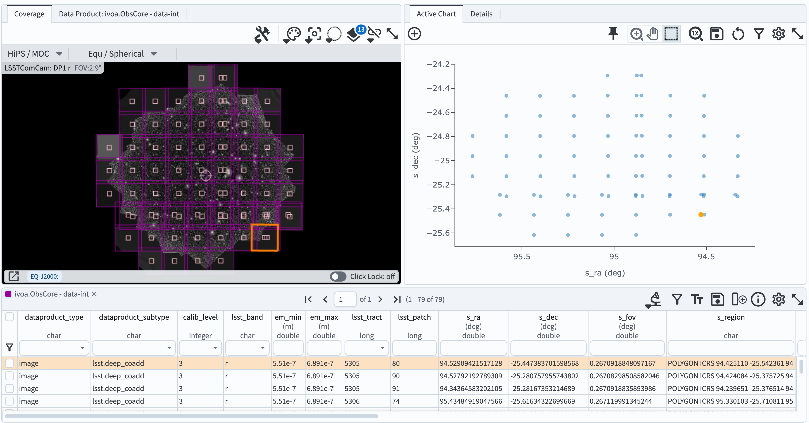

.. _portal-301-6:

##################################
301.6. Low Galactic Latitude Field
##################################

For the Portal Aspect of the Rubin Science Platform at data.lsst.cloud.

**Data Release:** DP1

**Last verified to run:** 2025-06-27

**Learning objective:** Understand the observations and data available for the Low Galactic Latitude field RubinSV\_95\_-25.

**LSST data products:** ``deep_coadd`` images, ``Visit``, ``CcdVisit``, and ``Object`` tables

**Credit:** Originally developed by the Rubin Community Science team.
Please consider acknowledging them if this tutorial is used for the preparation of journal articles, software releases, or other tutorials.

**Get Support:** Everyone is encouraged to ask questions or raise issues in the `Support Category <https://community.lsst.org/c/support/6>`_ of the Rubin Community Forum.
Rubin staff will respond to all questions posted there.

----

This tutorial examines the Data Preview 1 (DP1) data products in the "RubinSV\_95\_-25" field, including magnitude limits, visit distribution with time, data quality, and the distributions of stars and galaxies in color-magnitude and color-color diagrams.

The field denoted "RubinSV\_95\_-25" is sometimes referred to as the "low-latitude field" because it was at the lowest Galactic latitude of any of the fields observed during LSSTComCam on-sky commissioning. RubinSV\_95\_-25 is centered at (RA, Dec) = (95.0, -25.0) degrees, corresponding to Galactic longitude/latitude of (l, b) = (232.5, -17.6) degrees. It is relatively far from the Galactic plane, and not representative of the crowded fields that LSST will see in the Milky Way disk. Nonetheless, it contains the highest source density of any of the LSSTComCam fields in DP1. The region covered spans a diameter of about 1 degree.

**1. Log in to the Portal Aspect of the RSP.**

See the how-to guide in the 101-series Portal tutorials.

**2. Retrieve and examine a deep_coadd image.**

Use the approximate central coordinates of the RubinSV\_95\_-25 field for searches throughout this tutorial. A 1-degree radius will encompass the entire field.

**Central coordinates:** (RA, Dec) = 95.0, -25.0 degrees

Navigate to the "DP1 Images" tab on the Portal, and enter the following ADQL query.

.. code-block:: SQL

  SELECT dataproduct_type, dataproduct_subtype, calib_level, lsst_band,
         em_min, em_max, lsst_tract, lsst_patch,
         s_ra, s_dec, s_fov, s_region, s_xel1, s_xel2, obs_id, obs_collection, o_ucd,
         facility_name, instrument_name, obs_title, access_url,
         access_format, obs_publisher_did
  FROM ivoa.ObsCore
  WHERE obs_collection = 'LSST.DP1' AND calib_level = 3 AND dataproduct_type = 'image'
        AND instrument_name = 'LSSTComCam' AND dataproduct_subtype = 'lsst.deep_coadd'
        AND CONTAINS(POINT('ICRS', 95, -25), s_region)=1

This should return 6 ``lsst.deep\_coadd`` results -- one for each of the *ugrizy* bands. The results should look something like the following.

    Figure 1: The results of the ``deep_coadd`` image search.

**3. See all of the patches overlaid on a coverage map**

Return to the DP1 Image Search window and enter the following ADQL query, which searches for all *r*-band ``deep_coadds``. Click the Submit button.

.. code-block:: SQL

  SELECT dataproduct_type, dataproduct_subtype, calib_level, lsst_band,
         em_min, em_max, lsst_tract, lsst_patch,
         s_ra, s_dec, s_fov, s_region, s_xel1, s_xel2, obs_id, obs_collection, o_ucd,
         facility_name, instrument_name, obs_title, access_url,
         access_format, obs_publisher_did
  FROM ivoa.ObsCore
  WHERE obs_collection = 'LSST.DP1' AND calib_level = 3 AND dataproduct_type = 'image'
        AND instrument_name = 'LSSTComCam' AND dataproduct_subtype = 'lsst.deep_coadd'
        AND CONTAINS(POINT('ICRS', s_ra, s_dec),CIRCLE('ICRS', 95, -25, 1))=1
        AND ( 622e-9 BETWEEN em_min AND em_max )

This should return 79 images. If it's not already visible, click on the "Coverage" tab to see the patch boundaries overlaid onto a HiPS coverage map. Note how you can click one of the patches on the coverage map, and its corresponding image will be highlighted in the table.

    Figure 2: The search results showing the coadd footprints ("patches") on the HiPS coverage map.

**4. Visits**

Retrieve all visits from the ``Visit`` table that fall within a circular region centered at (RA, Dec) = (95.0, -25.0) with a radius of 1 degree. Return the visit ID, band, and observation midpoint time in both MJD and calendar date.

Navigate to the "DP1 Catalogs" tab and enter the following ADQL query.

.. code-block:: SQL

  SELECT ra, dec, band, expTime, visit, expMidpt, expMidptMJD
  FROM dp1.Visit
  WHERE CONTAINS(POINT('ICRS', ra, dec), CIRCLE('ICRS', 95, -25, 1))=1

This should return 292 visits in total. Note that the RA, Dec plot shows the field centers, illustrating how the field was dithered.

**4.1. Filter distribution**

Use the filter function in the table to select each of the *ugrizy* values from the "band" column in turn, and note how many observations there were in each filter. There should be 33 *u*, 82 *g*, 84 *r*, 23 *i*, 60 *z*, and 10 *y*-band visits.

**4.2. Visit dates cumulative histogram**

Click on the "expMidptMJD" column to sort by observation time; you will see a triangle pointing up. This means that the table is now sorted by expMidptMJD so that it is in ascending order (confirm that it is sorted by looking at the first few table entries).

Add a new column to the table by clicking the column+ icon. Click "Use preset function", and select "Number rows in current sort order". Give the new column a name (e.g., "cumulative_expnum") and click "Add Column".

Create a new chart in the "Active Chart" area. Choose "Plot Type: Scatter", then plot column "expMidptMJD" on the x-axis, and "cumulative_expnum" on the y-axis. Set the "Trace Style" to "connected points", and now you have a cumulative histogram of the number of exposures taken over time.

The resulting plot should look like the following, showing the growing number of exposures with MJD.

.. figure:: images/portal-301-6-3.png
    :name: portal-301-6-3
    :alt: A cumulative histogram of number of exposures as a function of expMidptMJD. Values steadily increase with time over a span of 17 days.

    Figure 3: The figure showing the cumulative number of exposures obtained with time.

**4.3 Visit image quality**

Derived quantities that characterize the quality of images and their properties can be found in the ``CcdVisit`` table. Query that table to retrieve a list of all ccd+visit combos that were observed. Use the "Edit ADQL" section on the DP1 Catalogs query page, and the following query:

.. code-block:: SQL

  SELECT visitId, ra, dec, band, seeing, magLim
  FROM dp1.CcdVisit
  WHERE CONTAINS(POINT('ICRS', ra, dec),CIRCLE('ICRS', 95.0, -25.0, 1.0))=1
  ORDER BY visitId

The query should return 2628 results.

Plot a histogram of seeing. (You could subselect by "band" if you wish to see the distribution in a particular filter.)

Create a new chart, and plot a histogram of magLim, the 5-sigma limiting magnitude of each image.

.. figure:: images/portal-301-6-4.png
    :name: portal-301-6-4
    :alt: A plot showing two histograms. On the left is the distribution of seeing in arcsec, and on the right a histogram of magLim in mag.

    Figure 4: The two histograms showing the distribution of seeing and limiting magnitude over all LSSTComCam detectors and visits, in all bands, in DP1.

**5. Objects**

Finally, examine the ``Object`` table, which contains detections and measurements from the ``deep_coadd`` images. Execute the following query in the ADQL query window, retrieving PSF and cModel magnitudes in g, r, and i bands, as well as the refExtendedness parameter.

.. code-block:: SQL

  SELECT coord_ra, coord_dec,
         g_psfMag, i_psfMag, r_psfMag,
         g_cModelMag, i_cModelMag, r_cModelMag,
         g_psfFlux, g_psfFLuxErr,
         r_psfFlux, r_psfFLuxErr,
         i_psfFlux, i_psfFLuxErr,
         refExtendedness, tract, patch
  FROM dp1.Object
  WHERE CONTAINS(POINT('ICRS', coord_ra, coord_dec), CIRCLE('ICRS', 95, -25, 1))=1
        AND g_psfFlux/g_psfFluxErr > 5
        AND r_psfFlux/r_psfFluxErr > 5
        AND i_psfFlux/i_psfFluxErr > 5

Plot a color-magnitude diagram. Add a chart and select the "Heatmap" Plot Type. Put color (e.g., g_psfMag-r_psfMag) on the x-axis and magnitude (e.g., r_psfMag) on the y-axis. Select 300 bins in X and 200 bins in Y. Set XMin, XMax to -1, 2, and YMin, YMax to 16, 26. Then click the "reverse" button under "Options" to make the y-axis display brighter magnitudes (i.e., lower numbers) toward the top.

Select only point-like objects ("stars") by filtering the refExtendedness column to equal 0.

Open a new plot window by clicking the "Add a chart" button. Make a color-color diagram by plotting r_psfMag-i_psfMag vs. g_psfMag-r_psfMag. Place the two figures side-by-side.

.. figure:: images/portal-301-6-5.png
    :name: portal-301-6-5
    :alt: A plot showing color-color and color-magnitude diagrams as heatmaps.

    Figure 5: A color-color and color-magnitude diagram of stars in the RubinSV\_95\_-25 field.

Exercises for the learner: try plotting the color-color and color-magnitude diagrams for galaxies (refExtendedness=1) instead; recall that cModel magnitudes are better suited for extended sources.
