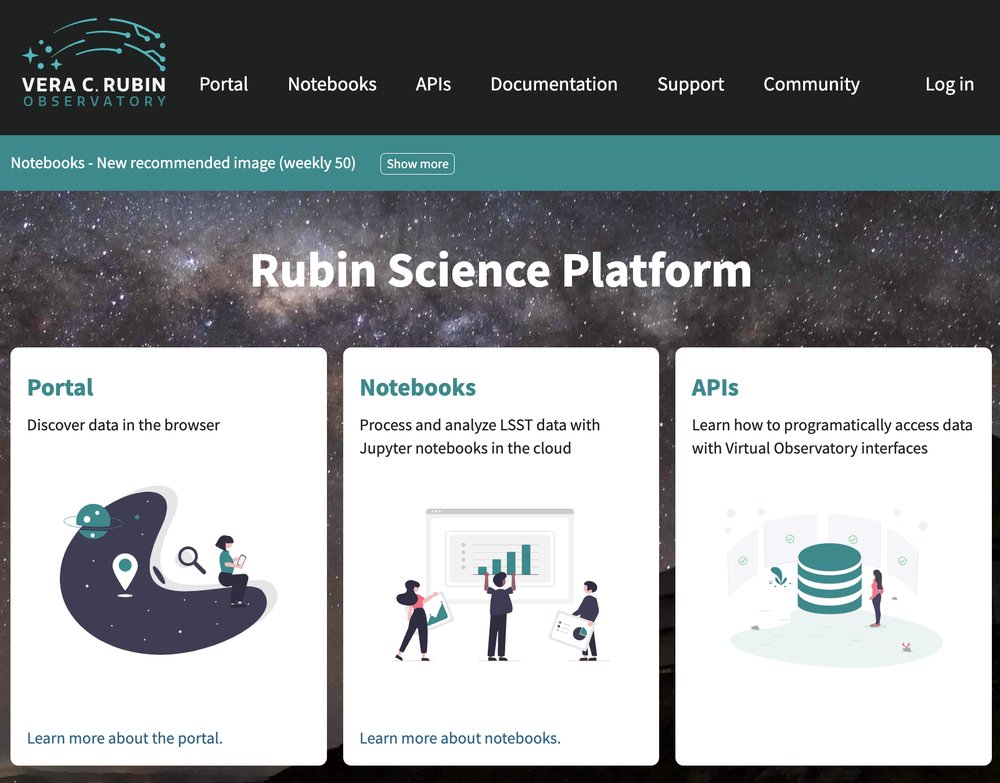
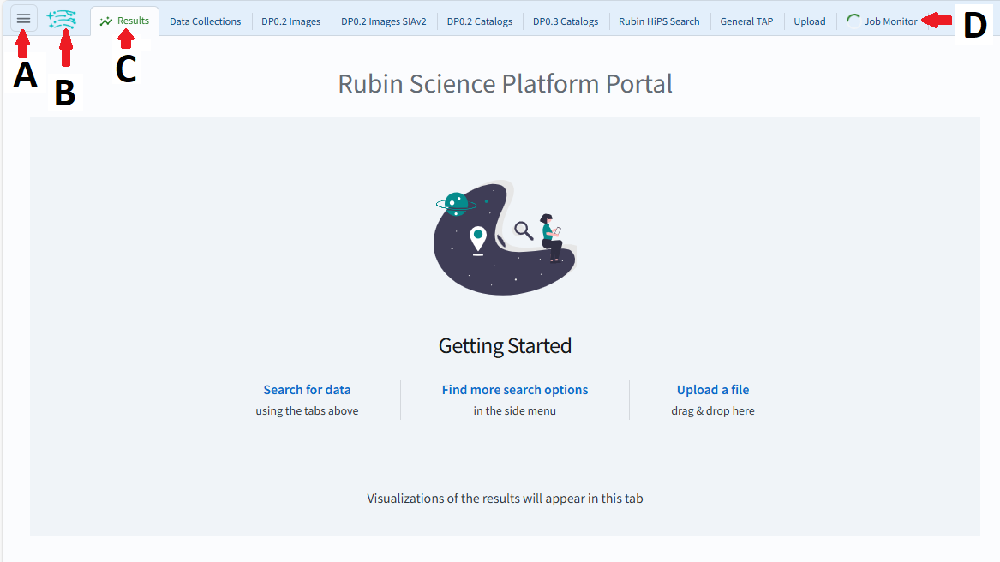
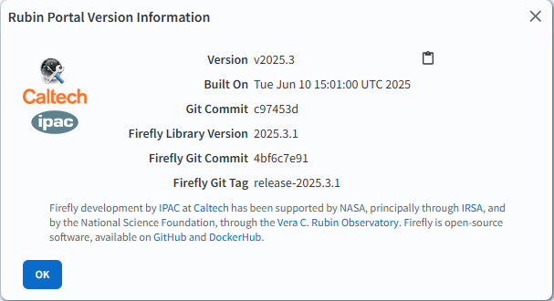

.. _portal-es-101-1:

############################################
101.1. Navegando la interfaz de usuario (UI)
############################################

Para la Faceta Portal de la Plataforma Científica de Rubin (RSP) en data.lsst.cloud.

**Divulgación de Datos:** Vista Previa de Datos 1

**Última verificación de ejecución:** 2025-06-28

**Objetivo de aprendizaje:** Navegar por los componentes principales de la interfaz de usuario (UI) del Portal.

**Productos de datos LSST:** N/A

**Créditos:** Desarrollado originalmente por el equipo científico de la comunidad de Rubin.
Por favor, considerar reconocer su trabajo si este tutorial se utiliza para la preparación de artículos de revistas, lanzamientos de software u otros tutoriales.

**Soporte:** Se invita a toda la comunidad a hacer preguntas o plantear problemas en la `Categoría de asistencia <https://community.lsst.org/c/support/6>`_ del Foro de la Comunidad de Rubin.
El equipo de Rubin responderá a todas las preguntas publicadas allí.

----

**1. Acceder al RSP.**
En un navegador web, acceder al RSP utilizando la URL `data.lsst.cloud <https://data.lsst.cloud/>`_.

    Figura 1: Página de inicio principal de la Plataforma Científica de Rubin.

**2. Iniciar sesión.**
En la página de inicio de la RSP (Figura 1), si aparece "Log in" (Iniciar sesión) en la parte superior derecha en lugar del nombre de usuario, hacer clic en "Log in" y seguir las instrucciones para autenticarse.

**3. Ingresar al Portal.**
En la página de inicio de la RSP (Figura 1), hacer clic en el panel de Portal para ingresar a la Faceta Portal.

    Figura 2: Página de inicio principal de la Faceta Portal.

**4. Revisar la disposición.**
En la página de inicio del Portal (Figura 2), observar los íconos y pestañas en la parte superior de la pantalla y notar que la pestaña seleccionada por defecto de la página de inicio se denomina Results (Resultados).

**5. Ver la ventana de información.**
En la página de inicio del Portal, hacer clic en el logo de Rubin junto al ícono del menú (B en la Figura 2) para abrir una ventana con la información sobre la versión del Portal Rubin.
Cerrar la ventana haciendo clic en el botón OK o en la X situada en la esquina superior derecha.
(La ventana no se muestra en ninguna figura de este tutorial.)

**6. Abrir el menú lateral.**
En la página de inicio del Portal, hacer clic en el ícono del menú (tres líneas horizontales en la parte superior izquierda; A en la Figura 2) para abrir el menú lateral.

    Figura 3: Menú lateral de la Faceta Portal.

**7. Revisar el menú lateral.**
En el menú lateral (Figura 3), observar que algunas de las opciones del menú corresponden a publicaciones de datos más antiguas (por ejemplo, DP0.2 Catalogs) y que las pestañas que se muestran se pueden configurar con la opción "Hide Tab" para ocultarlas.

Todas las funcionalidades del Portal son accesibles a través del menú lateral:

* **Tab Selection (Selección de Pestañas):** Permite personalizar qué pestañas se muestran en la página de inicio.
* **Results (Resultados):** Interfaz de resultados de consultas.
* **Upload (Subir):** Permite subir tablas al Portal.
* **Job Monitor (Monitor de Tareas):** Permite obtener la URL o detener la ejecución de las tareas de consulta enviadas.
* **Data sets (Conjuntos de datos):** Interfaces de consulta para Vista Previa de Datos 1 (LSSTComCam), Vista Previa de Datos 0 (datos LSST simulados) y otros archivos.
* **Appearance (Apariencia):** Permite cambiar entre el modo oscuro y el modo claro.

**8. Cerrar el menú lateral.**
Hacer clic en la X situada en la esquina superior derecha del menú.
