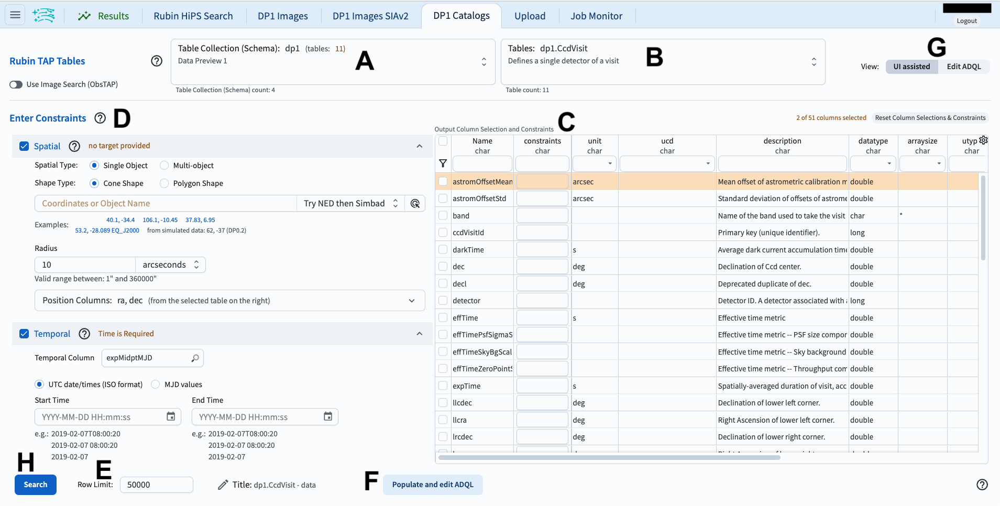
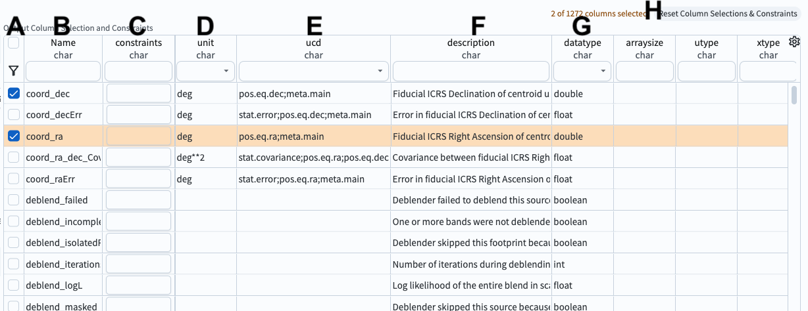
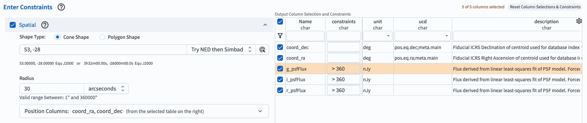

.. _portal-es-102-1:

#####################################
102.1. Consultando datos del catálogo
#####################################

Para la Faceta Portal de la Plataforma Científica de Rubin (RSP) en data.lsst.cloud.

**Divulgación de Datos:** Vista Previa de Datos 1

**Última verificación de ejecución:** 2025-07-23

**Objetivo de aprendizaje:** Navegar por los componentes principales de la interfaz de usuario (UI) del Portal.

**Productos de datos LSST:** Tabla ``Object``

**Créditos:** Desarrollado originalmente por el equipo científico de la comunidad de Rubin.
Por favor, considerar reconocer su trabajo si este tutorial se utiliza para la preparación de artículos de revistas, lanzamientos de software u otros tutoriales.

**Soporte:** Se invita a toda la comunidad a hacer preguntas o plantear problemas en la `Categoría de asistencia <https://community.lsst.org/c/support/6>`_ del Foro de la Comunidad de Rubin.
El equipo de Rubin responderá a todas las preguntas publicadas allí.

----

**1. Iniciar sesión en el RSP y acceder a la Faceta Portal.**
En un navegador web, ir a `data.lsst.cloud <https://data.lsst.cloud/>`_, seleccionar la Faceta Portal e iniciar sesión.

**2. Seleccionar la pestaña DP1 Catalogs.**
En la página de inicio del Portal, hacer clic en la pestaña denominada "DP1 Catalogs" (Catálogos DP1).

**3. Colocar el cursor sobre los elementos para ver notas emergentes.**
En la pestaña "DP1 Catalogs" (Catálogos DP1) (Figura 1), colocar el cursor por encima de los componentes de la interfaz o hacer clic en los signos de interrogación para ver explicaciones emergentes sobre la funcionalidad.

    Figura 1: Interfaz del Portal para consultar catálogos.

**4. Revisar los componentes de la interfaz.**
En la interfaz del Portal (Figura 1), revisar los 8 componentes principales etiquetados de la A a la H, que se utilizan conjuntamente para consultar (buscar) y obtener datos.

* A: Menú desplegable de las colecciones disponibles. Los catálogos DP1 están seleccionados de forma predeterminada.
* B: Menú desplegable de las tablas disponibles para el catálogo seleccionado. La tabla ``Object`` (Objeto) está seleccionada de forma predeterminada.
* C: Interfaz del esquema para aplicar restricciones en las columnas y seleccionar las filas que se desean obtener de la tabla seleccionada.
* D: Campos de entrada para las restricciones espaciales que se aplicarán a la tabla seleccionada (por ejemplo, coordenadas, áreas cónicas o poligonales).
* E: Campo de entrada para establecer el número máximo de filas que se extraerán de la tabla seleccionada.
* F: Botón para convertir las restricciones de búsqueda establecidas con C, D y E en una consulta ADQL.
* G: Botón para alternar entre esta interfaz gráfica y la interfaz ADQL alternativa.
* H: Botón para ejecutar la consulta; para aplicar las restricciones de búsqueda y obtener los datos en la pestaña de resultados.

    Figura 2: Ejemplo de la interfaz del esquema para la tabla ``Object``, con dos columnas seleccionadas (``coord_ra``, ``coord_dec``).

**5. Revisar los componentes de la interfaz del esquema.**
En la interfaz del esquema de la tabla (Figura 2), revisar los 8 componentes etiquetados de la A a la H, que se utilizan para aplicar restricciones de búsqueda a los datos de la tabla.

* A: Casillas de selección. Hacer clic en una casilla para incluir la columna en la consulta. Hacer clic en el ícono del embudo para ver sólo las columnas seleccionadas.
* B: Nombres. Los nombres de las columnas son breves, descriptivos y únicos dentro de una tabla. Hacer clic en "Name" para ordenar por nombre.
* C: Restricciones. Aplicar límites a los valores de las columnas escribiendo las restricciones deseadas (por ejemplo, :math:`>, <, =, !=`).
* D: Unidades. Las unidades de los valores que se obtendrán.
* E: Descriptor de Contenido Unificado (UCD). Estándares de vocabulario establecidos por la `Alianza Internacional de Observatorios Virtuales <https://www.ivoa.net/>`_.
* F: Descripciones de los datos de la columna.
* G: Tipo de los datos. Por ejemplo, entero (int), doble precisión (double), booleano.
* H: Botón para borrar (reestablecer) todas las selecciones y restricciones de columnas.

**6. Hallar las columnas de interés.**
En la interfaz del esquema de la tabla (Figura 2), observar que se permite buscar nombres de columnas.
Escribir una palabra o utilizar el menú desplegable situado en la parte superior de cada columna para encontrar las columnas que sean de interés.
Por ejemplo, en el campo de entrada debajo de "Name" (Nombre), escribir "Flux" (Flujo) y presionar "Enter" o "Return" (retorno) para ver todos los nombres de columnas que contienen "Flux".
Borrar el campo de entrada y presionar nuevamente "Enter" o "Return" para ver todos los nombres de columnas (todas las filas de la interfaz del esquema).

**7. Establecer restricciones.**
A la izquierda, hacer clic en "Spatial" para incluir restricciones espaciales (una búsqueda cónica o "Cone Shape") centradas en RA, Dec = 53, -28 grados.
Limitar el radio a 30 segundos de arco.
En la tabla, seleccionar ``coord_ra``, ``coord_dec``, ``g_psfFlux``, ``r_psfFlux`` e ``i_psfFlux`` para obtener los datos de esas columnas.
Añadir restricciones para que sólo se incluyan objetos con flujos superiores a 360 nJy.
Este es un ejemplo de una consulta muy sencilla.

    Figura 3: Ejemplo de consulta para el catálogo ``Object`` de DP1 configurado en la interfaz.

**8. Ejecutar la búsqueda haciendo clic en "Search".**
En la parte inferior izquierda, hacer clic en el botón azul denominado "Search" (Buscar).
Esta consulta devolverá 24 filas de la tabla ``Object``.
