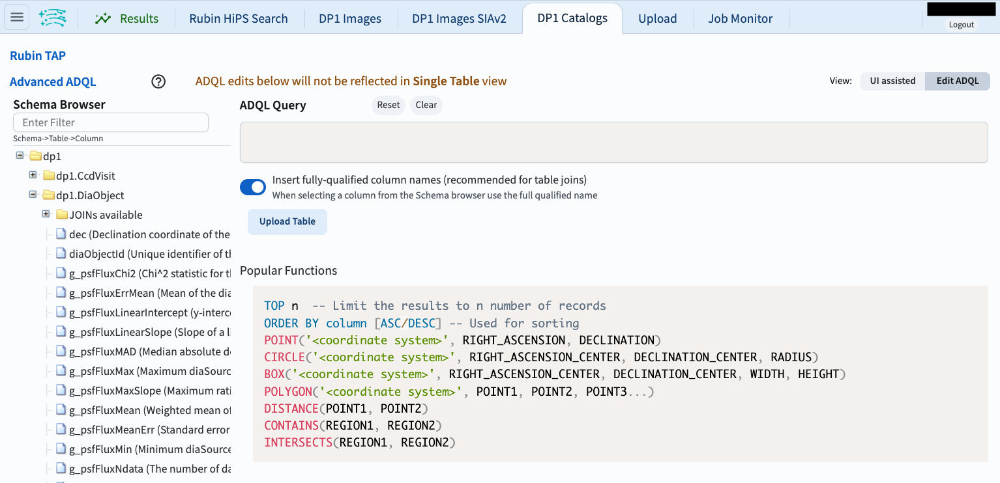
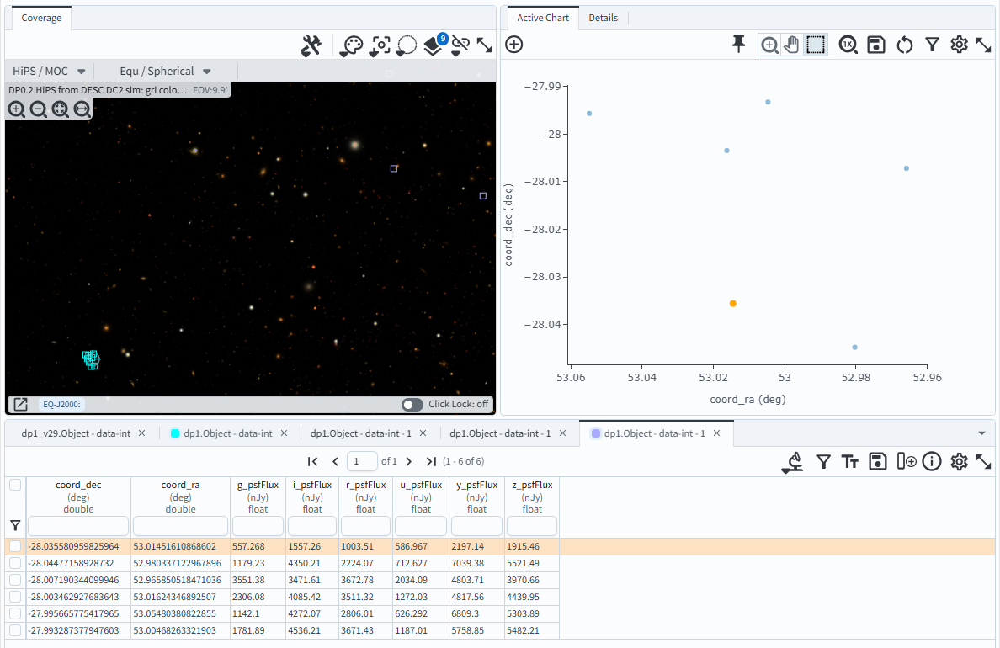

.. _portal-es-103-2:

##############################################
103.2. Consulta de datos del catálogo con ADQL
##############################################

Para la Faceta Portal de la Plataforma Científica de Rubin en data.lsst.cloud.

**Divulgación de Datos:** DP1

**Última verificación de ejecución:** 2025-07-23

**Objetivo de aprendizaje:** Preparar y ejecutar una consulta en `Lenguaje de consulta de datos astronómicos (ADQL) <https://www.ivoa.net/documents/latest/ADQL.html>`_ en el Portal.

**Productos de datos LSST:** Tabla ``Object``

**Créditos:** Desarrollado originalmente por el equipo científico de la comunidad de Rubin.
Por favor, considerar reconocer su trabajo si este tutorial se utiliza para la preparación de artículos de revistas, lanzamientos de software u otros tutoriales.

**Soporte:** Se invita a toda la comunidad a hacer preguntas o plantear problemas en la `Categoría de asistencia <https://community.lsst.org/c/support/6>`_ del Foro de la Comunidad de Rubin. El equipo de Rubin responderá a todas las preguntas publicadas allí.

----

Introducción a ADQL
===================

La `documentación de ADQL <http://www.ivoa.net/documents/ADQL>`_
incluye más información sobre sintaxis, palabras clave, operadores, funciones, etc.
ADQL es similar a SQL (Lenguaje de Consulta Estructurado o Structured Query Language).

Una sentencia ADQL típica tiene al menos tres componentes:

.. code-block:: SQL

  SELECT <columnas> FROM <catálogo> WHERE <restricciones>

donde ``<columnas>`` es una lista separada por comas de las columnas que se van a devolver, ``<catálogo>`` es el nombre del catálogo del que se van a obtener los datos y ``<restricciones>`` impone una restricción según la cual sólo se devuelven las filas cuyos valores de columna cumplen las condiciones.

Por ejemplo, supongamos que existe un catálogo llamado "mysurveydata" con 5 columnas, "col1", "col2", etc.
La siguiente sentencia ADQL devolvería una tabla con tres columnas y todas las filas que cumplan las dos restricciones de la cláusula ``WHERE``.

.. code-block:: SQL

  SELECT col3, col4, col5 FROM mysurveydata WHERE col1 > 0.5 AND col5 < 10

En la Faceta Portal del RSP, las consultas ADQL se envían al servicio TAP (Protocolo de Acceso a Datos Tabulados o Table Access Protocol).

----

**1. Ir a la interfaz ADQL de DP1 Catalogs (Catálogos DP1).**
El botón para cambiar de la interfaz de usuario (UI) a la interfaz ADQL se encuentra en la esquina superior derecha: "Edit ADQL" (Editar ADQL).

**2. Explorar la interfaz ADQL.**
Explorar las tablas disponibles en el servicio TAP en la barra lateral izquierda.
Desplazarse hacia abajo para ver ejemplos de consultas ADQL.
La interfaz debería tener el aspecto de la Figura 1.

    Figura 1: La interfaz ADQL.

**3. Introducir la consulta ADQL en el recuadro.**
La siguiente consulta ADQL selecciona las coordenadas RA y Dec, y las magnitudes PSF *gri* para los objetos que se encuentran dentro de una pequeña región circular del centro del campo ECDFS (RA, Dec = 53, -28; radio = 0.05 grados), y que son más brillantes que magnitud 25 en los tres filtros.

.. code-block:: SQL

  SELECT coord_ra, coord_dec, g_psfMag, r_psfMag, i_psfMag
  FROM dp1.Object
  WHERE CONTAINS(POINT('ICRS', coord_ra, coord_dec),
        CIRCLE('ICRS', 53, -28, 0.05))=1
  AND g_psfMag < 25 AND r_psfMag < 25 AND i_psfMag < 25

**4. Ejecutar la consulta ADQL.**
Hacer clic en el botón "Search" (Buscar) situado en la parte inferior izquierda.
La consulta se ejecutará y los 536 objetos devueltos estarán disponibles en la interfaz de resultados.

    Figura 2: Vista predeterminada de los resultados de la consulta.

Próximos pasos: consultar los tutoriales de la serie sobre cómo manipular la interfaz de resultados del catálogo.
