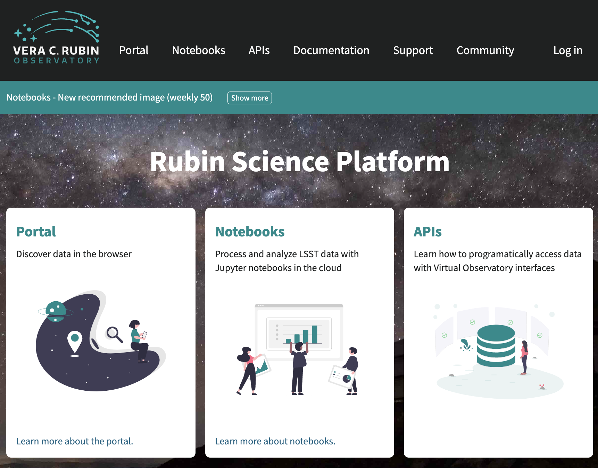
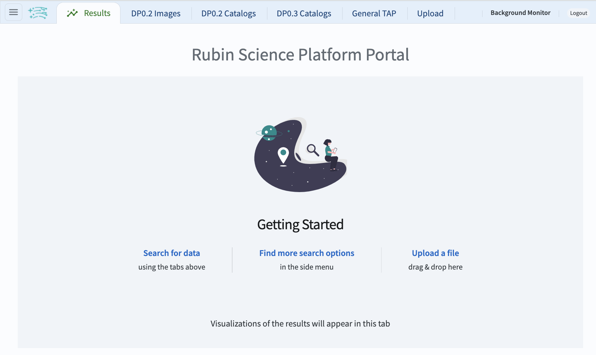
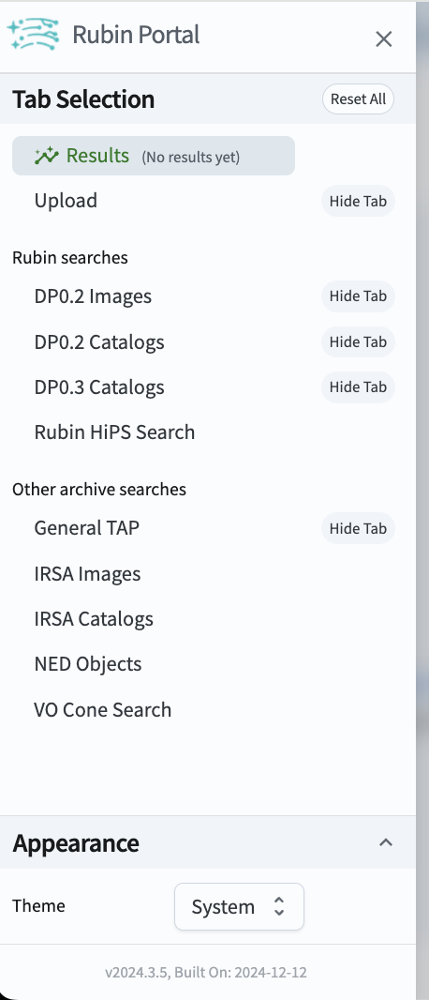
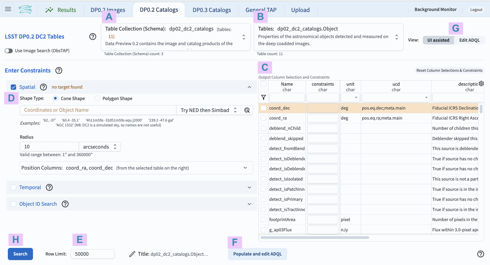
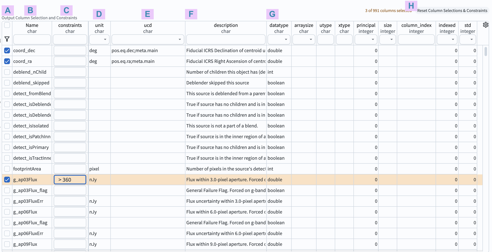

.. _portal-101-1:

##############################################
101.1. How to navigate the UI (user interface)
##############################################

For the Portal Aspect of the Rubin Science Platform at data.lsst.cloud.

**Data Release:** DP1

**Last verified to run:** 2025-05-30

**Learning objective:** This tutorial demonstrates how to navigate the Portal's user interface (UI), and provides a tour of the main components.

**LSST data products:** dp0.2 catalogs

**Credit:** Originally developed by Greg Madejski and Melissa Graham. Please consider acknowledging them if this tutorial is used for the preparation of journal articles, software releases, or other tutorials.

**Get Support:** Everyone is encouraged to ask questions or raise issues in the `Support Category <https://community.lsst.org/c/support/6>`_ of the Rubin Community Forum. Rubin staff will respond to all questions posted there.

.. _portal-101-1-S1:

**1. Go to the RSP.**
In a web browser go to the Rubin Science Platform (RSP) using the URL `data.lsst.cloud <https://data.lsst.cloud/>`_.

    Figure 1: The main landing page of the Rubin Science Platform.

**2. Log in.**
On the RSP landing page (Figure 1), if "Log in" appears at upper right instead of your username, click "Log in" and follow the prompts to authenticate.

**3. Enter the Portal.**
On the RSP landing page (Figure 1) click on the Portal square to enter the Portal Aspect.

    Figure 2: The main landing page of the Portal Aspect.

**4. Review the layout.**
On the Portal landing page (Figure 2) notice the icons and tabs across the top of the screen, and that the default selected tab of the landing page is labeled Results.

**5. View the information window.**
On the Portal landing page (Figure 2) click on the Rubin logo next to the menu icon to open a window with Rubin Portal Version Information.
Dismiss the window by clicking on the OK button or on the X in its upper right corner.
(Window is not shown in a figure in this tutorial.)

**6. Open the sidebar menu.**
On the Portal landing page (Figure 2) click on the menu icon (three horizontal lines at upper left) to open the sidebar menu.

    Figure 3: The sidebar menu of the Portal Aspect.

**7. Review the sidebar menu.**
In the sidebar menu (Figure 3) notice that some of the menu options match the tabs (e.g., DP0.2 Catalogs), and that which tabs you see are configurable with the "Hide Tab" option.
Dismiss the sidebar menu by clicking on the X in the upper right corner of the menu.

**8. Select DP0.2 catalogs.**
On the Portal landing page (Figure 2) click on the tab labeled DP0.2 Catalogs.

**9. Mouse-over for pop-up notes.**
In the Portal UI (Figure 4) use the mouse to hover-over the components of the UI and see pop-up explanations of the functionality.

    Figure 4: The Portal User Interface (UI) for querying the DP0.2 catalogs.

**10. Review the UI components.**
In the Portal UI (Figure 4) review the 8 main components labeled A through H, which are used together to query (search) and retrieve data.

* A: Drop-down menu of the collections available. The DP0.2 catalogs (``dp02_dc2_catalogs``) are selected by default.
* B: Drop-down menu of the tables available for the selected catalog. The ``Object`` table is selected by default.
* C: Schema interface to apply column constraints on, and select rows to be returned from the selected table.
* D: Entry fields for spatial constraints to be applied to the selected table (e.g., coordinates, cone or polygon areas).
* E: Entry field to set the maximum number of rows to return from the selected table.
* F: Button to convert the search constraints set with C, D, and E into an ADQL statement.
* G: Toggle to switch between this graphical UI and the alternative ADQL UI.
* H: Button to execute the query; to apply the search constraints and retrieve data into the results tab.

    Figure 5: The example schema interface for the DP0.2 ``Object`` table, with three columns selected (``coord_ra``, ``coord_dec``, and ``g_ap03Flux``), and a constraint that ``g_ap03Flux`` be greater than 360 nJy (nanoJanskies).

**11. Review the schema interface components.**
In the table schema interface (Figure 5) review the 8 components labeled A through H, which are used to apply search constraints on the table data.

* A: Selection boxes. Click a box to include the column in the query. Click the funnel icon to view only selected columns.
* B: Names. Column names are short, descriptive, and unique within a table. Click on "Name" to sort by name.
* C: Constraints. Apply limits on column values by typing in desired constraints (e.g., :math:`>, <, =, !=`).
* D: Units. For DP0.2, it is a known issue that some columns are missing their units.
* E: Unified Content Descriptor (UCD). Vocabulary standards set by the `International Virtual Observatory Alliance <https://www.ivoa.net/>`_.
* F: Descriptions of the column's data.
* G: Data type. E.g., integer (int), double precision (double), boolean.
* H: Button to clear (reset) all column selections and constraints.

**12. Interact with the table schema.**
In the table schema interface (Figure 5) notice that the columns are searchable.
Type a word, or use the drop-down menu, at the top of every column to find columns of interest.
For example, in the entry field under "Name" type "Flux" and click "enter" or "return" to see all column names with "Flux" in them.
Clear the entry field and click "enter" or "return" again to see all columns names (all rows of the schema interface).

