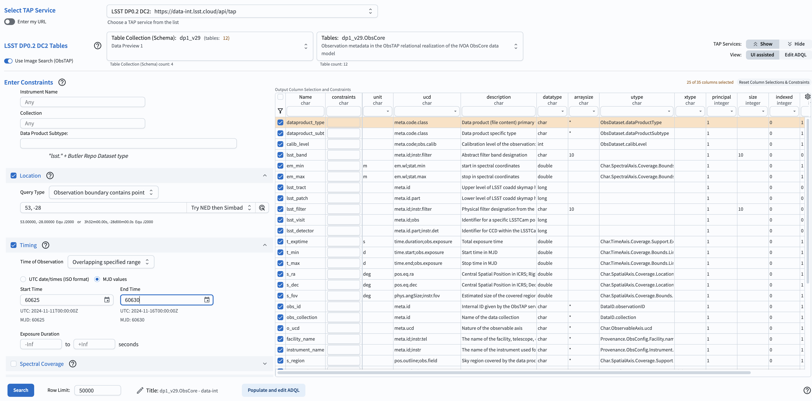
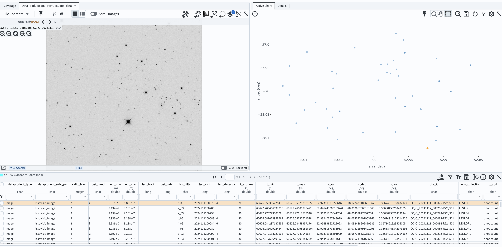

.. _portal-102-3:

##########################################
102.3. How to query for images with ObsTAP
##########################################

For the Portal Aspect of the Rubin Science Platform at data.lsst.cloud.

**Data Release:** DP1

**Last verified to run:** 2025-06-09

**Learning objective:** This tutorial demonstrates how to use the ObsTAP service to retrieve DP1 images.
Specifically it retrieves all “calexps” (Processed Visit Images) containing a specific location on the sky during the desired range of observation epochs.

**LSST data products:** dp1 catalogs and images

**Credit:** Originally developed by Greg Madejski and Melissa Graham.
Please consider acknowledging them if this tutorial is used for the preparation of journal articles, software releases, or other tutorials.

**Get Support:** Everyone is encouraged to ask questions or raise issues in the `Support Category <https://community.lsst.org/c/support/6>`_ of the Rubin Community Forum. Rubin staff will respond to all questions posted there.

.. _portal-102-3-S1:

**1. Select the image repository for your query.** Go to the Rubin Science Platform at `data.lsst.cloud <https://data.lsst.cloud/>`_, select the Portal Aspect, and select the "General TAP" tab.
(If that tab does not appear after selecting the Portal Aspect, click on the "hamburger" (three horizontal lines) menu in the upper left, and click on "General TAP" to add it as an additional tab.)
For the "Table Collection (Schema)" select the “dp1_v29” from the menu (it should be the default).
In the box for selecting tables, select "dp1_v29.ObsCore".

**2. Select the location contained in the images to be retrieved.**
Select the "Location" box and in the "Query Type" select "Observation boundary contains point."
In the "Coordinates or Object Name" enter the desired coordinates.
This example uses 53.0, -28.0 for RA and Dec.

**3.  Select the Observation Type and Source.**
Check the box for the "Observation Type and Source".
In the drop-down menu, for "Calibration Level" select "PVIs (2)".
For the "Data Product Type" select "image", and leave the  "Instrument Name" and "Collection" in the default state.

**4.  Select the desired range of observation times.**
Check the "Timing" box and for the "Time of Observation" select "Overlapping specified range".
Select "MJD values" and enter ``60625`` for the "Start Time" and ``60630`` for the "End Time".
Leave "Spectral Coverage" and "Object ID Search" unchecked.

Figure 1:  The screenshot of the window containing all parameters and ready to execute the search.

**5.  Retrieve the images.**  
Click on the "Search" button.
This will result in extracting 50 images meeting the selected criteria.
By default, the displayed image on the upper left is the first one in the table of images on the bottom of the screen.
The plot on the upper right will display the pointing directions of the telescope for individual images.

Figure 2:  The screenshot of the window resulting from the execution of the search with parameters as in Figure 1.

**6.  Examine the images.**
Click on any line in the table - this will result in displaying the image corresponding to the table entry.
Click on any point on the scatter plot on the right - this also will display the corresponding image.

Return to the list of DP0.2 :ref:`DP0-2-Tutorials-Portal`.
